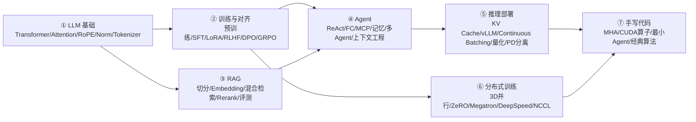
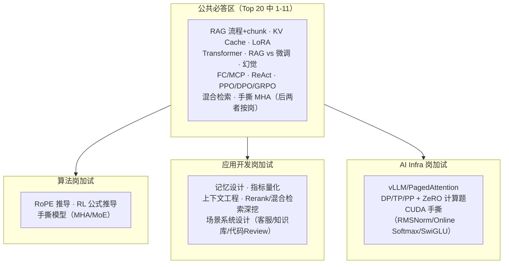

# 高频考点地图（interview-questions）

> 考点体系基于 10+ 篇公开面经（牛客摘录、代码随想录、kamacoder 面经、CSDN 秋招
> 实测 28 家公司等调查研究），并按 JD 调研标定权重。完整题目清单见
> [高频面试真题汇总](./高频面试真题汇总.md)；学习顺序见
> [resources/学习路线图](../resources/学习路线图.md)。

## 一、模块划分（由浅入深）

各模块目录（持续更新）：

| 模块 | 目录 | 岗位权重 |
|---|---|---|
| LLM 基础 | `llm基础/` | 三类岗位公共必答 |
| 训练与对齐 | `训练与对齐/` | 算法岗核心，其余懂概念 |
| RAG | `rag/` | 应用岗第一权重，Infra 懂流程 |
| Agent | `agent/` | 应用岗第一权重 |
| 推理部署 | `inference/` | Infra 岗第一权重 |
| 分布式训练 | `distributed-training/` | Infra/算法岗，应用岗懂概念 |

## 二、三类岗位的答题区

## 三、出现率 Top 20（合并 10+ 篇面经去重）

| # | 题目 | 频率 |
|---|---|---|
| 1 | RAG 完整流程 + chunk 切分策略 | 极高 |
| 2 | KV Cache 原理与显存估算 | 极高 |
| 3 | LoRA 原理及与全量微调对比 | 极高 |
| 4 | Transformer 架构 / Self-Attention 原理 | 极高 |
| 5 | RAG vs 微调的取舍 | 极高 |
| 6 | 幻觉的成因与工程缓解 | 极高 |
| 7 | Function Calling 原理 / MCP 区别 | 极高 |
| 8 | ReAct 范式与循环控制 | 极高 |
| 9 | PPO / DPO / GRPO 差异与推导 | 极高（算法岗） |
| 10 | 混合检索（BM25+向量）/ Rerank | 极高 |
| 11 | 手撕 Multi-Head Attention | 极高（算法/Infra） |
| 12 | vLLM / PagedAttention / Continuous Batching | 高 |
| 13 | RoPE 位置编码原理 | 高 |
| 14 | RLHF 完整流程与 Reward Model | 高 |
| 15 | Agent 长短期记忆设计 | 高 |
| 16 | 项目指标怎么量化（通用追问） | 高 |
| 17 | DP/TP/PP + ZeRO-1/2/3 | 高 |
| 18 | 量化选型 GPTQ/AWQ/PTQ/QAT | 高 |
| 19 | MHA→MQA/GQA/MLA 演进 | 高 |
| 20 | 上下文工程：压缩策略与摆放位置 | 高（2026 新热点） |

## 四、公司面试风格差异（面经体现）

- **字节**：题量最大、追问最深；手撕硬（MHA/attention 算子，AML 要求 numpy 从 0 写 softmax）；
  新热点是上下文工程、压缩、权限（ACL 先过滤还是先召回）。
- **阿里**：算法岗深挖 RL 理论（GRPO loss、Advantage、KL 摆放、on/off-policy）；Infra 挖 CUDA kernel、
  FlashAttention 底层、NCCL 排障。
- **腾讯**：结构细节题（Pre/Post-Norm、Decoder-only 原因）+ 微调框架横评 + 一体化平台设计。
- **美团**：具体结构+工程细节（SwiGLU、LoRA、手撕 MoE、SSE 流式）；场景设计题多。
- **快手**：框架横评型（vLLM、LangChain vs LangGraph、Harness/Skills 管理）；重设计取舍。
- **滴滴**：AI Infra 极硬核——显存计算、ZeRO 通信量、AdamW 4 倍显存、CUDA 手撕。
- **京东**：RAG 工程味浓（RRF、多路召回）；Java 生态（Spring AI vs LangChain4j）特色。
- **通用规律**：算法岗 = 结构细节 + RL 推导 + 手撕模型；应用岗 = RAG 全链路 + Agent 工程 +
  效果量化；Infra 岗 = 显存/通信计算 + CUDA 手撕 + vLLM/ZeRO 原理。
  **2026 共同追问主线："怎么量化"**——幻觉率、召回率、提升百分比都要讲得出测试集和口径。

## 五、使用建议

1. 概念题只是起点，**简历项目深挖才是决定项**——每个主题备一个真实项目案例
   （怎么量化、踩过什么坑）。
2. 按模块目录逐个击破：`coding/` 里有配套手撕练习，`system-design/` 里有设计题模板。
3. 答题模板：**先讲原理（是什么/为什么）→ 再讲工程取舍（什么时候用/代价）→
   最后落到自己项目的数字**。
