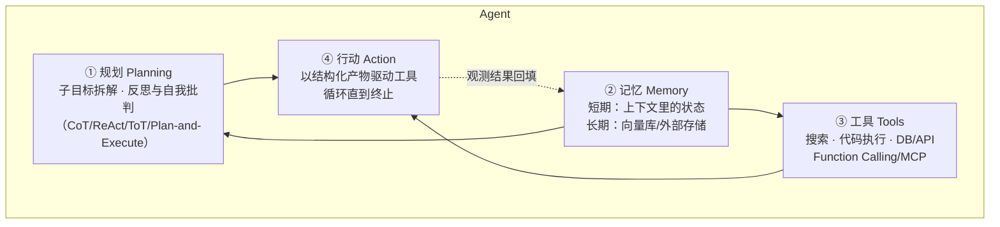
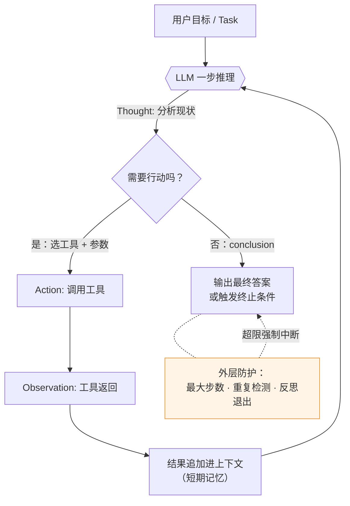

# Agent 基础与规划

> 本模块四篇连续阅读：本篇（基础与规划）→ [工具调用与 MCP](./工具调用与mcp.md)
> → [记忆与上下文工程](./记忆与上下文工程.md) → [多 Agent 与评测](./多agent与评测.md)。
> 题目清单来源：[高频面试真题汇总 · 三、Agent 方向](../高频面试真题汇总.md)。

Agent 是应用岗面试的第一权重模块（[JD 分析](../../resources/jd分析-agent开发岗.md)：
18/21 份 JD 点名 FC/MCP，14/21 点名多 Agent 与评测）。本篇讲三件事：Agent 到底是什么、
它内部由哪几个件组成、最常用的规划范式（ReAct）怎么工作、怎么选型、怎么防死循环。

## 一、直觉与定义：什么是 Agent

### 1.1 一句话定义

**Agent = LLM 在一个循环里自主决定「下一步做什么」，直到任务完成。**
与之相对，单次调用 LLM 是"你问一句、它答一句"，流程完全由你的代码写死。

用一个比喻打开：

- **直接调 LLM**：像一个百科全书式的顾问，你问它答，但它没有手——查不到实时数据、
  不能操作任何系统。
- **Workflow（工作流）**：像流水线。你事先把步骤编排好（先检索 → 再总结 → 再润色），
  LLM 只是流水线上某几个工位的"智能零件"。流程确定、可控、好调试，但遇到预料之外的
  情况不会变通。
- **Agent**：像一个实习生。你只给目标（"帮我把这个 bug 修了"），它自己决定先干什么、
  调用什么工具、看到结果后再决定下一步。灵活，但不可控、不好预算成本和耗时。

### 1.2 Workflow vs Agent 的边界（极高频题）

> ▶ 面试题：什么是 Agent？为什么不用直接调大模型？Agent 与 Workflow 的边界在哪？
> ——**极高频**（蚂蚁/字节/快手/腾讯）

这题的标准参照是 Anthropic《Building effective agents》（链接已验证，见
[学习资源清单 · 博客/Anthropic Engineering](../../resources/学习资源清单.md)）的划分：

| 维度 | Workflow | Agent |
|---|---|---|
| 控制流 | **代码写死**：步骤顺序、分支条件都是预定义 | **模型决定**：LLM 在运行时自主选择下一步 |
| 确定性 | 高——同样的输入走同样的路径 | 低——路径是概率性的 |
| 可调试性 | 好——每一步可单测 | 差——需要 Trace 回放整段轨迹 |
| 成本/延迟 | 可预算 | 不可预算（步数不定） |
| 适用场景 | 流程固定、容错低：退款审批、固定报表 | 开放式任务：修 bug、深度调研、多轮运维排查 |
| LLM 角色 | 流程中的"智能节点" | 系统的"决策者" |

**参考答法要点**：先给 Anthropic 的定义性区分（"workflow 是 LLM 和工具通过预定义代码
路径编排；agent 是 LLM 动态指挥自己的流程和工具使用"），再接一句工程判断——**能写死
流程就别用 Agent**，生产上 80% 的场景是 workflow 套一两个 LLM 节点就够了；只有任务
路径真的不可预知（工具数/步数不定）才上 Agent 循环。这种"克制"的态度是 Anthropic
文章强调的，也是面试官想听的成熟度信号。

"为什么不直接调大模型"的三点理由（层层递进）：

1. **没有实时性**：模型知识有截断日期，查股票、查工单状态都要工具。
2. **没有行动力**：生成文本 ≠ 改变世界。发邮件、建 Jira、跑 SQL 都得靠工具调用。
3. **没有闭环**：单轮调用无法根据中间结果纠偏——拿到工具报错不能自己重试，
   Z 拿不到 Y 就不能换 X 再试一次。Agent 的核心价值就是这个**感知-决策-行动闭环**。

## 二、Agent 四大件：Lilian Weng 框架

业内通用的拆解来自 Lilian Weng《LLM Powered Autonomous Agents》（原文见
[学习资源清单 · 博客/Lil'Log](../../resources/学习资源清单.md)）：一个 Agent 由
四个核心组件构成。



逐个说人话：

1. **规划（Planning）**：把大目标拆成可执行子目标，并在执行中纠偏。这是本文
   第三、四节的主角；面试追问集中在 ReAct/Plan-and-Execute/Reflection 的选型。
2. **记忆（Memory）**：短期记忆就是当前上下文窗口（保住了本轮状态）；长期记忆
   是外挂存储（向量库/SQL），跨会话召回。详见
   [记忆与上下文工程](./记忆与上下文工程.md)。
3. **工具（Tools）**：LLM 的"手和眼"。包括搜索、代码解释器、数据库、内部 API、
   其他 Agent。详见[工具调用与 MCP](./工具调用与mcp.md)。
4. **行动（Action）**：规划落成的具体输出——一次工具调用、一段最终回答、或者
   一个"转人工"的决定。

> ▶ 面试题：LLM-based Agent 架构怎么拆？——**高**
> 答法：四大件点名 + 一句话各自职责 + "记忆是规划的输入，行动是规划的下发，工具是
> 行动的载体"。能提到这是 Lilian Weng 的拆解框架，出处意识立刻加分。

## 三、ReAct 原理与工作流

ReAct（Yao et al., 2022，论文清单见[学习资源清单](../../resources/学习资源清单.md)）
是 Agent 规划范式的"行业标准"，也是 Top 20 里第 8 题"ReAct 范式与循环控制"。

### 3.1 原理：把"想"和"做"交错起来

ReAct = **Re**asoning + **Act**ing。核心思想一句话：**让模型把推理轨迹
（Thought）显式写出来，穿插在行动（Action）和观察（Observation）之间，形成循环**。

它解决的痛点是纯 CoT（Chain-of-Thought）的软肋：CoT 只会闭门推理，推到最后
一步发现事实错了也没法补救；而 ReAct 边推边查——查到的证据反过来修正推理。

单次循环长这样：

```text
Thought: 我需要先知道用户问的这个库的最新版本是多少，本地知识可能过时。
Action: search("pyqueryx latest version 2026")
Observation: "1.4.2 (released 2026-09)"
Thought: 好，最新版是 1.4.2，文档里安装命令应该带上版本约束。
Action: finish("请执行 pip install pyqueryx==1.4.2")
```

### 3.2 完整循环图（面试可随手画）



三个要点，答题时务必覆盖：

1. **Thought 是显式的**。它不是模型内心戏，是 prompt 约束下必须吐出来的文本——
   这让轨迹可观测、可回放（第四篇"可观测性"的根基）。
2. **Observation 是环境给的，不是模型编的**。工具真实返回被拼回上下文，这是
   ReAct 抗幻觉的来源。
3. **每步都要存进上下文**。轨迹 = 模型唯一的"工作记忆"，这既是它的强项
   （透明可追）也是它的命门（轨迹无限膨胀 → 上下文爆掉 → 需要压缩，第三篇详述）。

### 3.3 优缺点

| 优点 | 缺点 |
|---|---|
| 推理可解释，轨迹天然是 debug 材料 | 每步一次 LLM 调用，**延迟和 Token 成本 × 步数** |
| 不需要训练，Prompt 工程即可起步 | 上下文学长后早期信息被稀释，容易"忘记初心" |
| 强适配工具密集型任务（查、算、写代码） | 一个 Thought 推理错误可能滚雪球 |
| 生态成熟：LangChain/LangGraph/各厂自研都有实现 | 终点不可预期 → 必须配外层循环控制（见第五节） |

> ▶ 面试题：ReAct 工作流程、优缺点？——**极高频**（腾讯/京东/美团）
> 答法模板：定义（Reason+Act 交错）→ 画出循环 → 拿出一个具体 trace 片段讲
> → 优点（可解释/免训练/抗幻觉）→ 缺点（步数成本/上下文膨胀/错误累积）。
> 最后一定接一句"所以生产上要配循环控制"——自然带出追问的下一题。

## 四、ReAct vs Plan-and-Execute vs Reflection 选型

> ▶ 面试题：ReAct vs Plan-and-Execute vs Reflection，怎么选型？——**中高**
> （阿里/美团/字节）

| 范式 | 机制 | 优点 | 缺点 | 适用场景 |
|---|---|---|---|---|
| **ReAct** | 边想边做，逐步调工具 | 灵活、能根据中间结果变招 | 没有全局蓝图，可能局部走偏、绕路 | 工具反馈决定走向的任务（搜索/调试/客服） |
| **Plan-and-Execute** | 先让 Planner 产完整计划，Executor 逐步执行 | 全局目标感强、少走冤枉路；Planner 可用强模型、Executor 可用便宜模型 | 计划对中间失败不敏感；中途环境变了计划就废 | 步骤可预知的长任务（报表生成、批量处理、确定性流程） |
| **Reflection / Reflexion** | 执行后生成自我批评，下一轮带着"上次错哪了"重试 | 显著提高一次性正确率（论文报告在代码/问答任务上提升明显） | 改动失败轨迹会再次全量复跑，Token 翻倍；批评质量依赖模型自省能力 | 无确定性 verifier、但结果可自检的任务（代码生成后跑测试、文案校对） |

**参考答法要点**：这不是三选一，是三个正交的增强手段——**主干一般还是 ReAct
循环**，复杂任务前挂一个 Planner，关键交付物后加一个 Reflect 环节。真实系统里
（LangGraph agent、Claude Code 都是这个套路）三者是组合的：Plan → ReAct 逐步执行
→ 子任务完成时 Reflect 确认，失败回退改计划再执行。

一句话选型口诀：**流程能提前定死的上 Plan-and-Execute，反馈决定走向的上 ReAct，
结果能自检的加 Reflection；混合式生产系统全都要。**

## 五、循环控制：防死循环与"三层防护"

> ▶ 面试题：Agent 死循环 / 无效循环怎么终止？为什么要三层防护？——**中高**（字节/快手）

Agent 死循环是线上事故第一名：模型状态感弱，可能反复调用同一个工具、同一个参数，
或者 A 失败 → 试 B → B 失败 → 试 A 打乒乓球。且每一步都是真金白金的 Token。

### 第一层：最大步数 / 时间 / Token 预算（硬兜底）

- `max_iterations`（如 20 步）+ `max_wall_time` + 每任务 Token 上限。
- 是最后一道防线，防止任何上层逻辑失效时还烧钱。
- 达到上限的处置不是"直接报错"：应该让 Agent 用当前已有信息**尽力总结一个
  降级答案**（best-effort），实在不够再返回"任务未完成，原因：X"。

### 第二层：重复检测 / 状态去重（针对性拦截）

- 维护已执行动作的指纹（tool_name + normalized_args 的 hash）；同一指纹
  出现 N 次（如 2 次）→ 拦截并向模型反馈"这个方法已经试过，结果是 Y，请换思路"。
- 配合动作黑名单：禁止连续两次调用同一个工具不改参数。
- 状态机视角：把"（规划状态, 观测摘要）"做去重，发现回到已访问状态即判循环。

### 第三层：反思退出 / 模型自终结（智能提前退出）

- 在每 K 步（或初始步数）插入一个 Reflect 环节：让模型评估"目标接近了吗？当前
  策略有效吗？"，如果判定"目标无法达成"或"已达成"，显式输出 `exit` / `finish`。
- 更优雅:**在 System Prompt 里明示终止准则**（例如"当搜索结果连续 3 次没有新增
  信息时应停止并回答'找不到'"）。不教模型何时停，模型倾向于假装永远有进展。

**为什么是三层而不是一层**？因为它们失效模式不同：模型自信偏差会让反思层漏判
（以为自己还在进展），重复检测拦不住"每次都换了个参数但本质在绕圈"的变体循环，
只有硬兜底能兜住一切。三层是**纵深防御**，各自的拦截成本不同、漏检能互补。

> 参考答法结构：先承认"Agnect 死循环是生产真实痛点"→ 列三层并讲各自防什么
> → 举一例（重复指纹拦截的 hash 设计）→ 落数字（"我们把相同指纹阈值设为 2，
> 循环拦截率 X%，平均节省 Y 步"）。

## 六、面试准备清单

1. 口述 Anthropic workflow vs agent 的定义区分，能举例（退款=workflow，修bug=agent）。
2. 徒手画 ReAct 循环，标出 Thought/Action/Observation/外层控制。
3. 准备一个自己项目里"某步失败→换工具重试"的真实 trace（边讲边放）。
4. 备好"死循环三层防护"的一句话背稿和一个落地的阈值数字。
5. 想透"你的项目为什么不用 Plan-and-Execute 要用 ReAct"——这是选型追问的常见切入。

## 练习建议

- **手写最小 ReAct Agent（极高频 live coding）**：去 `coding/`
  目录完成"脱框架手写最小 ReAct Agent"练习——要求自己实现：工具注册表（name→
  函数+schema）、TAO 循环、`finish` 终止、`max_iterations` 兜底、重复指纹拦截。
  参考素材：[学习资源清单 · Tiny-Universe 的 Tiny Agent](../../resources/学习资源清单.md)。
- 进阶：给你的 Agent 加一层简单的 Reflection（子任务完成后自查）；再进阶，
  把 Planner 拆出来变成 Plan → ReAct 混合架构，对比同一任务的步数与成功率。
- 延伸阅读：ReAct 原始论文与 Reflexion 论文（清单里"对齐与推理增强 /
  Prompt 与 Agent"分组），加上 Anthropic《Building effective agents》——
  面试里能准确引用"Anthropic 把 workflow 和 agent 分成两类……"是区分度很高的信号。
