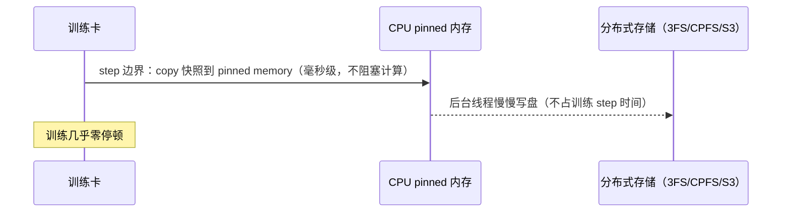
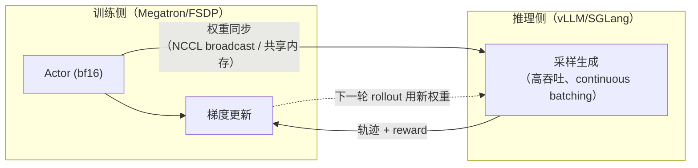

# 训练框架、吞吐与大规模稳定性

> 分布式训练模块第三篇。三件套：① 框架横评（DeepSpeed/Megatron/FSDP/verl/
> LLaMA-Factory/ColossalAI——腾讯/美团/通义的"实际用过哪些"题）；② 大规模训练的
> 稳定性工程（容错、断点续训、数据管线——腾讯混元 Dataloader/Checkpoint 岗考点）；
> ③ MFU 与收敛性排查。面试里前两篇（[三维并行](./三维并行.md)、
> [ZeRO 与显存优化](./zero与显存优化.md)）是"懂不懂"，这篇是"**做没做过**"。

## 一、训练框架横评（横频题）

▶ 面试题：DeepSpeed/Megatron/verl/LLaMA-Factory 定位？实际用过哪些？——**中高频**（腾讯/美团/通义）

| 框架 | 出品方 | 一句话定位 | 核心能力 | 什么时候选它 |
|---|---|---|---|---|
| **Megatron-LM** | NVIDIA | 3D 并行的"原厂标杆" | TP/PP/SP/CP 最全最成熟，Distributed Optimizer（≈ZeRO-1），MoE/EP 支持好 | 稠密大模型**预训练**，千卡万卡，追求 MFU |
| **DeepSpeed** | 微软 | ZeRO 全家桶的代名词 | ZeRO-1/2/3、Offload/Infinity、与 HF Transformers 融合好；DeepSpeed-Chat | 显存紧的**微调/中小规模训练**，要省显存不想上复杂 3D |
| **FSDP / FSDP2** | PyTorch 官方 | PyTorch 原生 ZeRO | FULL_SHARD ≈ ZeRO-3、HYBRID_SHARD、与 torch.distributed 深度整合；TorchTitan | 想留在纯 PyTorch 生态、避开重型框架预训练；详见 [ZeRO 篇](./zero与显存优化.md) |
| **ColossalAI** | 潞晨科技 | "大杂烩"开源框架 | 并行方式非常全，Gemini 异构内存管理，国产化适配早 | 需要 TP/PP/ZeRO 灵活拼装、或国产硬件 |
| **LLaMA-Factory** | 北航开源社区 | 微调/对齐"全家桶" | 百种模型一键 SFT/DPO/PPO，LoRA/QLoRA 首选 | **做实验、调优、对齐验证**，不解决超大规模 |
| **verl** | 字节跳动开源 | RL 后训练基础设施 | HybridFlow：Rollout 接 vLLM/SGLang、Training 可接 Megatron/FSDP，PPO/GRPO | **RLHF/GRPO 后训练**，RL infra 岗必读 |
| **slime** | 智谱 | RL 训练框架 | Megatron + SGLang 训推一体，GLM 系列实战 | 同 verl，Moonshot/GLM 系背景 |

**答法套路**：① 先按"预训练 / 微调对齐 / RL 后训练"三个场景分层给答案；
② 每个框架说出"招牌特性"（Megatron=3D 并行、DeepSpeed=ZeRO、verl=HybridFlow、
LLaMA-Factory=LoRA 全模型化）；③ 收尾必须带真实使用经历——比如"用过
LLaMA-Factory 做 7B LoRA，后来 70B 全量时换 FSDP+TP 自己配，原因是……"。
没有真实使用就说"实验过 X、读过 Y 源码"，坦诚比吹强。

补充一个趋势观察：**verl/slime/OpenRLHF 这类 RL infra 框架近两年崛起**，因为
GRPO/Agentic RL 后训练成为大厂标配——预训练和推理框架的边界在合拢，详见第六节。

## 二、容错与断点续训

▶ 面试题：千卡集群容错与断点续训怎么设计？checkpoint 存取开销怎么优化？——**低中频**（腾讯混元岗深挖）

千卡万卡跑一个月，**不出故障才是新闻**。工程上把稳定性拆成三层：

### 1. Checkpoint 保存什么、多久存一次

一个完整 checkpoint ≈ 模型权重 + **优化器状态**（AdamW 的 m/v/FP32 master，
这才是大头）+ dataloader 位置 + RNG 状态 + step/lr scheduler 状态。

- **频率取舍**：存太勤 → IO 堵、训练停顿；太疏 → 一次故障回退 N 小时。实践里
  按"可接受的回退损失"定：
  - 千亿级预训练：每 500~1000 step 一次；
  - 7B/13B 微调：每 1000~2000 step 或 epoch 结束。
- **存多大**：70B 模型 ZeRO-3 下全量优化器状态 ≈ 数 TB——写一次就是几分钟。
  这是混元岗 JD 写"Dataloader/Checkpoint"当独立方向的原因。

### 2. 异步 Checkpoint（约定俗成的标准答案）



- **思路**：先把 checkpoint snapshot 复制到 CPU pinned 内存（这一步快），然后
  后台线程异步落盘到分布式存储，GPU 不等待磁盘 IO；Megatron/NeMo、DeepSpeed、
  PyTorch DCP（Distributed Checkpoint）都支持 async save。
- **追问口径**：落盘引擎通常配合并行文件系统（Lustre/CPFS）或对象存储，关键
  指标是"每 GB 写入时间"而非保存次数。

### 3. 故障发现与恢复

- 心跳 + 健康检查（NCCL 通信超时、DCGM 指标异常）自动识别坏节点并**踢出/重启**
- 弹性训练（elastic launcher / rendezvous）：重启后新节点加入，不必等死
- 恢复时从最近 valid checkpoint 重放 dataloader 的 sample 索引续训（dl state 别只存 step 数）

## 三、MFU：训练吞吐怎么算、怎么提

### 定义

**MFU（Model FLOPs Utilization）= 实际达成的 FLOPS / 硬件峰值 FLOPS**。

换算一下就是：**模型每 token 前向+反向的 FLOPs × tokens/s ÷ GPU 峰值**。

```text
Transformer 经验公式：每 token ≈ 6 Ψ FLOPs（前向 2Ψ + 反向 4Ψ），
加一个 attention 二次项修正（长序列不可忽略）。

例：H800 BF16 峰值 989 TFLOPS
7B 训练吞吐 3000 tokens/s/卡 → 6 × 7e9 × 3000 ≈ 1.26e14 FLOPS = 126 TFLOPS
MFU ≈ 126 / 989 ≈ 12.7%——及格线以上的数字
（30%+ 算优秀，50% 是顶尖论文级如 DeepSeek-V3 的配置）
```

▶ 面试题：MFU 怎么算？千卡训练多少算正常？——**中频**（Infra 岗）

- **怎么提**：① kernel 融合（FlashAttention、fused RMSNorm/GELU/RoPE，减少
  HBM 往返）；② **通信与计算重叠**（DP 的 bucket 梯度异步 AllReduce、TP 的
  AllGather 与 GEMM overlap、ZeRO-3 的预取）；③ 数据管线不阻塞（下一节）；
  ④ 减少重计算（selective recompute 而非 full）；⑤ 合理并行配比（把 TP 的
  高频通信留在 NVLink、DP 用 RDMA）。
- **讲项目时给这两个数字**：MFU + tokens/s/GPU，再加一句"比基线高 X%，来自
  XX 优化（举一项）"——比任何概念题都有说服力。

## 四、收敛性问题排查（loss spike / 坏卡）

▶ 面试题：出 loss spike 或者训崩了怎么定位？——**中频**

大规模训练特有的两类问题：

1. **数据/超参侧**：脏数据（乱码、格式错）、lr 过高、batch 突变（dynamic
   batching 边界）。排查：回滚到上一个好 checkpoint、跳过可疑 batch 重训看是否
   复现；线上监控 **grad norm**——spike 的先行指标。
2. **硬件坏卡侧（Silent Data Corruption, SDC）**：某卡计算结果悄悄出错但**不
   报错**，污染梯度，loss 抬头或抖动。定位套路：
   - 各 rank 独立记录 loss/grad norm 上报，**找分布异常的那张卡**；
   - DCGM + XID error 日志，ECC 重试暴涨的卡优先；
   - 上 canary 工具，同 input 多卡跑同一 kernel 交叉验证，对不上的隔离；
   - 断掉该卡，从老 checkpoint 重训对比 loss 曲线是否复现。

**重点一句话**：大规模训练里"loss 不对"≈20% 是算法问题、80% 是**工程问题**
（数据、卡、通信）。回答时这个口径感比任何单点知识都重要。

## 五、数据管线（腾讯混元岗的招牌考点）

▶ 面试题：Dataloader IO 瓶颈怎么解？——**中频**（腾讯混元）

千卡 GPU 嗷嗷待哺，一个慢的 dataloader 能直接阉掉一半 MFU。标准答案四件套：

| 问题 | 解法 |
|---|---|
| 单线程 decode/预处理慢 | DataLoader `num_workers` + 持久 workers、把 CPU 密集的移动到离线预处理 |
| 文件系统/对象存储慢 | 训练数据放**并行文件系统/本地 NVMe 缓存**，对象存储（S3/OSS）只做回填层 |
| 随机读放大 IO | 先 shuffle 成**连续大文件**（webdataset/tar shard、arrow），顺序化读取 |
| GPU 等数据 | prefetch → pinned memory → **GPUDirect Storage**（绕过 CPU 进显存） |

训练/`dataloader` 端可以用 **acc/dist sampler 对全部 rank 做分片**，保证不重复、
不遗漏，且能从 checkpoint 恢复（和第二节的 dataloader state 绑定）。

## 六、RL 训练的 Infra（JD 新趋势，点到为止）

▶ 面试题：vLLM rollout + Megatron training 怎么对齐？训推一致性怎么保？——**中频，2026 升温**（Moonshot/字节）

新一代 post-training（GRPO / Agentic RL）把系统拆成两半：



三个核心考点（知道名字 + 一句话本质即可，深入见
[训练与对齐](../训练与对齐/) 与 [inference](../inference/) 模块）：

1. **训推一致性**：训练在 Megatron（bf16 权重+TP 切分）上跑，rollout 在 vLLM
   （fp16 内核+连续 batching）上跑，两边精度、kernel、KV 布局都不完全一致，
   会产生 **on-policy 偏移**。工程上靠：权重同步时严格对齐（bf16 round-trip）、
   rollout 用 fp32 logits、KL 监控偏差；否则 GRPO 的 advantage 会被引入系统误差。
2. **权重同步怎么办**：每个 RL iter 训练侧学出来新权重，要秒级下发到 vLLM——
   常见方案是**走 NCCL/NVLink 广播**或与推理实例共享 memory pool（训推一体
   colocate），而不是走文件系统 checkpoint。verl/slime 的核心创新点就长在这里。
3. **长尾 rollout**：Agentic RL 里一条轨迹可能有几十轮工具调用，短的 1s 长的
   1 min——**rollout 利用率被长尾拖累**；对策是异步 rollout + 部分 off-policy
   容忍度。

答面试就一句：**"RL infra 的难点不在 RL 算法，而在训推边界——权重同步、精度
一致性、rollout 长尾。"** 算法细节（GRPO loss、Advantage）请带路去
[训练与对齐](../训练与对齐/) 模块。

## 七、手撕练习（→ coding/）

- **框架对比小抄面试版**：把第一节压缩成 3 句话（预训练用 Megatron/FSDP、
  微调用 DeepSpeed/LLaMA-Factory、RL 用 verl），能一眼背出；
- **MFU 计算器**：给定模型 Ψ、卡型号峰值、实测 tokens/s，口算 MFU，并对
  [三维并行](./三维并行.md) 的通信表说清楚"差的那 88% 去哪了"；
- **异步 checkpoint 伪代码**：描述并写出"主线程训练 + 后台线程落盘"的
  线程模型，重点答出"怎么保证 checkpoint 是一致快照"（step 边界同步点）；
- 代码实现目录：[coding/](../../coding/)。

---

*相关阅读：[三维并行](./三维并行.md)（切法与通信）·
[ZeRO 与显存优化](./zero与显存优化.md)（显存公式）·
[考点地图](../README.md) ·
框架与部署对比见 [学习资源清单](../../resources/学习资源清单.md)*
