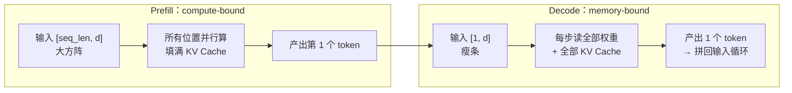
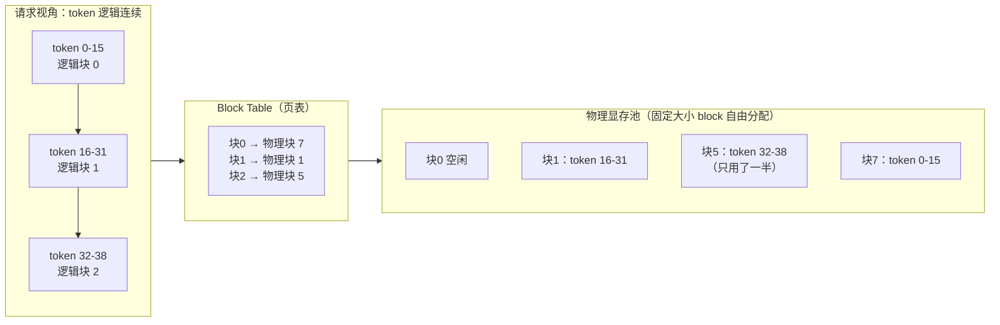
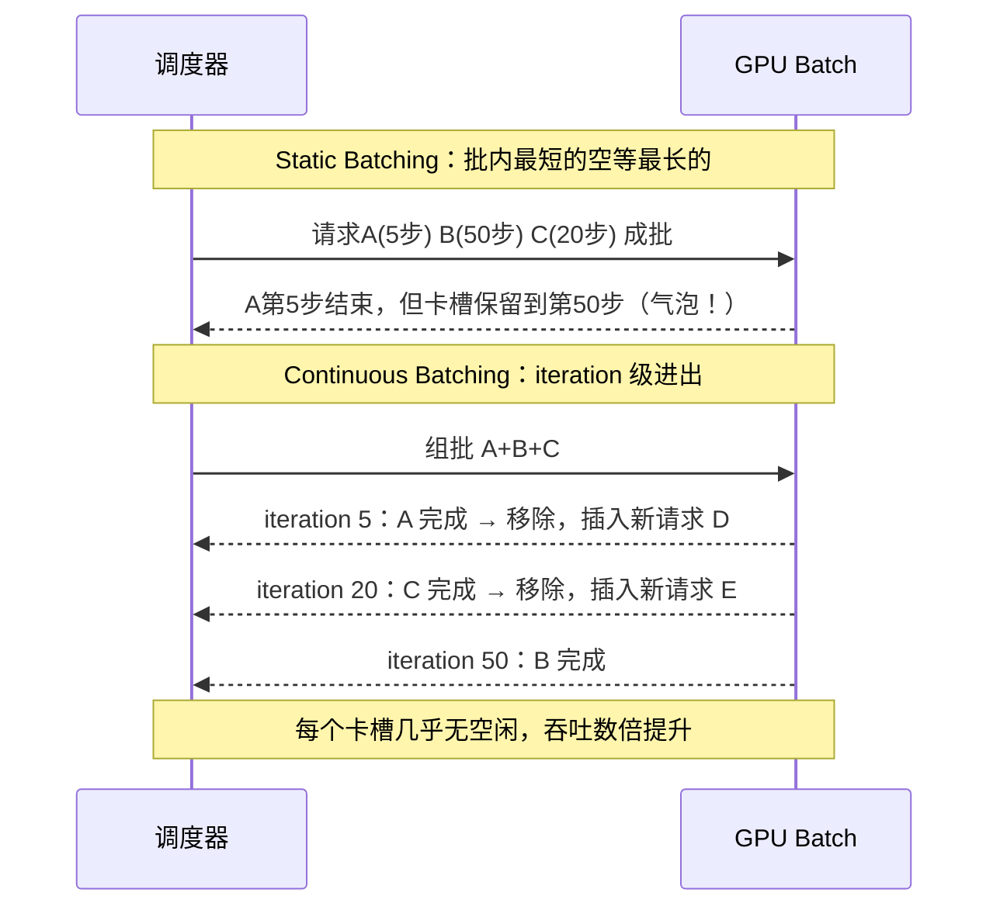
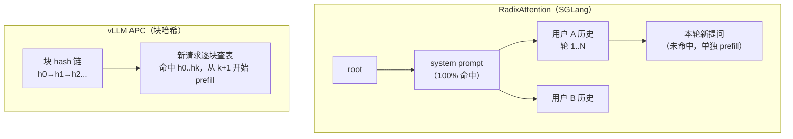
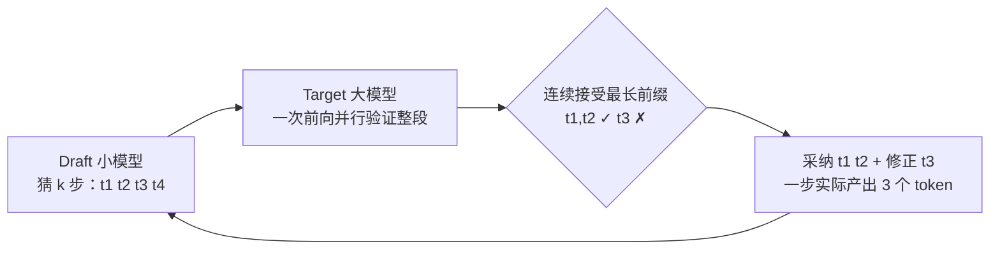
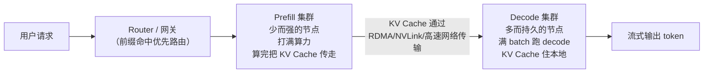

# vLLM 与推理加速核心

> 推理部署模块的第一篇，AI Infra 岗第一权重。PagedAttention / Continuous Batching
> 是"高"频题，PD 分离和 Prefix Cache 是 2026 升温考点。本文按「直觉 → 原理 →
> 工程取舍 → 面试高频追问」组织，题目标注自
> [高频面试真题汇总](../高频面试真题汇总.md#五推理部署)。
> KV Cache 本身的原理和显存估算在 [LLM 基础模块](../llm基础/transformer与attention.md#四kv-cache-原理与显存估算)
> 已讲透，本文只补"引擎怎么管这些 cache"。

## 一、Prefill 与 Decode：一次推理的两种性格

▶ 面试题：LLM 推理为什么分 prefill 和 decode 两个阶段？——**高频**（推理岗开场题）

自回归推理一次请求走两趟完全不同的路：

- **Prefill（预填充）**：把整段 prompt 一次性并行算完，生成第一个 token，顺手把
  所有位置的 KV Cache 填好。矩阵形状是 `[seq_len, hidden]` 的"大方阵"，
  **计算密集（compute-bound）**——GPU 算力打满。
- **Decode（解码）**：每步只算 1 个新 token 的前向，但必须把**全部权重 + 全部
  KV Cache 从 HBM 读一遍**。矩阵形状是 `[1, hidden]` 的"瘦条"，计算量极小，
  时间全花在搬数据上——**访存密集（memory-bound）**。

### Roofline 直觉

Roofline 模型一句话：**一个 kernel 的快慢，取 min(算力上限, 带宽上限 × 算术强度)**。
算术强度 = 计算量 / 访存量（FLOPs per Byte）。

- Prefill 每个权重被 seq_len 个 token 复用，算术强度高，卡在算力屋顶（拿 A100 说，
  几百 TFLOPS 的 BF16 屋顶）。
- Decode 每个权重只被 1 个 token 用，算 2 次 FLOP 就要搬 2 个字节，算术强度 ≈ 1，
  卡在带宽斜坡上——A100 的 HBM 带宽约 2 TB/s，7B 模型 BF16 权重 14 GB，
  理论上限就是 ~140 tokens/s，再强的算力也没用。

**答题要点**：这个二分是所有推理优化的出发点——prefill 拼算力（换更强的卡、并行
加卡），decode 拼带宽和复用（量化省字节、KV Cache 管理、batch 摊权重读）。
后面整篇文章都是在 decode 的带宽瓶颈上做文章。

## 二、KV Cache 复用（一句话回顾）

Decode 时每步不需要重算历史 token 的 K/V——因果 mask 保证它们不会再变，缓存即可。
KV Cache 是 decode 显存大头，也是 prefill/decode 分家的直接原因。原理、显存估算
公式（`2 × L × n_kv × d_head × bytes`/token）、GQA/MLA 压缩手段，见
[LLM 基础模块-KV Cache](../llm基础/transformer与attention.md#四kv-cache-原理与显存估算)，
本文不重复。本文要讲的是：**这些 cache 在引擎里怎么摆放、怎么调度**。

## 三、PagedAttention：像操作系统管内存一样管 KV Cache

▶ 面试题：vLLM 核心原理？PagedAttention 怎么管理显存？——**极高频**（腾讯/快手/字节）

### 先讲问题

PagedAttention 出现之前，KV Cache 的经典摆放方式是：给每条请求按**最大可能长度**
分配一段**连续**显存。这造成两种浪费（vLLM 论文口径，SOSP 2023）：

1. **内部碎片**：请求没生成到最大长度就结束了，预留的空位闲置；"预留的长度更长，
   实际只用了零头"。
2. **外部碎片**：请求长短不一，释放后留下的空隙越来越大，新请求放不进去。

论文实测：传统方案下真正用于存 token 的显存只占约 **20%~40%**，其余全是碎片和预留。

### 原理：虚拟内存 + 页表

PagedAttention 的灵感直接来自操作系统的**虚拟内存与分页**——这个类比是 vLLM
面试的经典开场，建议原样背下来：

| 操作系统 | PagedAttention |
|---|---|
| 虚拟内存地址空间 | 请求"看起来"连续的 token 序列 |
| 固定大小的物理页（4KB） | 固定大小的 KV **block**（默认每块 16 个 token） |
| 页表（virtual → physical） | **block table**（逻辑块号 → 物理块号） |
| 按需分页 | KV Cache 按需分配，生成多少占多少 |
| 写时复制（COW） | beam search / 并行采样时前缀块共享引用 |

attention 计算时，kernel 拿着 block table 去**物理上不连续**的块里取 K/V，
逻辑上拼成完整序列——所以 attention 本身要改写（这正是"PagedAttention"作为
kernel 名字的原因），vLLM 的 kernel 按 block 粒度索引 cache。

### 收益与共享

- **近乎零浪费**：内存利用率到 96% 以上（论文口径），碎片只发生在每请求最后
  一个不满的块（最多浪费 16 个 token 的 cache）。
- 显存省下来 → batch 可以开大 → 吞吐提升 2~4 倍（vLLM 论文 vs FasterTransformer/
  Orca 的对照口径，量级记住"数倍"即可，别编具体数字）。
- **块级共享**：多条请求共享前缀（system prompt、few-shot 示例）时，前缀块只需
  存一份，多个 block table 指过去；这是后面 Prefix Cache 的地基。

**高频追问**：block 大小为什么是 16 个 token？——权衡：块太大→内部碎片增多；
块太小→block table 变长、kernel 索引开销变大。16 是 vLLM 默认值，可配。

## 四、Continuous Batching：按 iteration 调度，不按请求调度

▶ 面试题：Continuous Batching 原理？为什么提吞吐？——**极高频**（网易/通义 Infra）

### 先讲问题

经典的 **static batching**（整批调度）：凑够 B 条请求一批，跑批里**最长**的那条
生成完，整批才结束、再放下一批进来。问题是：

- 各请求输出长度差异大，短的早就生成完了，但卡槽被占着，陪着最长的那条空转
  （padding / bubble），GPU 利用率难看。

### 原理

Continuous batching（Orca 论文提出，2022）把调度粒度从"**请求级**"降到
"**iteration 级**"：**每生成一步 token，就重新决定下一步的 batch 里装谁**。

- 某条请求生成完了（EOS / 达到 max_tokens）→ **立刻从 batch 移除**，占用的
  KV block 释放。
- 有新请求到达、显存放得下 → **立刻插进 batch** 接着跑下一步。
- batch 组成一直在变，GPU 的卡槽始终装着实实在在干活的请求。

**为什么提吞吐**：消除了"等长对齐"的气泡，decode 阶段 batch size 在大多数时刻
都贴着显存上限跑，而 decode 是 memory-bound——batch 翻倍不增加总的权重读取
（权重在 batch 内共享一份读），等于白赚吞吐量。vLLM、SGLang、TRT-LLM、TGI
今天全都是这个调度的实现。

**工程取舍追问**：要不要等一等再组批？——得配 max waiting time；prefill 和
decode 怎么混在同一批？vLLM 用的是 chunked prefill（把长 prompt 的 prefill 切片
混进 decode 步骤里，缓解大 prefill 抢走 decode 算力导致 TPOT 抖动）——这个词说
出来就很加分。

## 五、Prefix Cache / RadixAttention：多轮对话与同前缀请求的缓存复用

▶ 面试题：Prefix Cache（Radix Tree）命中链路？——**中高，2026 升温考点**（字节底层追问）

问题来源：真实流量里**大量请求共享前缀**——同一个 system prompt、同一个 RAG
上下文、多轮对话的历史轮。之前每来一次请求就把这些前缀 re-prefill 一遍，白烧
算力且 TTFT 居高不下。思路：**按 token 前缀把已算好的 KV Cache 留下来，命中就
跳过 prefill**。

两家实现是面试对比点：

| | vLLM (APC, Automatic Prefix Caching) | SGLang (RadixAttention) |
|---|---|---|
| 数据结构 | 按 block 哈希的 **map**：key 是 (token ids + 前缀hash)，query 时逐块查表 | **Radix Tree（前缀树）**：节点是 token 序列段，边上是 KV 指针 |
| 命中粒度 | block 对齐（默认 16 token 的倍数） | 任意前缀长度（树本身逐 token/段共享） |
| 淘汰策略 | 引用计数 + LRU | 树节点的 LRU 驱逐 |
| 多轮对话 | 每轮请求重命中历史轮的共同前缀 | 天然贴合——对话历史就是一条从根走下去的路径 |
| 额外亮点 | 简单，工程改动小 | RadixAttention + cache-aware 调度（把命中最高的请求优先排），号称 tree 结构对 Agent 多轮/分支 rollout 尤其有利 |

**答法要点**：核心一句话——**"把 prefill 的重复计算变成一次哈希/树查询，以
显存换 TTFT"**。命中越高，TTFT 越低；代价是额外占用 KV 显存（和可用 batch 抢
资源，所以都得配淘汰策略）。2026 年 PD 分离落地后，prefix cache 下沉到
CPU/SSD 做分层（DRAM→HBM 两级缓存）是各家框架的新战场，字节面试已考到
"KV 下沉 SSD 要不要过主存"。

## 六、Speculative Decoding：小模型猜、大模型验

▶ 面试题：推测解码原理？不适用哪些场景？——**中高**

### 直觉

Decode 慢的根子是**串行**：一次只能生成一个 token，但 GPU 明明有闲算力。
Speculative decoding 用一个小模型
（draft model，或者 Medusa/EAGLE 这种在目标模型头上加猜想的变体）
先**猜 k 个 token**，然后让目标大模型把这 k 个 token **并行一次前向验证**——
前缀中连续猜对的就**免费采纳**（不花额外前向），第一个猜错的地方截断重来。

### 为什么有效（关键数学）

- 大模型并行验证 k 个 token 的成本 ≈ 跑 1 次单 token 前向（prefill 性质，比串行 k 次便宜近 k 倍）。
- 每一步**期望接受长度** > 1，吞吐就提升；接受率由 draft 和 target 分布的接近程度决定。
- **输出分布不变**：验证步用的是目标模型的分布 + rejection sampling 修补，数学上和无推测完全一致——这是 answer 里必须声明的："提吞吐、不掉质量"。

**不适用场景**（面试高频追问）：

1. **batch 已经很大、算力打满时**：推测的价值是把 decode 从 memory-bound 变成
   半 compute-bound，拿闲算力换低延迟；batch 一大、GPU 已经 compute-bound，
   验证成本就不再免费，反而可能掉吞吐——所以推测解码是**低负载/在线低延迟**
   场景的武器，不是高吞吐场景。
2. **draft 和 target 分布差太远**（小模型太弱、领域迁移大）：接受率低，全白算。
3. **温度高/采样很随机**的生成：验证接受率显著下降。
4. 需要**严格复现输出**时，某些实现有数值细节差异，要说明实现是 lossless 的。

**变体提一嘴**（区分度点）：Medusa（加多个 LM head 并行猜多个位置，不用单独
小模型）、EAGLE（在特征层面自回归猜，接受率更高）、self-speculative（跳过层）；

## 七、PD 分离：Prefill 和 Decode 为什么要拆成两套集群

▶ 面试题：PD 分离（Prefill/Decode Disaggregation）是什么？为什么提升整体吞吐？——**中高，2026 升温考点**

直觉回忆第一节：prefill 是 compute-bound、decode 是 memory-bound，**是同一块
GPU 上的两个互相掐架的角色**。长 prompt 进来一次大 prefill，会把同卡 decode 的
TPOT 拉出一个毛刺（chunked prefill 缓解但不消灭）；长 context 下 KV cache 又和
decode batch 抢显存。治理思路：**分开部署**。

- **好处**：两类节点独立扩缩容、独立做 SLA（prefill 对 TTFT，decode 对 TPOT）、
  prefill 不再把 decode 延迟拉毛刺；还能做"prefill 用算力型卡、decode 用大显存卡"
  的异构搭配。
- **代价/门槛**：KV Cache 的跨节点传输成了新瓶颈，要靠 NVLink/RDMA/napkin 里的
  transfer engine（如 Mooncake、NIXL 等开源实现）把传输藏到 decode 间隙里；
  调度器也多了一层"哪个 prefill 节点算、KV 寄到哪里"的复杂度。
- **2026 现状**：DeepSeek、Moonshot（Mooncake）、DistServe/Splitwise 论文一派，
  vLLM/SGLang 都内置了 PD 分离支持，生产落地案例显著增多——**这是今年推理岗
  升温最快的话题**，简历项目有就写上去。

**答题节奏**：先两阶段 bound 相反 → 同卡互害（TTFT 抢 TPOT、cache 抢显存） →
拆开独立扩缩 + 异构 → 代价是 KV 传输，所以传输引擎和网络是灵魂 → 落到见闻
（Mooncake / vLLM P2P / SGLang PD Serve）。

## 八、吞吐 vs 延迟：TTFT / TPOT / ITL 指标必须脱口而出

▶ 面试题：吞吐 vs 延迟怎么 trade-off？线上延迟怎么优化？——**极高频**（推理岗必考）

先把三个延迟指标的定义背到条件反射（面试必问定义）：

| 指标 | 定义 | 受什么影响 |
|---|---|---|
| **TTFT** (Time To First Token) | 请求到收到第一个 token 的时间 = 排队 + **prefill** | prompt 长度、prefix cache 命中、PD 分离的 prefill 调度 |
| **TPOT** (Time Per Output Token) | decode 阶段平均每步的延迟 | batch size、模型/卡、KV cache 命读写、量化 |
| **ITL** (Inter-Token Latency) | 相邻两个 token 之间的间隔序列 | 调度抖动、prefill 插入抢算力（chunked prefill 就是要压它） |

TTLT（总时延）≈ TTFT + TPOT × 输出长度。E2E 延迟和 THROUGHPUT 的 trade-off：

- **大 batch → 高吞吐但高 TPOT**：decode 是 memory-bound，batch 翻倍增吞吐
  几乎不增成本，但每步延迟会缓慢上升（读 KV cache 和计算都在涨）。
- **优化套路**：TTFT 用 prefix cache / 分流长 prompt / PD 分离；TPOT 用 continuous
  batching 开大 batch、量化、更好的 kernel；ITL 用 chunked prefill 压毛刺。
- 延迟优化一句话答法："**先测 TTFT/TPOT 拆解定段，再在对应段落选武器**"——
  prefill 段（prefix cache、chunked prefill、PD 分离）或 decode 段（batching、
  量化、推测解码、GQA/MLA、更好的 kernel）。

## 九、SSE / WebSocket：流式输出怎么到用户

▶ 面试题：逐 token 流式输出底层什么协议？——**中**（美团/蔚来）

生成一段文字要秒级乃至十几秒，用户体验上必须每出一个 token 就推给前端。
可选协议：

| | SSE (Server-Sent Events) | WebSocket | WebRTC |
|---|---|---|---|
| 通道 | 单向：服务器 → 客户端，HTTP 长连接 | 双向、全双工 TCP | 面向音视频，P2P/实时媒体 |
| 协议成本 | 极轻，纯 HTTP/1.1 可用，`text/event-stream` | 握手升级，有帧协议 | 重 |
| LLM 场景 | **主流**（OpenAI/Claude/Kimi API 全是 SSE） | 适合需要双向（如语音流式输入 + 输出同一条连接） | 几乎不用 |

**答法要点**：LLM 推理的流式输出**天然单向**（用户发完 prompt 后只需接收 token），
SSE 足够、无连接升级成本、天然走 HTTP 代理友好、断线可 `last-event-id` 续。
只有在同一条连接上还要反向流式（语音实时上传）时才需要 WebSocket。这是"懂
工程"和"背八股"的分水岭题，答出取舍即可。

## 十、高频追问清单（本主题）

| 追问 | 答题要点 |
|---|---|
| Continuous batching 和 PagedAttention 的关系？ | 正交但互相成就：CB 要求请求能**随时进出 batch**→ KV cache 必须灵活分配/释放，这正是 PagedAttention 的非连续块式管理给的能力；vLLM 把两件事做成了一个引擎。 |
| batch size 为什么不能无限开？ | 受 KV cache 显存上限约束；且 TPOT 会随 batch 上升，SLO 约束下存在最优点。PD 分离后 decode 节点可跑到更大 batch。 |
| chunked prefill 解决什么？ | 避免一个大 prefill 把 batch 里 decode 的 TPOT/ITL 拉毛刺：把长 prompt 的 prefill 切成块，穿插在 decode iteration 之间做。 |
| Prefix cache 和 PagedAttention 共享块是一回事吗？ | 是底座与应用：PagedAttention 的块可以引用计数共享，Prefix cache 在其上做"按 token 前缀的索引 + 命中查询"。 |
| 推测解码的接受率怎么提？ | 小模型选型接近原分布（蒸馏自同款基座）、加上下文相关的 token 树验证（一次验证多条候选路径）、用 Medusa/EAGLE 类让 draft 更"懂" target。 |
| PD 分离后 KV 怎么传？ | 专门 KV transfer 层：P2P/NCCL/RDMA；分层缓存（HBM→DRAM→SSD）；prefill 完提前异步传输，藏在 decode 间隙。 |

---

*读书建议：本模块 3 篇的分散知识点，系统串联看 [学习资源清单](../../resources/学习资源清单.md)
里 vLLM / SGLang / 推理系统一节的论文列表。手撕 CUDA 算子（RMSNorm/Online
Softmax/SwiGLU）进 [coding/](../../coding/)。*
