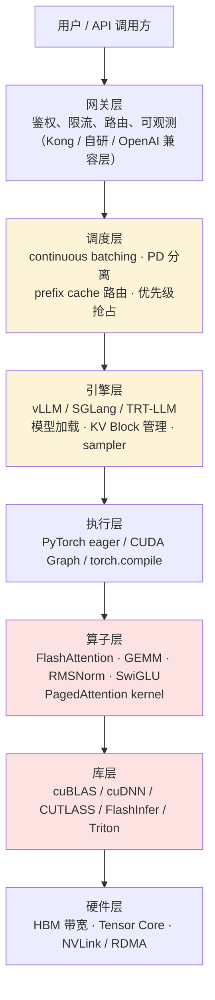
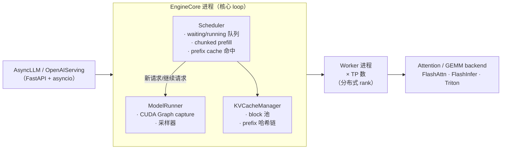
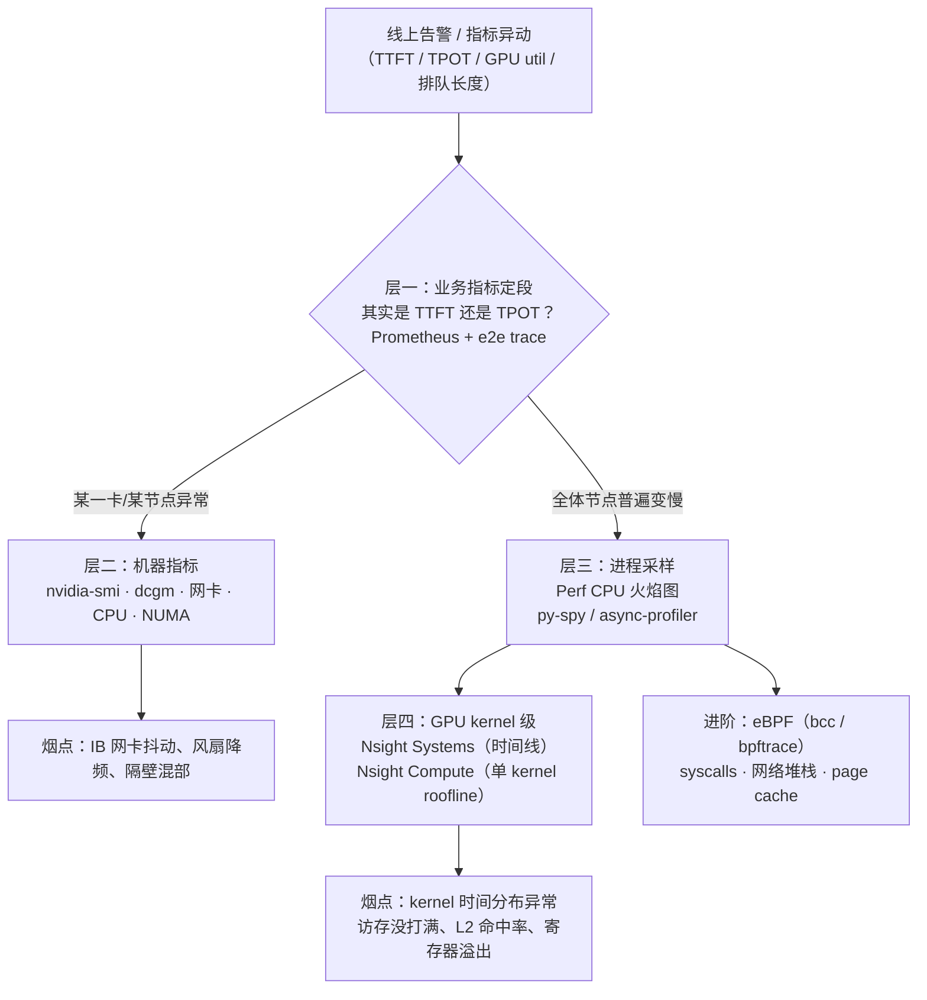

# 推理引擎选型与源码路线

> 推理部署模块第三篇。vLLM/SGLang/TRT-LLM 三件套选型是 JD 原文钦定考点
> （见 [JD 分析-AI Infra 岗](../../resources/jd分析-ai-infra岗.md)），工程上"读过
> vLLM / SGLang 源码"和"会 Nsight 定位"是面试里最能拉开差距的两件事。本文分
> 选型、技术栈分层、源码路线、CUDA 手撕预告、性能分析五段。

## 一、主流引擎怎么选

▶ 面试题：vLLM / SGLang / TGI / llama.cpp / TRT-LLM 怎么选型？——**中高**（快手/美团）

| 引擎 | 定位 | 语言/底层 | 核心特点 | 什么时候选 |
|---|---|---|---|---|
| **vLLM** | 通用云侧 serving 事实标准 | Python + CUDA（V1 起 Rust 介入少） | PagedAttention 发明者、continuous batching、prefix cache、PD 分离、生态最大、模型上新最快 | **默认答案**：云侧 API、私有化部署、需要快速跟进新模型 |
| **SGLang** | 高吞吐 + 复杂生成结构 | Python + CUDA | RadixAttention（前缀树 cache）、结构化生成（constrained decoding）、多轮 Agent 流量友好、RadixCache、Lora 多租户 | 多轮对话/Agent/结构化输出重的业务；前缀复用高 |
| **TensorRT-LLM** | NVIDIA 官方极限优化 | C++ + CUDA（Python binding） | 深度 CUDA kernel 优化、FP8/INT4 支持最早、in-flight batching、TRT-LLM + Triton 部署栈 | 追极致单卡性能、机柜全是 N 卡、有 C++ 算法工程化能力 |
| **TGI** | Hugging Face 出品 | Rust + Python | 与 HF 生态/MODELS 无缝集成、稳定但迭代慢于 vLLM | 已经在 HF 栈里、想要最小接入成本 |
| **LMDeploy** | 上海 AI Lab | Python + CUDA | 国产模型适配好（InternLM/Qwen）、TurboMind 引擎、中文文档全 | 国内团队/国产模型栈/实习项目 |
| **llama.cpp** | 端侧/CPU/边缘 | C/C++（ggml） | GGUF 格式 + k-quants、Mac/iPhone 也能跑、几乎零依赖 | 端侧、M 系列 Mac、CPU-only 环境、demo |
| **MindIE / MLC / Ollama** | 各自领域 | — | 华为昇腾、跨平台、本地玩具 | 视硬件生态 |

**选型一句话**：云侧服务化默认 **vLLM** 兜底；前缀复用极高的 Agent/多轮对话看
**SGLang**；极限 N 卡性能或定制 kernel 关注 **TRT-LLM**；端侧 **llama.cpp**；
国内栈/快速上手 **LMDeploy**。答出"为什么不是 TGI"（迭代速度、生态落后）比
背对比表更有说服力。

## 二、技术栈全景：从用户请求到 CUDA kernel

▶ 面试铺垫题：一个推理请求走哪些层？（常被用来决定往哪追问）

面试时这张图的用法：

- 问"吞吐怎么提"→ 调度层 + 引擎层（batching、paged、prefix、PD）。
- 问"单步延迟"→ 算子层 + 库层 + 硬件层（kernel、CUDA Graph、tensor core 利用率）。
- 问"线上毛刺"→ 网关层 + 调度层（ITL/排队、预热、抢占、优先级）。
- 问"CUDA 手撕"→ 直接被带进算子层往下（第四节）。

## 三、源码学习路线：从 1200 行复刻开始

> 配套专题：[源码解读/](./源码解读/README.md)——一个请求经过 vLLM / SGLang
> 引擎的全过程逐段源码溯源（全景时序图、进程架构、数据结构卡片、面试追问证据清单，
> 文件路径均实测核实到 2026-10 主干）。

▶ 面试题：看过 vLLM 源码吗？（很多面试官直接这么问）——**中高**

### Step 1：nano-vllm（约 1200 行 Python）

[学习资源清单](../../resources/学习资源清单.md#15-推理引擎源码)已验证收录——
nano-vllm 用 ~1200 行手写 PagedAttention + continuous batching + CUDA Graph +
prefix cache 的最小可用 vLLM。**建议做到「每个文件能默画出模块图」**，这是一周
内把"读过 vLLM"变成"懂 vLLM"的最快路径。顺序建议：

1. `engine/`：LLMEngine + Scheduler 的核心循环（encode → schedule →
   execute → detokenize），理解 CB 怎么在 iteration 粒度增删请求。
2. `core/`：Block / BlockManager / BlockAllocator，对应 PagedAttention 那一节，
   能默写 block table 更新过程。
3. `kernel/` 调用：FlashAttention/FlashInfer 的入口长什么样。

### Step 2：vLLM V1 engine 结构

V1 比早期 monocore 版本大重构（2025 起），读之前先建立坐标系：

读法建议：

- 入口：`vllm/v1/engine/llm_engine.py` 的 `step()` → Scheduler 的 `schedule()` →
  返回的 `SchedulerOutput` 是怎么喂给 ModelRunner 的——把这条主线读透足以应对
  "CB 是怎么实现的"的深挖。
- 关键文件：`scheduler.py`、`kv_cache_manager.py`、`gpu_model_runner.py`。
- prefix cache：`kv_cache_utils.py` 里的 block 哈希链，和西五节的 APC 对照。
- **读源码的目标不是背代码**，是能跟面试官在**调度、cache、kernel 三层**都聊
  得动——这三层对应第一节的全景图。

### Step 3：SGLang RadixAttention

对照 vLLM APC 单独读：

- `python/sglang/srt/mem_cache/radix_cache.py`：radix tree 的 insert/match/evict，
  呼应 vLLM 对比表。
- cache-aware 调度策略（请求按"预期命中前缀"排序），是 SGLang 调度层的特色。
- 结构化生成 backend（outlines/xgrammar 集成），是它的差异化护城河。

### Step 4：TensorRT-LLM

C++ 工程、门槛更高，建议按需读：

- 入口：`cpp/tensorrt_llm/executors/`（in-flight batching 的实现），
  对照 vLLM Scheduler。
- kernel 目录：`cpp/tensorrt_llm/kernels/`，当 CUDA 手撕的语料库——
  fused decoding attention、fp8 GEMM。
- 官方推荐的"阅读地图"和博客在
  [学习资源清单](../../resources/学习资源清单.md) 里有收口。

**要不要给框架提 PR**：vLLM/SGLang 的贡献是 JD 明文加分项（3 家点名）。
从"文档 typo / 测试修复 / 小 kernel / sampler fix"起步，过一两个 PR 就是一种简历
硬通货。

## 四、CUDA Kernel 面试点预告（→ coding/）

▶ 面试题：手撕 RMSNorm / Online Softmax / SwiGLU CUDA 算子——**中高**（滴滴/字节 Infra 一面常客）

这三题的设计不是让你写最优 kernel，是看**访存与归约**基本功：

| 题 | 考点 | 关键技巧 |
|---|---|---|
| **RMSNorm** | 归约 kernel 写法 | block 内 warp shuffle 归约、一次访存算 sum(x²)、注意除法折点 |
| **Online Softmax** | 分块 + 在线更新 | 维护 running max m 和 running sum ℓ，新块先缩放再并入（是 FlashAttention 的"原子件"，[基础模块提过思想](../llm基础/transformer与attention.md#五flashattention把-o-n-显存压成-o-n)） |
| **SwiGLU** | element-wise 融合 | y = (x₁ ⊙ sigmoid(x₁)) ⊙ x₂，一行 kernel，但要求写对一个 thread 处理多元素的 grid-stride 循环 |

回踩的方式：在 PyTorch eager 里跑一份 kernel benchmark，被问"性能"时就敢报
"访存 bound、多少 GB/s 实测、还差 roofline 多少"——这比背"FlashAttention
更快"高一个段位。

**练习清单（指向 [coding/](../../coding/)）**：

1. PyTorch 手写 RMSNorm + 对照 `F.rms_norm` 数值正确性。
2. Triton 或 CUDA C 写 RMSNorm / softmax / online softmax / SwiGLU 四件套。
3. 进阶：写一个**最简单的 PagedAttention-style attention kernel**（逻辑 block
   查表索引），把第五节 PagedAttention 的块表和真正的 kernel 串起来。

## 五、性能分析方法论：Nsight / Perf / eBPF

▶ 面试题："线上 ttft 突然翻倍怎么定位？"——**极高频**（字节推理岗 JD 明文要求）

按"从粗到细"的层级推进，答出这套**排查树**就是 JD 要求的"全链路性能分析"：

各工具一句话用法（面试要会说）：

- **Nsight Systems**：全系统时间线，看 CPU/GPU 调度间隙、kernel 空隙、bubble；
  答"为什么 CUDA Graph 后还有空隙"靠它。
- **Nsight Compute**：单 kernel 深潜，roofline 分析、访存利用率、occupancy——
  CUDA 手撕题优化段的灵魂。
- **Perf / py-spy**：CPU 侧火焰图，找 Python 解释器/tokenizer/detokenizer 热点。
- **eBPF**：零侵入观测内核态（page cache 命中、syscall、TCP），字节 JD 直接
  点名——会用它说明你在生产环境做过真排查，比会背名词值钱 10 倍。
- **PyTorch Profiler / torch.compile 日志**：模型层视角，通常先拿它排除
  "是不是某个 op 退化成 eager"这类低级错误。

**回答模板**：先分 TTFT vs TPOT 段定位 → 层二排除硬件/混部 → profiler 上分
（CPU/GPU 各一侧）→ 烟点落到具体 kernel 或调度参数 → 改动 + 灰度验证。
**数字记 2 个**：线上有排队的时候大概 GPU util 百分位；kernel 占 e2e 的比例；
说出你自己项目里某一两个实测数字即可。

## 六、高频追问清单（本主题）

| 追问 | 答题要点 |
|---|---|
| vLLM 和 SGLang 本质区别？ | SGLang = RadixAttention（树形前缀复用）+ 结构化生成 + cache-aware 调度；vLLM = 块哈希 APC + 生态大小 + V1 模块化彻底。前者对 Agent/多轮友好，后者是新模型跟进和生产稳定性首选。 |
| TRT-LLM 为什么极限性能更强？ | C++ 调度栈 + NVIDIA 官方 kernel 第一手优化 + 对硬件特性的最近接入（FP8/Sparse），代价是工程门槛和模型跟进速度。 |
| 模型上新用哪个最快？ | vLLM（社区响应速度）> LMDeploy（国产模型）> SGLang > TRT-LLM > TGI。 |
| CUDA Graph 在引擎里干什么？ | 固定 shape 重复执行的 kernel 序列录制成"图"，一次 launch 多次 replay，消灭 CPU launch 开销；decode 小 batch 阶段收益显著。 |
| TP=4 时 vLLM 是怎么并行的？ | Worker 按 rank 切分权重（列/行切 GEMM）、all-reduce/RS+AG 通信；面试深挖会引到分布式训练模块的 TP 八股（3D 并行、通信量计算）。 |
| tokenizer 也会是瓶颈？ | 会——Python HF tokenizer 在高吞吐下能吃掉几个百分点 CPU；工程上用 fast tokenizer 批化或往 C++ 侧下沉。 |

---

*配套阅读：[vllm与推理加速核心.md](./vllm与推理加速核心.md)（引擎内算法原理）
· [量化与压缩.md](./量化与压缩.md)（引擎共同支持的量化路径）。
资源导航见 [学习资源清单](../../resources/学习资源清单.md) 的 §1.5 推理引擎源码
与 §五 论文清单"推理系统"组。*
