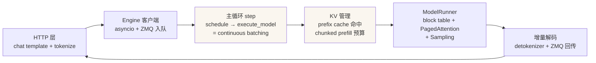

# 源码解读专题：一个请求经过推理引擎的全过程

> 从 `POST /v1/chat/completions` 到最后一个 token 流出，逐段溯源两大主流推理引擎的
> 主干源码。所有文件路径/类名均为 **2026-10 实测核实**（raw.githubusercontent.com 抓取确认），
> 见各文档末尾的核实声明清单。

## 目录

| 文档 | 内容 | 关键看点 |
|---|---|---|
| [源码学习路线图.md](源码学习路线图.md) | 怎么学 | **从原理框架 → nano-vllm → vLLM 主线 → SGLang 对照 → 专题深挖，4-5 周渐进路径，每级带验收标准与 3 天冲刺版** |
| [vllm 请求全链路.md](vllm请求全链路.md) | vLLM（V1 架构，V0 已移除） | AsyncLLM → EngineCore 主循环（continuous batching 落点）→ Scheduler + KVCacheManager（prefix cache、chunked prefill、抢占）→ ModelRunner → 增量解码输出 |
| [sglang 请求全链路.md](sglang请求全链路.md) | SGLang（main，v0.5.21 口径） | 三进程流水线（tokenizer/scheduler/detokenizer）→ event loop 与 batch 调度 → **RadixCache 深挖**（SGLang 杀手特性落点）→ PD 分离入口 |

## 建议读法

1. 先读 [../vllm与推理加速核心.md](../vllm与推理加速核心.md) 建立原理框架
   （PagedAttention / Continuous Batching / Prefix Cache），再回到本专题看源码落点。
2. 每篇每段有「▶ 面试追问」，把追问和代码证据一起记，而不是只背概念。
3. 两引擎的架构差异对照表在 SGLang 篇第二节；面试问"vLLM 和 SGLang 区别"
   时，答原理层（RadixTree vs block hash）+ 进程层（三进程 vs EngineCore 双进程）两层。

## 面试速记：一个请求的关键落点

一句话版：**一个请求 = 被 tokenize → 排队 → 被 schedule 成 batch 的一员 →
在 GPU 上和其他几十个请求共享一次 forward → 采出一个 token → 增量解码流回；
下一个 iteration 再来一遍。**

引擎之间 80% 的差异在第 3、4 步（怎么调度、怎么管理 KV），原理见模块文档，
源码见本专题。
