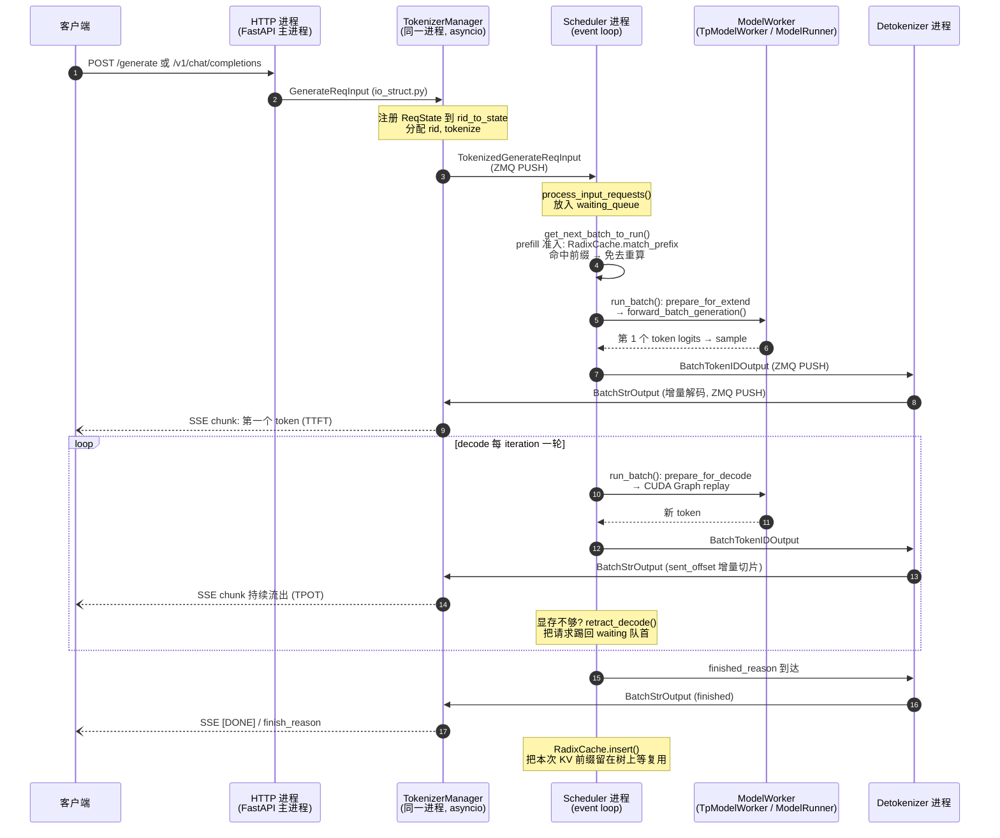
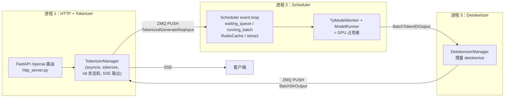
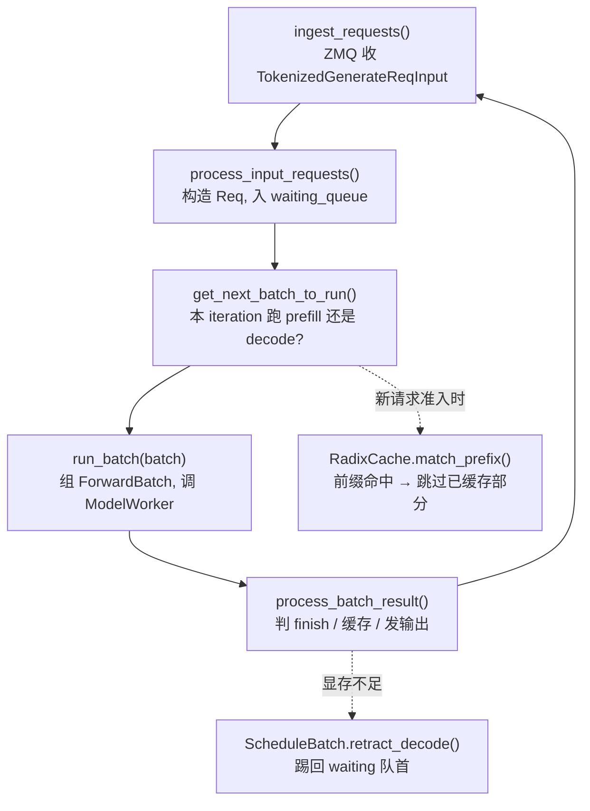
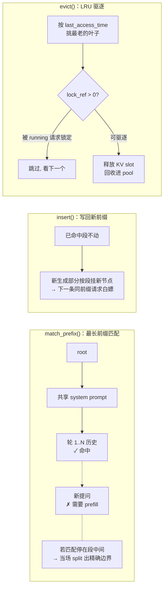

# SGLang 源码解读：一个请求的全链路

> 源码解读系列 SGLang 篇。原理口径（RadixAttention / continuous batching / PD 分离）以
> [vllm与推理加速核心](../vllm与推理加速核心.md) 为准，本文只讲"这些原理在 SGLang 代码里
> 长什么样"；vLLM 的对照解读见 [vllm请求全链路](./vllm请求全链路.md)。
> 版本口径：**sgl-project/sglang main 分支，2026-10 现场核实**（最近稳定 release v0.5.21），
> 所有路径/类名/函数名均逐一抓取确认，详见文末核实声明。

面试里"读过源码"和"知道原理"是两个段位。本文按一个请求的完整旅程组织：
`POST /generate` → TokenizerManager →（ZMQ）→ Scheduler → ModelWorker →
DetokenizerManager → SSE 流回客户端。每一段都给"文件路径 + 类/函数"的坐标，
读完你能对着 GitHub 自己走一遍。

## 一、全景：一个请求的完整旅程

▶ 面试追问：一个推理请求从 HTTP 到流出 token 经过哪些组件？——这是推理岗最常用的开场图，
SGLang 答法的特色是**三进程流水线 + RadixAttention 命中点**。

一句话背下来：**HTTP 层只管协议，TokenizerManager 管"请求生命周期状态"，
Scheduler 管"每个 iteration 谁上 GPU"，DetokenizerManager 管"token ids 怎么变回增量文本"，
四者之间全是 ZMQ 消息，没有一个函数跨进程直接调用。**

## 二、进程架构：三进程流水线，为什么这么拆

▶ 面试追问：SGLang 为什么要拆成多个进程？直接在 HTTP 进程里跑模型不行吗？

拆分理由，按重要性排：

1. **Python GIL**。进程是最暴力的 GIL 绕法：Scheduler 的 event loop 是计算密集的主循环，
   tokenizer/detokenize 是 CPU 密集的字符串活，HTTP 是 asyncio IO 活——三类负载放三个进程，
   各占一个核，互不阻塞。
2. **tokenizer/detokenizer 是 CPU 密集**，而且高吞吐下不是小开销（HF tokenizer 能吃掉好几个
   百分点 CPU，[选型篇也提过](../推理引擎选型与源码路线.md)）。拆出去后 GPU 进程的 CPU 时间
   全留给调度。
3. **ZMQ PUSH/PULL 管道**天然解耦速率：任何一个环节偶发抖动不会反向卡死上游，消息在管道里
   排队。代码落点在 `python/sglang/srt/managers/tokenizer_manager.py`（`send_to_scheduler`:
   ZMQ PUSH 到 `scheduler_input_ipc_name`）和
   `python/sglang/srt/managers/detokenizer_manager.py`（`recv_from_scheduler`: ZMQ PULL）。
4. Scheduler 进程同时是 **GPU 的宿主**（TpModelWorker 就在 Scheduler 进程里运行），这样
   调度和前向之间零 IPC——这是和 vLLM 最大的架构差异之一。

### 与 vLLM 架构的差异对比

| 维度 | SGLang | vLLM (V1) |
|---|---|---|
| 进程划分 | HTTP/Tokenizer 进程 + Scheduler 进程（含 ModelWorker）+ Detokenizer 进程 | API 进程（AsyncLLM）+ EngineCore 进程（Scheduler+ModelRunner）+ TP Worker 子进程 |
| 前端协议层位置 | TokenizerManager 与 FastAPI 同进程（asyncio 共享事件循环） | API 层独立，经 ZMQ 喂 EngineCore |
| 调度循环 | `event_loop_normal` / `event_loop_overlap` 双轮换位 | `EngineCore.step()` 单循环 |
| 前缀缓存数据结构 | Radix Tree（`RadixCache`，任意长度前缀 + LRU） | 块哈希链（KVCacheManager，block 对齐） |
| scheduler-worker 间通信 | 同进程函数调用（再按 TP 情况跨进程） | 同进程调用 + TP rank 间通信用 NCCL/shm |
| 请求标识状态 | `rid_to_state: Dict[str, ReqState]` | `request_id` + output queue |

vLLM 侧的细节不再展开，对照阅读 [vllm请求全链路](./vllm请求全链路.md)。

## 三、分段源码溯源

### a. API 层：FastAPI → TokenizerManager → ZMQ

▶ 面试追问：OpenAI 兼容接口和原生 /generate 是不是两套链路？abort 又是怎么传达的？

- 入口：`python/sglang/srt/entrypoints/http_server.py`。FastAPI app 里
  `/generate` 挂在 `generate_request()`（`@app.api_route("/generate", ...)`），
  OpenAI 兼容层在 `python/sglang/srt/entrypoints/openai/serving_chat.py::OpenAIServingChat`
  等 `OpenAIServing*` 家族——它们只是把协议翻译成内部请求对象，**最终汇进同一条
  TokenizerManager 通路**，不存在两套引擎。
- 请求对象：`python/sglang/srt/managers/io_struct.py::GenerateReqInput` —— 带
  text/input_ids、sampling_params、stream 标志的 dataclass 风格结构（msgspec 序列化）。
- `python/sglang/srt/managers/tokenizer_manager.py::TokenizerManager.generate_request()`：
  为请求分配 rid，在 `self.rid_to_state: Dict[str, ReqState]` 里注册这条请求的 asyncio
  状态机（`ReqState`：output 列表、finished 标志、event），然后 tokenize 得到
  `TokenizedGenerateReqInput`（io_struct.py），经 `_send_one_request()` →
  `sock_send(self.send_to_scheduler, obj)` 推给 Scheduler。HTTP 侧随后在这个
  asyncio event 上等结果，流式时逐 chunk yield 成 SSE（FastAPI StreamingResponse）。
- **abort 机制**：客户端断连被 tokenizer_manager 的 handle coroutine 捕获后，调
  `TokenizerManager.abort_request()`，构造 `AbortReq`（io_struct.py）经同一条 ZMQ
  发给 Scheduler；Scheduler 在该请求所在 batch 里把它标记 finish 并回收 KV 引用。
  全程不需要进程间锁——消息即指令。

关键数据结构：`GenerateReqInput`（用户视角）→ `TokenizedGenerateReqInput`（加了
token ids 和配额信息，真正跨进 Scheduler 的格式）→ `ReqState`（HTTP 侧状态机）。

### b. Scheduler event loop：每个 iteration 谁上 GPU

▶ 面试追问：continuous batching 在 SGLang 里是哪个函数？prefill 和 decode 怎么混排？
retraction（请求回退）是什么？

主循环：`python/sglang/srt/managers/scheduler.py::Scheduler.event_loop_normal()`，
一轮 iteration 五步，结构非常干净：

分步看：

1. **收请求**：`ingest_requests()` / `process_input_requests()` 把 ZMQ 消息还原成
   `Req`（`python/sglang/srt/managers/schedule_batch.py::Req`，一个 Req 就是一条请求的
   完整档案：origin_input_ids、output_ids、KV 指针、stop 条件），进 `waiting_queue`。
2. **出 batch**：`Scheduler.get_next_batch_to_run()` 返回 `NextBatchPlan`
   （schedule_batch.py）。决策逻辑：
   - 先把上一轮 prefill 完成的 `last_batch` 合并进 `running_batch`（extend → decode 的
     过渡就发生在这里，finished 的请求被滤掉）；
   - `get_new_batch_prefill()` 用 `SchedulePolicy`（见下）从 waiting_queue 里拣请求，
     受 token 预算和 batch 上限约束；拣选时调用 `RadixCache.match_prefix()` 算前缀命中——
     **这就是 RadixAttention 这个杀手特性的落点**；
   - 显存挤了：在 decode 侧 `batch.check_decode_mem()` 失败时调
     `batch.retract_decode()`，把后到的 decode 请求**踢回 waiting 队首**
     （`_add_request_to_queue(req, is_retracted=True)`），释放的 KV 让先到的 decode 继续跑。
     retraction 机制在 main 分支上对 PD 分离的 decode 端还有专门的
     "retraction backup"（`kv_cache_builder.resolve_decode_retraction_backup()`）——
     因为 PD decode 侧的请求没有原始 prompt 可重算，被踢前得先备份 KV。
3. **跑**：`run_batch(batch)` 里 `batch.prepare_for_extend()` /
   `batch.prepare_for_decode()`（schedule_batch.py）把 ScheduleBatch 变成
   `ForwardBatch`（`python/sglang/srt/model_executor/forward_batch_info.py`），
   `forward_mode` 取 `ForwardMode.EXTEND / DECODE / MIXED`（同文件枚举），然后调 ModelWorker。
4. **收场**：`process_batch_result()` 走
   `scheduler_components/batch_result_processor.py::SchedulerBatchResultProcessor`
   分流 decode/prefill 结果：append token、查停止条件（finish_reason）、更新 RadixCache
   引用与插入、累计 metrics，最后
   `scheduler_components/output_streamer.py` 把本步输出打包成
   `BatchTokenIDOutput`（io_struct.py）经 `send_to_detokenizer` 推出。
5. **overlap**:`Scheduler.event_loop_overlap()` 是另一条循环——把上一批的
   CPU 收尾（process_batch_result）压到下一批的 GPU forward 底下做，用一个
   `result_queue` deque 实现两批流水。面试提一句"main 分支默认玩 schedule/GPU overlap
   双批流水"就是读了代码的证据。

**排进 prefill 的拣选策略**在 `python/sglang/srt/managers/schedule_policy.py`：

- `CacheAwarePolicy`（绕不过 RadixCache 的四种）：`LPM`（longest prefix match，
  命中最多的先来）、`DFS_WEIGHT`（树深度加权）、`HRRN`（token 级 aging 的
  highest response ratio next，防饿死）、`SHORTEST_PREFILL_FIRST`。
- `CacheAgnosticPolicy`：`FCFS / LOF / RANDOM / ROUTING_KEY`。
- `PrefillAdder` 是这个策略的执行体；被 retract 的请求靠 HRRN 的 aging 优先获得重准入——
  这是 SGLang 解决"踢回去会不会饿死"的答案。

优先级抢占：`Scheduler` 里还有 `enable_priority_preemption` 开关，高优先级请求到来时
可以打断低优先级的运行中请求，答"多租户/不同 SLA 流量怎么混"时可用上。

### c. ModelWorker：真正碰 GPU 的那一层

▶ 面试追问：attention backend 怎么选的？CUDA Graph 在哪个文件？speculative 放哪？

- `python/sglang/srt/managers/tp_worker.py::TpModelWorker.forward_batch_generation()`
  是被 `run_batch()` 调用的入口：拿着 ForwardBatch 走 ModelRunner 前向 + 采样；
  `BaseTpWorker` 抽象在同一文件，方便加别的 worker 类型。
- `python/sglang/srt/model_executor/model_runner.py::ModelRunner` 是模型宿主：加载权重、
  持有 attention backend 和 token pool、执行 forward。TP 场景下每个 rank 一份 ModelRunner。
- **attention backend** 是可插拔的，目录 `python/sglang/srt/layers/attention/` 下并存
  `flashattention_backend.py`、`flashinfer_backend.py`、`triton_backend.py`、
  `flashmla_backend.py`（MLA）等多家实现，由模型结构 + server_args 选择。面试可说
  "SGLang 的 attention 是 strategy 模式，FA / FlashInfer / Triton / FlashMLA 可切"。
- **CUDA Graph**：decode 的固定 shape 前向被录制为 cuda graph 以消灭 launch 开销，
  相关组织在 `python/sglang/srt/model_executor/model_runner_components/cuda_graph_setup.py`
  （注意：老资料里的 `cuda_graph_runner.py` 在 main 上已改版进这个组件目录——
  这正是"照着旧博客写信源会翻车"的实例）。
- **speculative**：`python/sglang/srt/speculative/` 目录整体是 EAGLE/draft-model 家族
  （`eagle_info.py`、`eagle_worker_v2.py`、`spec_utils.py` 等；同样注意老资料里的
  `eagle_worker.py` 已改为 v2 系列），受 `server_args` 的 speculative 开关启用。

### d. 输出链路：BatchTokenIDOutput → 增量解码 → SSE

▶ 面试追问：为什么说 detokenizer 是"增量"的？token 和文本的关系是什么？

- Scheduler 每 iteration 产出的不是文本，而是 **批量 token ids**：
  `io_struct.py::BatchTokenIDOutput`（注意命名，老资料写的 `TokenIDsOutput` 已在 main 更名）。
- `python/sglang/srt/managers/detokenizer_manager.py::DetokenizerManager.event_loop()`
  用 ZMQ PULL 收 `BatchTokenIDOutput`，`handle_batch_token_id_output()` 里做
  **增量 detokenize**：每条请求维护 `DecodeStatus`（记 `sent_offset` 等游标），
  每一轮把新来的 token ids 续接到既有解码上下文中重新 decode，只把"新生成的文本差分"
  （`output_str[sent_offset:]`）放进 `BatchStrOutput`，推回 TokenizerManager。
  增量是必需的：一个人 token id 可能和下一个拼出多字节字符（UTF-8 partial / surrogate），
  逐 token 独立解码会出乱码块——只能"累计 decode + 游标切片"。
- TokenizerManager 的 `handle_loop()` 收到 `BatchStrOutput` 后走
  `_handle_batch_output()`：把增量文本 append 进对应 `ReqState` 的 out_list，set event，
  HTTP 侧 yield 出下一个 SSE chunk。finished 时带上 `finish_reason`（length / stop /
  matched 等多种 `BaseFinishReason` 家族，定义在 schedule_batch.py）一并收尾。

整条链路可以浓缩成一句："Scheduler 出 ids，Detokenizer 出 diff 文本，HTTP 层只看
`ReqState.out_list`"。

### e. RadixAttention 深挖：前缀树才是 SGLang 的灵魂

▶ 面试追问：Radix Tree 怎么 insert/match/evict？为什么 Agent/多轮场景命中率天然高？

核心文件：`python/sglang/srt/mem_cache/radix_cache.py`，三个关键类：

- `RadixKey`：前缀的键——token ids 序列 + 可选 `extra_key` 命名空间标签（比如
  隔离不同 LoRA adapter、"不该共享缓存"的请求）。match_prefix 的 docstring 写得很直白：
  相同 token 前缀但 `extra_key` 不同的 entry **故意不共享**。
- `TreeNode`：树的节点，挂着一段 token 序列的 KV 指针、子节点指针、
  `last_access_time` 和 lock 引用计数。
- `RadixCache`（继承 `BasePrefixCache`）三件套：

- `match_prefix()`：对新请求做最长前缀匹配；命中停在树中段的内部时**当场分裂节点**，
  让命中边界精确到 token（而不是 block 对齐——对比 vLLM APC 的
  16-token 粒度），同时刷新访问时间供 LRU 使用。
- `insert()`：请求 prefill 完成后把"新算出来的那段"挂成新子节点。所谓 RadixAttention 的
  收益=这轮 insert 的 KV，下一条同前缀请求直接 match 命中、跳过 prefill。
- `evict()`：显存挤压时按 `last_access_time`（LRU）从叶子逐出，但
  `inc_lock_ref() / dec_lock_ref()`：正在跑的请求对路径上的节点加锁，evict 绝不驱逐
  被引用的 KV——**为什么 SGLang 在多轮 Agent 流量下 cache 不会被自己的 running batch
  挤爆**就是靠这个锁。

**为什么 Agent/多轮命中率天然高**：

1. 同一个 system prompt/工具定义挂在 root 附近的同一个路径上，所有请求共享；
2. 多轮对话历史就是"从根往下走的一条路径"，下一轮请求天然是上一轮路径的延长——
   命中长度自动拉长；
3. Agent 评测/rollout M 次分支（tree-of-thought、多采样）走"同前缀分叉"，树结构恰好
   复用公共段；再叠加 `CacheAwarePolicy.LPM / DFS_WEIGHT` 把同前缀请求聚在一起 prefill，
   命中率和 batch 内复用都拉满。这就是"cache-aware 调度"的全部含义。

**PD 分离（disaggregation）源码入口**：`python/sglang/srt/disaggregation/` 目录。prefill 和
decode 两种角色用各自的 Scheduler mixin 起（`prefill.py`、`decode.py`、
`scheduler` 侧的 `disaggregation/decode_schedule_batch_mixin.py`），KV 传输走
`disaggregation/common/conn.py` 抽象下的多后端（mooncake / NIXL 等传输引擎）。
前面 b 节提过的 decode 端 retraction backup（`resolve_decode_retraction_backup`）就是
decode 角色专属的补丁——PD 架构下 decode 侧没有 prompt，被踢前必须先备份 KV。

## 四、关键数据结构卡片

| 结构 | 位置（main 分支） | 一句话 |
|---|---|---|
| `GenerateReqInput` | `python/sglang/srt/managers/io_struct.py` | 用户请求的协议对象（text/ids + sampling 参数） |
| `TokenizedGenerateReqInput` | 同上 | TokenizerManager 加工后发往 Scheduler 的版本 |
| `ReqState` | `python/sglang/srt/managers/tokenizer_manager.py` | HTTP 侧每个 rid 的 asyncio 状态机（out_list、event、finished 标志） |
| `AbortReq` | `python/sglang/srt/managers/io_struct.py` | 取消消息：客户端断连 → ZMQ → scheduler 回收请求 |
| `Req` | `python/sglang/srt/managers/schedule_batch.py` | Scheduler 侧的请求档案：origin_input_ids、output_ids、KV 指针、stop 条件 |
| `ScheduleBatch` | 同上 | 一个 iteration 要跑的批次；`prepare_for_extend()/prepare_for_decode()` 组装 ForwardBatch |
| `NextBatchPlan` | 同上 | `get_next_batch_to_run()` 的返回值：running_batch + batch_to_run |
| `ForwardMode` | `python/sglang/srt/model_executor/forward_batch_info.py` | EXTEND / DECODE / MIXED 等前向模式枚举 |
| `ForwardBatch` | 同上 | 喂给 ModelRunner 的硬件视角输入（input_ids、positions、attention metadata） |
| `RadixKey` | `python/sglang/srt/mem_cache/radix_cache.py` | 前缀树的键：token ids + extra_key 命名空间 |
| `TreeNode` | 同上 | 树节点：一段 token KV + 子节点 + 访问时间 + lock 引用 |
| `RadixCache` | 同上 | `match_prefix/insert/evict/inc_lock_ref/dec_lock_ref` 的五件套管理器 |
| `ReqToTokenPool` | `python/sglang/srt/mem_cache/memory_pool.py` | (req_index, seq_pos) → 物理 KV slot 的查表 |
| `MHATokenToKVPool` / `MLATokenToKVPool` | 同上 | MHA 和 MLA 两种 KV pool 实体，按 token 存 K/V |
| `BatchTokenIDOutput` | `python/sglang/srt/managers/io_struct.py` | Scheduler → Detokenizer 的批量 token ids（旧名 TokenIDsOutput 已改） |
| `BatchStrOutput` | 同上 | Detokenizer → TokenizerManager 的增量文本批量输出 |
| `DecodeStatus` | `python/sglang/srt/managers/detokenizer_manager.py` | 每条请求的增量解码游标（sent_offset 等） |
| `SchedulePolicy` + `PrefillAdder` | `python/sglang/srt/managers/schedule_policy.py` | waiting_queue 拣选策略（LPM/HRRN/FCFS…）与执行体 |

## 五、面试怎么用：读源码答追问武器库

| 追问 | 一句话代码证据 |
|---|---|
| SGLang 和 vLLM prefix cache 差异？ | `radix_cache.py::RadixCache.match_prefix()` 任意长度前缀 + 中段 split，vLLM 是 block 对齐哈希；命中粒度差一个量级 |
| retraction 是什么？ | `schedule_batch.py::ScheduleBatch.retract_decode()`：decode 显存不够把请求踢回 waiting 队首，配合 `radix_cache` 的 lock_ref 不驱逐在用 KV |
| 三进程为什么这么拆？ | GIL + tokenizer/detokenize CPU 密集；`tokenizer_manager.py` 里 `zmq.asyncio` 的 PUSH/PULL 到 `scheduler.py` 的 `recv_from_tokenizer` |
| continuous batching 在哪？ | `scheduler.py::event_loop_normal()` 一轮五步；`get_next_batch_to_run()` 每 iteration 重排 batch，extend/decode 同池调度 |
| overlap 调度是什么？ | `scheduler.py::event_loop_overlap()` 用 `result_queue` deque 把上一批 CPU 收尾压到下一批 GPU forward 底下 |
| 流式输出链路？ | `BatchTokenIDOutput`（io_struct.py）→ `DetokenizerManager.event_loop()` 的 ZMQ PULL → `DecodeStatus` 增量 decode → SSE |
| abort 怎么实现？ | `TokenizerManager.abort_request()` 发 `AbortReq`（io_struct.py），tokenizer 维护 `rid_to_state` 状态机，一路 ZMQ 消息即指令 |
| cache-aware 调度为何适合 Agent？ | `schedule_policy.py::CacheAwarePolicy` 的 `LPM/DFS_WEIGHT/HRRN` 按前缀命中排序，同前缀请求聚批，树上路径共享拉满 |
| PD 分离在代码里的样子？ | `disaggregation/` 目录双 Scheduler mixin（prefill.py / decode.py），KV 传输走 `common/conn.py` 多后端，decode 端 retraction 需先备份 KV |
| attention backend 能换吗？ | `layers/attention/` 并存 flashattention/flashinfer/triton/flashmla 多 backend，由模型结构+参数可插拔 |

答这些题的时候先把"路径+函数名"抛出来（如 `scheduler.py::Scheduler.run_batch()`），
再用三句话讲清"干嘛的/怎么做的/为什么这么设计"——来源可信、细节可控，比背八股高一个段位。

## 六、版本与核实声明

- **版本口径**：`sgl-project/sglang` **main 分支**，2026-10 现场核实；最近稳定 release
  为 **v0.5.21**（GitHub `/releases/latest` 重定向确认）。
- **核实方式**：通过 `raw.githubusercontent.com/sgl-project/sglang/main/...` 逐个
  HTTP 抓取：先 HEAD 确认 200，再下载全文 grep 类名/函数名/行号。本文引用到的所有
  路径、类、函数名均按此确认；行号未在文中引用是因为主干迭代快，行号很容易失效。
- **实际核实到的关键路径**（均 200 且内容确认）：
  `entrypoints/http_server.py`、`entrypoints/openai/serving_chat.py`、
  `managers/tokenizer_manager.py`、`managers/scheduler.py`、`managers/tp_worker.py`、
  `managers/detokenizer_manager.py`、`managers/schedule_batch.py`、`managers/io_struct.py`、
  `managers/schedule_policy.py`、`managers/scheduler_components/batch_result_processor.py`、
  `managers/scheduler_components/output_streamer.py`、
  `mem_cache/radix_cache.py`、`mem_cache/memory_pool.py`、
  `model_executor/model_runner.py`、`model_executor/forward_batch_info.py`、
  `model_executor/model_runner_components/cuda_graph_setup.py`、
  `layers/attention/{flashattention,flashinfer,triton,flashmla}_backend.py`、
  `speculative/{eagle_info,eagle_worker_v2,spec_utils}.py`、
  `disaggregation/{prefill,decode}.py`、`disaggregation/decode_schedule_batch_mixin.py`、
  `disaggregation/common/conn.py`。
- **老资料警告**（证明"凭记忆写路径会翻车"）：老博客常说的
  `managers/model_worker.py`、PyTorch 版 `eagle_worker.py`、
  输出结构 `TokenIDsOutput` 在 main 上已改名/改版（`batch_token_id_output` 时代）；
  本文一律以 main 实际文件为准。
- 由于主干迭代极快（overlap、disagg、speculative 都在快速重构），文中路径与类名
  可能在下个版本继续变化；**结论性的架构判断（三进程 + ZMQ、event loop 五步、
  RadixCache 五件套、cache-aware 策略枚举）在多个近期版本中是稳定的**。

---

*配套阅读：原理口径与引擎对比见 [vllm与推理加速核心](../vllm与推理加速核心.md)、
[推理引擎选型与源码路线](../推理引擎选型与源码路线.md)；KV Cache 本身的原理和显存估算见
[LLM 基础模块](../../llm基础/transformer与attention.md)。*
