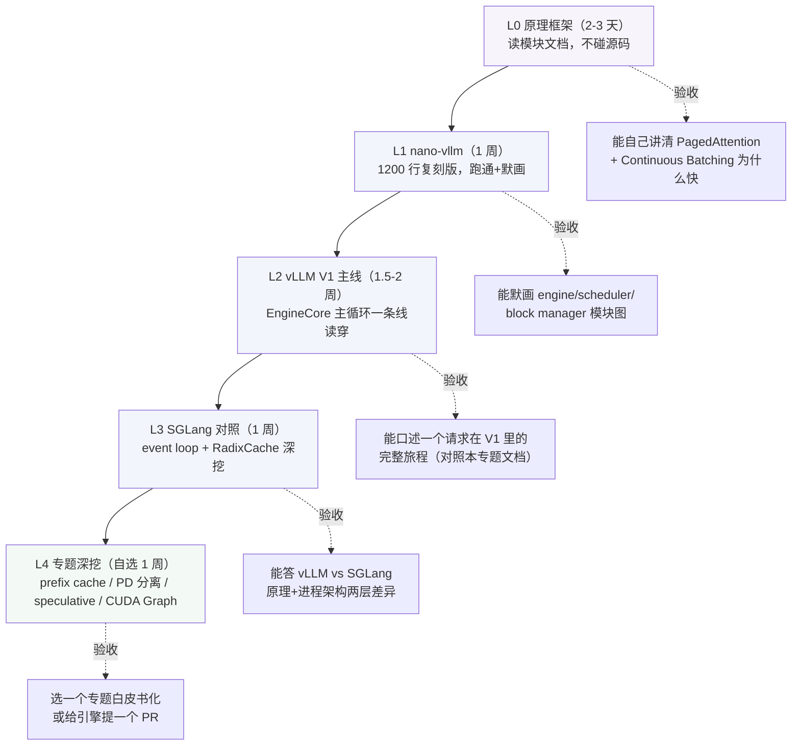

# 推理引擎源码学习路线图（vLLM / SGLang）

> 回答一个问题：**怎么从「用过 vLLM」走到「跟面试官聊透 vLLM 源码」**。
> 全程 4-5 周（每天 1.5-2 小时），每一级有可验证的验收标准——过不了就不进下一级。
> 原理框架见 [../vllm与推理加速核心.md](../vllm与推理加速核心.md)，
> 请求逐段溯源见 [vllm请求全链路.md](vllm请求全链路.md)、
> [sglang请求全链路.md](sglang请求全链路.md)。

## 全景

## L0：原理框架（2-3 天）

**目标**：脑子里先有"为什么需要这些机制"，读源码才知道每段在解决什么。

- 读 [../vllm与推理加速核心.md](../vllm与推理加速核心.md)：
- KV Cache 为什么省计算不省显存（公式在 [../../llm基础/transformer与attention.md](../../llm基础/transformer与attention.md)）
- PagedAttention 的 OS 虚拟内存类比
- Continuous Batching 为什么提吞吐（iteration 级进出）
- TTFT / TPOT / ITL 三个指标的定义

**验收**：不看文档能讲清"static batching 的气泡在哪、CB 怎么消掉它"。

## L1：nano-vllm（1 周）

**目标**：用 1200 行可跑代码把 vLLM 的骨架摸一遍。仓库链接见
[../../../resources/学习资源清单.md](../../../resources/学习资源清单.md#15-推理引擎源码)。

- Day 1-2 `engine/`：LLMEngine 主循环（tokenize→schedule→execute→detokenize），
  重点看 CB 怎么在 iteration 粒度增删请求。
- Day 3-4 `core/`：Block / BlockManager / BlockAllocator，对照 PagedAttention 原理，
  **能默写 block table 的分配与释放**。
- Day 5 kernel 入口 + CUDA Graph capture 的位置；Day 6-7 跑通、调参、断点跟一个请求到底。

**验收**：不看仓库能默画出 nano-vllm 的模块图（engine / scheduler / block manager /
model runner / sampler 之间谁调用谁）。

## L2：vLLM V1 主线（1.5-2 周）

**目标**：一条线读穿"请求在主循环里怎么被处理"，不追求全覆盖。
主线与方法都写在 [vllm请求全链路.md](vllm请求全链路.md)，建议**文档与代码对照读**：

1. **第 1 周**：API 层 → AsyncLLM → EngineCore busy loop。
   重点：`Scheduler.schedule()` 返回什么、waiting/running 双队列怎么流转。
2. **第 2 周**：KV 管理 + 输出链路。
   重点：`KVCacheManager` 的 block pool 与 prefix 命中（block hash 链）、
   `max_num_batched_tokens` 怎么决定 chunked prefill 预算、
   `_preempt_request` 的触发条件、detokenizer 增量解码。

**验收**：合上书能复述 vllm请求全链路.md 的全景时序图（6 个阶段、每段一个关键类）。

## L3：SGLang 对照读（1 周）

**目标**：带着"同样的功能 SGLang 怎么实现"的问题读，差异就是面试弹药。

- 三进程流水线为什么拆（GIL），ZMQ 连接点。
- `Scheduler.event_loop_*` 对照 vLLM busy loop；
  `get_new_batch_prefill` / `retract_decode` 对照 vLLM 的 chunked prefill 与 preemption。
- **RadixCache 深挖**：radix tree 的 match（中段 split）/ insert / evict，
  想清楚"为什么 agent、多轮、few-shot 场景它的命中率天然高于 block hash"。
- PD 分离入口（`disaggregation/`）知道在哪层即可。

**验收**：答出 vLLM vs SGLang 的两层差异——原理层（RadixTree vs block hash）、
进程架构层（EngineCore 双进程 vs 三进程流水线）。

## L4：专题深挖（自选，1 周）

挑一个做成"白皮书"（写进仓库 `interview-experiences/` 或开 issue 沉淀）：

| 专题 | 入口 | 面试价值 |
|---|---|---|
| Prefix Cache 两实现对比 | vLLM `kv_cache_manager.py` vs SGLang `radix_cache.py` | 高频："你们的命中率怎么测的" |
| PD 分离 | SGLang `disaggregation/`、vLLM 相关 PR | 2026 升温考点 |
| Speculative Decoding | SGLang `speculative/eagle_worker_v2.py` | 中高："为什么无损" |
| CUDA Graph | vLLM ModelRunner capture 流程 | Infra 深挖 |

**终极验收（选做）**：给一个引擎提一个真实 PR（文档、测试、小修复都算）——
腾讯/字节/Moonshot 的 JD 明确要求"contributor 优先"（见
[../../../resources/jd分析-ai-infra岗.md](../../../resources/jd分析-ai-infra岗.md)）。

## 防呆清单（短线冲刺版）

只剩 3 天面试？跳过 L1-L2 的动手环节，直接：

1. 背 [vllm请求全链路.md](vllm请求全链路.md) 全景时序图 + 8 条"面试武器"
2. 背 [sglang请求全链路.md](sglang请求全链路.md) 的三进程架构 + RadixCache 三操作
3. 演练一句定场白："我按 nano-vllm → vLLM main → SGLang main 的顺序读过源码，
   核心差异在调度与 KV 管理两层，具体来说……"
