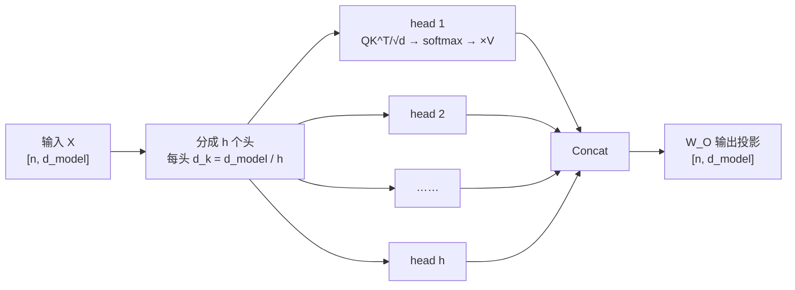
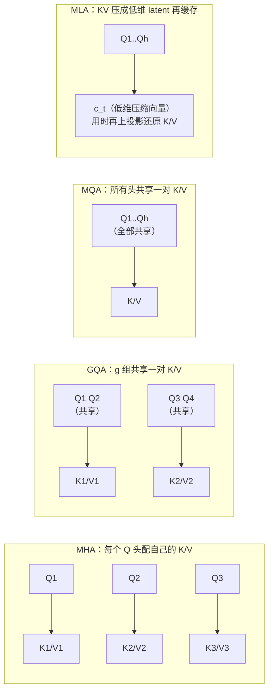
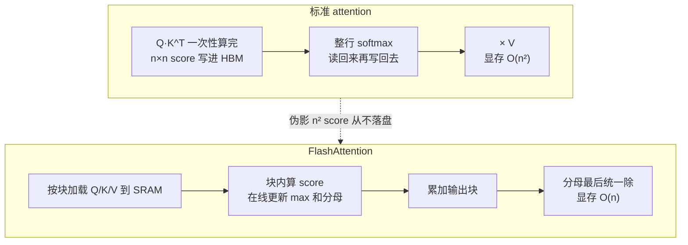

# Transformer 与 Attention 详解

> LLM 基础模块的第一篇，也是整个面试的"开场白"——Transformer 架构题几乎人人问
> （"极高"频率），MHA 手撕是算法/Infra 岗的硬通货。本文按「直觉 → 公式 → 结构 →
> 工程取舍 → 面试怎么答」组织，配套题目标注自
> [高频面试真题汇总](../高频面试真题汇总.md)。

## 一、Self-Attention 的直觉

▶ 面试题：Transformer 整体架构讲一遍（自注意力/多头/FFN/残差/位置编码）——**极高频**，几乎人人问

先讲讲故事版：一句话里每个词都要"看这个句子的所有其他词一眼"，来决定自己在这个
语境下的表示。比如"苹果发布了新手机"里的"苹果"，只有通过 attention 看到"手机"，
才能把自己的向量从"水果"修正成"公司"。

这件事用三句话说清楚：

1. 每个 token 把自己变成三个向量：**Query（我要找什么）**、**Key（我是什么）**、
   **Value（我携带的信息）**。
2. 用 Q 和所有人的 K 做点积，得到"相关性分数"（attention score）。
3. 分数过 softmax 变成权重，对所有人的 V 做加权求和，得到新的表示。

公式：

```text
             Q = XW_Q,  K = XW_K,  V = XW_V

                       QK^T
  Attn(X) = softmax( ——————— ) V
                       √d_k
```

其中 `d_k` 是 Key 向量维度。输入序列长 `n`、隐藏维度 `d` 时，Shape 变化：
`X: [n, d]` → `Q,K,V: [n, d_k]` → `QK^T: [n, n]` → 输出 `[n, d_k]`。

### 为什么除以 √d_k？（经典中的经典）

▶ 面试题：Attention 为什么除以 √d？——**极高频**（经典八股）

推导就一个假设：Q、K 各分量独立、均值为 0、方差为 1，则点积
$q \cdot k = \sum_{i=1}^{d_k} q_i k_i$ 的方差是 $d_k$（每一项方差 1，求和累乘加）。
也就是说维度越大，点积的数值就越大，softmax 的输入动辄几百上千。

softmax 对极端值很敏感：输入差一个数量级，输出就会"一边倒"成 one-hot，几乎退化成
硬 attention，**梯度趋近于 0**（softmax 的梯度在上界饱和区消失）。除以 $\sqrt{d_k}$
刚好把方差归一回 1，让 softmax 工作在一个梯度健康的区间。

一句话答法：**"方差随 d_k 线性膨胀，除以 √d_k 把 attention score 的方差归一，防止
softmax 饱和导致梯度消失。"**

### O(n²) 复杂度

`QK^T` 是 $n \times n$ 矩阵，序列每翻一倍，attention 的计算量和显存都翻四倍。
这就是长上下文的一切麻烦之源（KV Cache 显存、FlashAttention、稀疏 attention
都是为了对付它）。复杂度怎么优化也是高频追问，后文会讲。

## 二、MHA（Multi-Head Attention）

一个 head 只能学一种"看谁"的模式，多头就是并行跑 h 组不同投影的 self-attention，
各自捕捉不同关系（有的盯语法、有的盯指代、有的盯相邻），最后拼起来再过一次投影：

```text
  head_i = Attn(XW_Q^{(i)}, XW_K^{(i)}, XW_V^{(i)})     i = 1..h
  MHA(X) = Concat(head_1..head_h) W_O
```



一个标准 LLM block 的完整结构（Decoder-only / Pre-Norm 风格）：

```mermaid
flowchart TB
    A["输入 x"] --> B["RMSNorm"]
    B --> C["MHA（含 RoPE、加因果 mask）"]
    C --> D["残差相加：x + MHA(x)"]
    D --> E["RMSNorm"]
    E --> F["FFN（SwiGLU，约 8d² 参数）"]
    F --> G["残差相加"]
    G -->|"×L 层后" --> H["final RMSNorm → LM Head → softmax → 下一个 token"]
```

参数量估算（忽略 bias）：每层 attention 有 $W_Q,W_K,W_V,W_O$ 四个 $d \times d$
矩阵 = $4d^2$；SwiGLU FFN 三个矩阵（gate、up、down），中间维约 $\frac{8}{3}d$，合计
$3 \cdot d \cdot \frac{8}{3}d = 8d^2$。**每层约 $12d^2$**，L 层加 embedding 就是

$$N \approx L \cdot 12d^2 + V \cdot d$$

校验一下 LLaMA-2-7B（L=32，d=4096，V=32000）：$32 \times 12 \times 4096^2 \approx 6.44\text{B}$，
加 embedding（输入输出各一份）约 0.26B，≈ 6.7B，对得上。

## 三、MHA → MQA → GQA → MLA 演进

▶ 面试题：MHA→MQA→GQA→MLA 演进脉络，每一步在省什么？——**高频**（字节/快手）

主线只有一条：**压缩 KV Cache**（下一节会讲为什么它是推理显存大头）。所有变体
动的都是 K/V 的头数，Q 的头数始终不动。

| 方案 | Q 头数 | K/V 头数 | KV Cache 量 | 代表模型 |
|---|---|---|---|---|
| MHA | h | h（每头独立） | $2 \cdot L \cdot d$ | GPT-3、LLaMA-1 |
| MQA | h | 1（全部共享） | $2 \cdot L \cdot d/h$（省 h 倍） | Falcon、PaLM |
| GQA | h | g（1 < g < h，g 组共享） | $2 \cdot L \cdot d \cdot g/h$ | LLaMA-2-70B、Qwen |
| MLA | h | 低秩压缩 latent 向量 | 只存压缩向量 $c_t$，维度远小于 d | DeepSeek-V2/V3 |



各步答法要点：

- **MQA**：所有头共享一组 K/V，KV Cache 直接缩 h 倍，解码是 memory-bound 所以
  提速明显；代价是质量有损失（表达容量下降）。
- **GQA**：MHA 和 MQA 的折中——分组共享，几乎不掉点、显存省到 g/h。**目前是
  开源模型的主流默认**（LLaMA-2/3-70B、Qwen、Mistral 都是 GQA）。
- **MLA**：思路换了——不再共享头，而是把每个 token 的 K/V 先从 d 维**下投影到
  一个低维 latent $c_t$**（DeepSeek-V2 里 $d_c = 512$，远小于 $d$），cache 里只存
  $c_t$（加一个共享的 RoPE 分量），用的时候再上投影还原出各头的 K/V。因为下投影
  矩阵可以**被后续矩阵吸收**（矩阵乘法结合律：$W^{UK}$ 能并进 Q 的投影里不显式算出 K），
  既比 GQA 更省，又能保留接近 MHA 的表达能力。注意 MLA 里 RoPE 和压缩有冲突
  （RoPE 是逐位置的，不能被矩阵吸收），所以 DeepSeek 把一小部分维度单独留出来
  走 RoPE，不参与压缩——这是深挖追问点。

答这类题的节奏：**先说动机（KV Cache 是解码显存瓶颈）→ 按头数光谱讲 MHA/MQA/GQA
→ MLA 单独讲低秩压缩和矩阵吸收 → 收尾提各自代表模型。**

## 四、KV Cache 原理与显存估算

▶ 面试题：KV Cache 是什么？生成新 token 要不要重算历史 token？——**高频**（字节/拼多多开场题）
▶ 面试题：参数量和显存占用估算（7B/8×7B 权重 + KV Cache 占比）？——**高频**（字节/滴滴必考计算题）

### 原理

自回归解码时，第 t 步的 attention 需要前 t 个 token 的 K 和 V。历史 token 的 K/V
算过之后现在**不会变**（它们看不到未来，因果 mask 保证），所以缓存下来，每步只算
**当前新 token 的 QKV**，Q 和历史 K/V 算 attention。

- 生成新 token **不需要**重算历史 token 的前向，只算向量新增的 1 个位置。
- 这就是 prefill（输入整段，并行算，cache 首次填充）和 decode（一次一个 token，
  读 cache）两阶段分开的原因——prefill 是 compute-bound，decode 是 memory-bound
  （瓶颈在把 cache 从 HBM 搬进显存计算单元）。
- 评估缓存命中：常用指标是 **prefix cache 命中率**（vLLM/SGLang 都有），以及
  TTFT（首 token 延迟，prefill 完成才算）vs TPOT（每 token 延迟，纯 decode）。

### 显存估算公式（必背）

KV Cache 每 token 占的显存：

$$\text{KV/token} = 2 \times L \times n_{kv} \times d_{head} \times \text{bytes}$$

- 2 = K 和 V 两份
- L = 层数
- $n_{kv}$ = K/V 头数（MHA 时 = 头数 h，GQA 时 = 组数 g；$n_{kv} \times d_{head}$ 对 MHA 就是 $d_{model}$）
- bytes = 精度字节数（FP16/BF16 = 2，FP8/INT8 = 1）

总 KV Cache = 上式 × 序列长度 × batch size。

拿 LLaMA-2 系列算一遍（BF16，batch=1）：

| 模型 | L | d_model | n_kv | 每 token | 4K 上下文 | 8K 上下文 |
|---|---|---|---|---|---|---|
| 7B | 32 | 4096 | 32（MHA） | $2\cdot32\cdot4096\cdot2$B = 0.5 MB | 2 GB | 4 GB |
| 13B | 40 | 5120 | 40（MHA） | $2\cdot40\cdot5120\cdot2$B ≈ 0.78 MB | 3.2 GB | 6.4 GB |
| 70B | 80 | 8192 | 8（GQA） | $2\cdot80\cdot8\cdot128\cdot2$B ≈ 0.31 MB | 1.25 GB | 2.5 GB |

顺手核对一下 70B 为什么用 GQA：如果不分组的 MHA，每 token 是
$2\cdot80\cdot8192\cdot2$B ≈ 2.5 MB，4K 上下文 batch=1 就要 10 GB，batch 开大或
上下文加长直接爆。GQA-8 把它砍到 1/8。

再补一笔推理总显存的拆账（面试官经常接着问）：

$$\text{总显存} \approx \text{权重} + \text{KV Cache} + \text{激活/碎片（约 10%-20%）}$$

- 权重 = 参数量 × 每参数字节数：7B FP16 ≈ 14 GB，13B ≈ 26 GB，70B ≈ 140 GB。
- 所以"7B 模型 FP16 推理，4K 上下文"≈ 14 + 2 + 缓冲 ≈ **17 GB 左右**，一张
  24 GB 卡够用；batch 开大或上下文拉长后 KV Cache 就会反超权重成为大头——
  这正是上节所有 KV 压缩方案的动机。

扩展公式（若问到训练显存）：AdamW + 混合精度每个参数约占 **16 字节**
（BF16 权重 2 + BF16 梯度 2 + FP32 主权重 4 + FP32 一阶动量 4 + FP32 二阶动量 4），
7B ≈ 112 GB，还没算激活，这就是为什么 7B 全参训练单卡放不下。详细拆账见
[分布式训练模块](../distributed-training/) 和本模块 README 的速查表。

## 五、FlashAttention：把 O(n²) 显存压成 O(n)

▶ 面试题：FlashAttention 原理？——**中高频**（阿里 Infra 深挖）

先纠正一个常见误区：FlashAttention **不改数学结果，计算量仍是 O(n²)**，它省的是
**显存和 HBM 读写次数**。标准 attention 的痛点是把 $n \times n$ 的 score 矩阵
显式写出来，softmax 之后再读回来——n=8K 时这个矩阵 BF16 也有 128 MB，而且
HBM↔SRAM 之间来回搬，memory-bound。

FlashAttention 两招：

1. **分块（Tiling）**：把 Q、K、V 切成小块，像算矩阵乘法一样按块计算，$n\times n$
   score 从不落地显存，只在片上 SRAM 命里又活了几秒。
2. **在线 softmax（Online Softmax）**：普通 softmax 要看到整行分数才能归一，
   分块就没法算。在线 softmax 每处理一块就维护"当前最大值 m 和当前分母和 l"，
   新块来了就先把之前的结果按 $e^{m_{old} - m_{new}}$ 缩放、再并入新块，最后一步
   才做真正的归一化。数学上等价于一次性 softmax。



效果：显存从 O(n²) 降到 O(n)，实测 2-4 倍端到端加速；反向传播不重读中间矩阵，
而是**用保存的输出和 softmax 归一化统计量重算 attention**（重算比读 HBM 便宜）。
FA2 进一步调整了如何切 batch/head 维度的并行和 warp 内的工作划分；FA3 针对
Hopper 架构做 warp specialization 和低精度。追问到 Hopper 级别细节时答出"warp
specialization、生产消费流水"即可，不用背 kernel 代码。

## 六、高频追问清单（本主题）

| 追问 | 答题要点 |
|---|---|
| 为什么用 Decoder-only 而不是 Encoder-Decoder？ | ① 生成任务天然是自回归的，causal mask 的 Decoder 结构简单统一；② Decoder-only 在 zero-shot/少样本 generalization 上表现更好（有研究指出 full attention 的 prefix-LM 结构 bidirectional 部分会引入噪声）；③ prefill 时输入也走同一条路径，工程上 KD/蒸馏/KV Cache 都更顺。代价是理解类任务不如 Encoder 双向建模。——**高频**（腾讯/阿里） |
| 因果 mask 是什么？ | 上三角置 $-\infty$ 再过 softmax，保证第 t 个位置只能看到 ≤ t 的 token；训练和推理逻辑统一（teacher forcing 也靠它防泄漏）。 |
| 残差连接为什么必须有？ | 深网络梯度通路（恒等映射），缓解梯度消失；配合 Pre-Norm 后残差通路是"干净"的，能训练上百层。 |
| FFN 为什么要先把维度放大再缩回？SwiGLU 哪里好？ | FFN 提供逐位置非线性变换和"记忆库"，扩维后容量更大；SwiGLU = Swish(xW₁) ⊙ (xW₃) 再过 W₂，门控结构比 GELU 两层 FFN 同参数下效果更稳，代价是三个矩阵。 |
| Attention 除了 FA 还有哪些降复杂度方案？ | 稀疏 attention（Longformer/BigBird 固定 pattern）、线性 attention（kernel 近似 softmax 变 O(n)）、滑窗 attention（Mistral SWA，只看最近 w 个 token）、PagedAttention（这是显存管理不是改复杂度）、以及 KV Cache 侧的 GQA/MLA。 |
| Softmax 为什么要减 max？ | 数值稳定性：$e^{x}$ 容易上溢出，softmax(x) = softmax(x − max)，不变换结果但防 NaN。FlashAttention 的在线 softmax 本质就是动态维护这个 max。硬核追问如字节要求 numpy 从零手写 softmax，就考这个。 |

## 七、手撕练习（→ coding/）

本主题对应的手写代码真题（详见 [高频面试真题汇总-手写代码题](../高频面试真题汇总.md#七手写代码题live-coding-真题)）：

- **手撕 Multi-Head Attention**（PyTorch，可扩展 cross-attention）——字节算法岗，
  高频。核心考点：reshape 成多头、`QK^T/√d`、causal mask、softmax、`W_O`。
- **numpy 手撕 attention 前向**（含手写 softmax，要减 max）——字节 AML 一面原题。
- **FlashAttention 思想版实现**（分块 + 在线 softmax 的 Python 伪代码）——Infra 岗
  可能要求讲清后再写。
- 配套代码会在 [coding/](../../coding/) 目录更新，写完先对着本文公式自查 shape。

---

*相关阅读：[位置编码与 Norm](./位置编码与norm.md) · 上一页 [模块导航](./README.md)*
