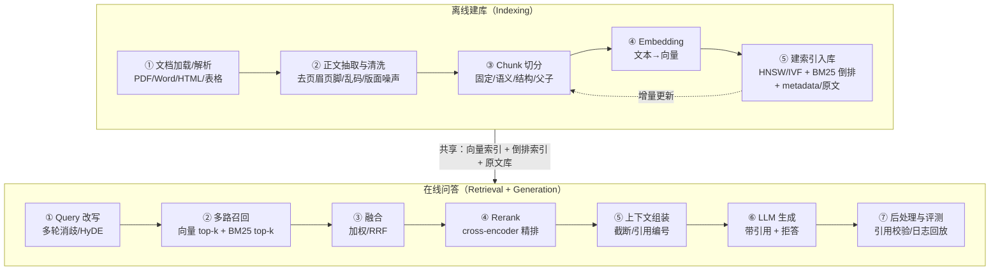

# RAG 全链路

> 应用岗面试第一权重模块：Top 20 里第 1 题（RAG 完整流程 + chunk 切分）、第 5 题
> （RAG vs 微调）都在本篇。导航见 [考点地图](../README.md)，配套阅读
> [检索与混合召回](./检索与混合召回.md)、[评测与建库工程](./评测与建库工程.md)。

## 零、先摆正心态

JD 调研里 RAG/知识库/向量检索被 **21/21 的 Agent 岗 JD 提及**——但它是门票，不是
分水岭。面试官真正想听到的不是"我会接 LangChain"，而是：**每个环节你的取舍是什么、
踩过什么坑、效果如何量化**。本篇按「是什么/为什么 → 怎么做 → 取舍与坑 → 高频追问」
组织，答题模板：先原理、再取舍、最后落到自己项目的数字。

---

## 一、为什么是 RAG：RAG vs 微调（极高频题）

> ▶ 面试题：RAG 完整流程？相比微调怎么选？ —— **极高频，几乎必问**

### 1.1 都在解决同一个问题：模型不知道你的数据

预训练大模型的知识有三个硬伤：

1. **时效性**：训练数据有截止日期，模型不知道昨天发的新制度；
2. **私有性**：公司内部 wiki、合同、工单从来没进过训练语料；
3. **幻觉**：不知道的东西它也敢编，语气还特别自信。

两条补救路线：**RAG（检索增强生成）**和**微调（Fine-tuning）**。这不是二选一的
宗教战争，面试里要讲的是分析框架。

### 1.2 一句话讲清本质区别

- **微调是「学习知识」，改的是参数**：让模型把领域知识/行为模式内化进权重；
- **RAG 是「查资料」，改的是输入**：模型参数不动，从外部知识库把相关内容塞进 context，
  模型基于给定材料作答。

"微调难在怎么定义要学的知识，RAG 难在怎么找到要找的知识。"——这是被各路面经
反复验证的最强一句概括，可以直接用。

### 1.3 对比表

| 维度 | RAG | 微调 |
|---|---|---|
| 知识时效性 | 强，改库即生效（分钟级） | 弱，更新一次要重训 |
| 私有/高频变更数据 | 天然适合 | 成本高 |
| 幻觉控制 | 好：答案基于给定材料，可引用溯源 | 弱：模型仍可能"凭记忆"输出 |
| 可解释性/可审计 | 好：每条答案能给出处 | 差：黑盒 |
| 领域风格/术语/输出格式 | 一般（靠 prompt 引导） | 强，能学说话方式和行为模式 |
| 复杂推理能力 | 提升有限 | 可以在预训练之上重塑推理模式 |
| 成本 | 低：embedding + 向量库 + 一次推理 | 高：数据、算力、回归评测 |
| 工程量 | 检索链路维护 | 训练 + 部署链路维护 |

### 1.4 取舍框架（讲给面试官听的版本）

按优先级判断：

1. **先用 Prompt/RAG 能解决就不微调**——成本差一个数量级，且 RAG 可控、可审计。
2. **知识动态变化（价格表、制度、工单）→ RAG**；
   **固定领域的风格、术语、格式、特殊行为（客服口吻、医疗问诊流程、代码风格）→ 微调**。
3. **要保证可信源数据 + 抗幻觉**（金融、医疗、客服承诺）→ **RAG + 微调结合**：
   RAG 管知识、管引用，微调管领域语言和行为模式。两者是正交的增强，不是互斥。
4. **长上下文越来越长，RAG 还要吗？** 要。1000K context 解决不了成本（每千条
   提问全量读文档，token 烧穿了），且"上下文越大、注意越散"的迷途问题更突出。
   RAG 的精确检索反而是把大海捞针变成书架取书的前提。

**高频追问：什么时候调 Prompt、什么时候微调、什么时候上 RAG？——高（阿里）**
参考答法：成本与可逆性排序——先 Prompt（零成本试错）→ 上 RAG（知识问题）→
不行再 LoRA 微调（行为/风格问题）→ 都不够才考虑 continue pretrain。每一步都要
用评测集证明上一步不够，而不是凭感觉升级武器。

---

## 二、RAG 完整流程：一条流水线讲清楚

> ▶ 面试题：RAG 完整流程讲一遍 —— **极高频（Top 1）**

RAG 分成**离线建库**和**在线问答**两条流水线，中间共享向量索引：

面试讲法建议：**先把这张图从嘴上图解一遍（30 秒），再挑 2-3 个环节深挖**——全文
讲完是 10 分钟的事，面试官没那个耐心，主动说"我对切分和混合检索这块踩过坑，
可以展开"，把球踢到你准备好的主场。

### 逐环节要点（离线五步 + 在线七步）

| 环节 | 干什么 | 核心取舍/坑 |
|---|---|---|
| ① 文档解析 | PDF/Word/Excel/HTML → 结构化文本 | PDF 表格、两栏排版、扫描件 OCR 是重灾区；版本升级测绘（同版文档差异）没人提但天天踩 |
| ② 正文抽取/清洗 | 去页眉页脚、版权申明、乱码、导航噪声 | 清洗规则要可回放；清洗太狠会把定义/边界吃光 |
| ③ Chunk 切分 | 把文档切成可检索的语义单元 | **「RAG 最难的一环」**——见本文第三节 |
| ④ Embedding | 文本 → 语义向量 | 模型选型、维度、垂域效果下降——见检索篇 |
| ⑤ 索引入库 | 向量索引（ANN）+ 倒排索引 + 原文/metadata | 向量库选型、增量更新一致性——见检索篇/工程篇 |
| ① Query 改写 | 消歧、查询扩展、问题分解 | 直接拿用户原话 embedding 是新手第一个坑 |
| ② 多路召回 | 向量 top-k + BM25 top-k 并行 | 语义互补：专有名词靠 BM25、同义改写靠向量 |
| ③ 融合 | 多路结果合并去重排序 | RRF 是最省心的默认项——见检索篇 |
| ④ Rerank | cross-encoder 对候选精排 | 双塔快但不准、交叉准但贵，先粗排后精排 |
| ⑤ 上下文组装 | 把 top-n chunk 填进 prompt，带编号 | "召回 30 条 context 只放得下 6 条怎么取舍"经典追问 |
| ⑥ 生成 | 基于材料作答 + 引用 + 拒答 | 拒答机制比努力回答更重要 |
| ⑦ 后处理 | 引用格式、答案校验、日志 | 没有评测和日志就没有迭代依据——见工程篇 |

---

## 三、Chunk 切分策略详解（“RAG 最难的一环”）

> ▶ 面试题：chunk 切分策略？粒度怎么选？切断语义怎么办？ —— **极高频**

为什么说最难：切分没有标准答案，没有好指标，切错的代价在整条链路下游放大——
切太大，噪声多、检索精度低、context 浪费；切太小，语义断裂、召回到了也答不全。
**切分决定了你能检索到的「意义单元」的粒度**，这一步错了，后面全是裱糊。

### 3.1 五大策略对比

| 策略 | 做法 | 优点 | 缺点 | 适用场景 |
|---|---|---|---|---|
| **固定长度切分** | 按 token/字符数硬切，比如每 512 token 一刀 | 实现零成本、粒度均匀、索引稳定 | 必然切断语义（一句话劈两半） | 快速起量、无结构文本、作为基线 |
| **滑动窗口/重叠切分** | 固定长度 + 前后重叠（如 512 + 50 overlap） | 保住跨边界语义、实现简单 | 冗余存储、重复召回、可能在实体中间断开 | 段落边界不可靠时的保险策略，生产常用兜底 |
| **语义切分** | 用 embedding 相似度/标点/话题模型找语义断点切 | 切在"意思完整"的边界上 | 贵（每句算向量）、断点不准、粒度不均 | 长文、报告、无固定格式文档 |
| **结构切分** | 按文档标题层级/Markdown/HTML/代码结构切 | 语义天然完整、可带层级上下文 | 依赖文档规范性；有的"节"过长或过短 | 技术文档、规章制度、合同这些结构化文档首选 |
| **父子切分（Parent-Child）** | 小块（子）做检索，命中后取整个大块（父）喂模型 | 检索精度与生成上下文兼得 | 实现复杂、存储两倍、要去重 | 长文档、上下文敏感的问答，"child 检索、parent 生成" |

### 3.2 粒度怎么选

没有银弹，但有决策树：

1. **看问题粒度反推**：用户问"XX 参数怎么配置"→ 小段（200~400 token）；
   问"总结第三章"→ 必须长段或整章（否则拼不出来）。**粒度由问题分布决定，不是由文档决定。**
2. **看 embedding 模型最佳输入**：大多数模型在 256~512 token 效果最稳；太短丢失
   区分度，太长向量被平均化。
3. **看 context 预算**：一次想塞 5 条 chunk、总预算 4K token → 单条别超 600。
4. **经验起点（不是定律）**：规章制度/手册类 256~512 + 10%~20% overlap；
   FAQ/短问答对直接把"一问一答"当一个 chunk；代码大块按函数/类切。

### 3.3 切断语义怎么办（高频追问）

四板斧，按成本从低到高：

1. **加 overlap**：最便宜保险，10%~20% 重叠，先上再说；
2. **换结构感知切分**：按标题/段落/列表切，别把一句劈两半；
3. **上下文增强**：每个 chunk 前面拼上"文档名 + 章节路径"如
   `员工手册 > 薪酬福利 > 3.2 补贴`，直接改善召回和生成时的 grounding；
4. **父子切分 / 小块检索大块生成**：上一步还不够再升级。

**真坑提醒**：切分优化在没到评测集之前全是玄学——先建一个 50 条的小评测集，
改动才有对照，否则你会在"哪个更好"上空转一周还进步为负。

---

## 四、引用溯源（引用是 RAG 的产品输出，不是加分项）

引用溯源 = 每条生成结论都能指回知识库里的具体 chunk/文档/段落。它是：

- **抗幻觉的最后一道闸门**：用户能点回去自己核对；
- **企业内审的硬需求**：客服/金融/医疗不允许"我不知道哪来的"；
- **评测的骨架**：评测集里"该引哪条"是 ground truth 的一部分。

### 怎么实现

1. **建库时存 metadata**：每个 chunk 带 `doc_id / 标题路径 / 页码或段落号 / 更新时间`；
2. **组装 context 时给每个 chunk 编号**：`[1] xxx [2] xxx`；
3. **prompt 强制输出引用**：要求结论句后标 `[1][2]`，材料不足就明说不知道；
4. **生成后校验**：答案里出现编号但引用 chunk 没被 rerank 选中 → 判为可疑；
5. **展示层把引号做成可点击**：这才是它产生信任价值的地方。

---

## 五、面试高频追问 + 参考答法要点

| 面试题 | 频率 | 答法要点 |
|---|---|---|
| RAG 完整流程讲一遍 | 极高 | 30 秒 mermaid 口令版 → 主动选 2 个环节展开 → 每个环节讲一个取舍 + 一个坑 |
| RAG vs 微调怎么选 | 极高 | 本质区别一句话 → 对比表 → 决策顺序：Prompt→RAG→LoRA→continue pretrain；知识动态→RAG，风格/行为→微调，要可信源→结合 |
| RAG 还能解决幻觉吗 | 嵌在第一题里 | 缓解不等于消除：检索没召回→编、召回到了生成仍可能编；引用溯源 + 拒答 + 评测集才是组合拳（见工程篇） |
| chunk 粒度怎么定 | 极高 | 由问题分布反推 + embedding 最佳输入 + context 预算三层约束 + 先 256~512 起步 |
| 切断语义怎么办 | 高 | overlap → 结构切分 → chunk 前拼章节路径 → 父子切分 |
| 为什么切分最难 | 高 | 没标准答案、没好指标、错误向下游放大；粒度 = 检索精度和上下文完整性的 trade-off |
| 长上下文普及后 RAG 还有意义吗 | 中（新问法） | 成本模型不变 + 大海捞针变书架取书 + 精确来源可审计，RAG 从"填知识"升级为"知识治理" |

---

## 六、手撕/练习建议

- `coding/`：手写一个**最小切分器**——固定长度 + 滑动窗口两个版本，
  输出 chunk + metadata，这是唯一能"跑给你看"的切分练习；
- `coding/`：手写**父子切分**——输入 markdown 文档按标题层级切，
  子块 300 token、父块整节，命中子块回父块；
- `system-design/`：企业知识库/本地化 Wiki Agent（导入/权限/评测全链路）
  设计题练手，本篇每一节都是它的一个子问题。

---

 *下一篇：[检索与混合召回](./检索与混合召回.md)——Embedding、向量索引、BM25+向量
 融合、Rerank、Query 改写、权限召回。*
