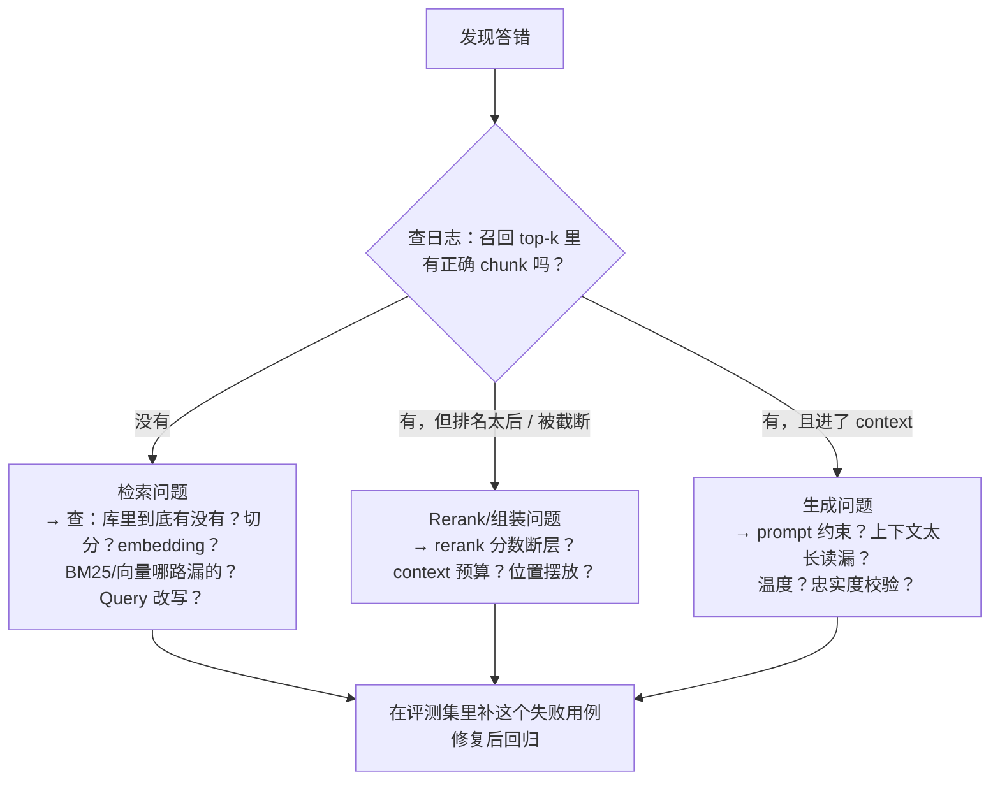

# 评测与建库工程

> 前两篇讲了"怎么搭"，本篇讲"怎么知道它好不好、坏了怎么修"。这是 1-3 年
> 和 3-5 年候选人的分水岭：前者能搭出 Demo，后者**能对非确定性系统负责**——
> 评测集、失败分类、线上监控、迭代闭环。导航见 [考点地图](../README.md)。

## 一、RAG 怎么评测（2026 共同追问主线："怎么量化"）

> ▶ 面试题：RAG 效果怎么评估？评测集从哪来、要多少条？ —— **极高（字节/阿里/京东）**

RAG 的评测要**分两段打分**——检索段和生成段用完全不同的指标，混在一起算平均分
等于没评。这也是下一节"定位是检索问题还是生成问题"的基础。

### 1.1 检索段指标（该找的找到了吗）

| 指标 | 含义 |
|---|---|
| **Recall@k（召回率）** | 正确的 chunk 有没有进 top-k——最核心，召回没有后面全免谈 |
| Hit Rate（命中率） | top-k 里至少有一条相关的 query 占比 |
| MRR | 第一个相关结果排多靠前，衡量排序质量 |
| nDCG | 排序质量 + 相关程度分级，更细但更贵 |

工程口径：**Recall@10 ≥ 业务可接受线**是第一道门禁，top-k 取多大由 context
预算倒推。

### 1.2 生成段指标（找到了之后答对了吗）

| 指标 | 含义 |
|---|---|
| 正确性 | 答案内容与 ground truth 是否一致 |
| 忠实度（faithfulness） | 答案是否**只基于检索到的材料**，没有夹带私货——幻觉的直接度量 |
| 答案相关性 | 答的是不是用户问的那个问题（防止答非所问） |
| 引用正确率 | 标的 `[1][2]` 是否真支持该结论 |

自动评测的落地形态是 **LLM-as-Judge**：用强模型按 rubric 给上面几个维度打分，
比人工快 100 倍，但必须抽 10%~20% 人工复核校准 judge 本身的偏差。
（RAGAS 这类框架就是把上面这套指标工程化了，知道它测的是什么比会调 API 重要。）

### 1.3 评测集怎么构造、要多少条（高频追问）

构造来源按优先级：

1. **真实用户 query 日志**（上线后）——分布最真，按需人工标注正确 chunk/答案；
2. **从文档反向造题**：让 LLM 对每个 chunk/章节生成"这个问题该由你回答"的
   query-答案对，人工筛——冷启动的主力；
3. **业务方出题**：客服/销售/合作方常问的 TOP 问题清单——优先级最高，覆盖头部流量；
4. **对抗样本**：易混淆术语、否定式问题、材料里没有答案的"该拒答"题——
   专门测幻觉和拒答，必须有，比例 10%~20%。

**要多少条**：

- **冷启动冒烟**：50~100 条，人半小时看完，能发现切分段的大错；
- **迭代回归门禁**：300~500 条，覆盖主要意图类别，每次改切分/换模型/改 prompt
  都全量跑；
- **上线前验收**：1000+ 条 + 线上灰度回放。

比例比绝对数重要：**头部高频意图占 60%+，长尾 + 对抗占 40%**——和真实流量同构，
否则会优化出"测试集冠军、线上青铜"。

---

## 二、幻觉的成因与缓解

> ▶ 面试题：RAG 怎么缓解幻觉？答错怎么定位是检索还是生成问题？ —— **极高（钉钉）**
> （通用幻觉题本身也是 Top 6，这里只讲 RAG 视角的部分。）

### 2.1 RAG 场景下幻觉的三个来源

1. **检索没召回**：库里没有/切坏了/embedding 不认这个词 → 模型用参数里的
   "记忆"硬答 → 编；
2. **召回到了但模型没读到**：context 太长被截断、关键 chunk 排在中间被"迷失"
   （lost in the middle）、上下文组装格式乱；
3. **读到了但自由发挥**：prompt 没约束、模型路径依赖自己的先验、温度开太高。

对应缓解（一一对应，别乱开药）：

1. 没召回 → 混合检索、Query 改写、评测集发现盲区后补库/调切分；
2. 没读到 → Rerank 把最相关的放前面、**关键结论性 chunk 放 context 首尾**、
   削 chunk 长度、控制条数；
3. 自由发挥 → prompt 硬性约束"仅依据材料，材料不足请说明"、降温度、
   强制引用编号、生成后用 chunk 做**忠实度校验**（答案的每个断言能否在
   引用 chunk 中找到支持）。

最重要的工程姿势：**把「不知道」训练成一等公民**。拒答率要进指标——宁可拒答率
高一点，也别让客服机器人给用户编一个承诺。

### 2.2 答错了怎么定位：检索问题还是生成问题

这是 RAG debug 的第一性框架，也是高频追问。四步走：

配套定量口径：在评测集上统计三个比率——**召回缺失率、进了 top-k 没进
context 率、进了 context 仍然答错率**。哪个比率高就先修哪段，迭代就从玄学
变成了排期。

---

## 三、建库工程：增量更新与一致性

> ▶ 面试题：知识库增量更新、索引与原文一致性？ —— **中**

### 3.1 增量更新怎么做

文档改了/删了，不能全量重建。标准链路：

1. **变更识别**：文档级 hash/版本号对比，识别新增/修改/删除；
2. **变更传播**：修改 = 找出该文档所有旧 chunk → 删（索引里标记删除或重建分区）
   → 重新解析切分 → 建新向量；**注意切分结果对编辑位置敏感**，一个文档改一句话
   可能导致其下游 chunk 全部被切出新边界——所以变更单位是文档级而不是 diff 级；
3. **双索引/版本切换**：大批量更新时建新索引分区，校验后原子切换，避免更新中
   的半新半旧状态被用户查到；
4. **删数据的坑**：ANN 索引（尤其 HNSW）删除是真删成本高，常用"软删除标记 +
   定期重建压缩"，删除生效有窗口期，高敏场景要在召回侧再过滤补偿。

### 3.2 索引与原文一致性

铁律：**向量库里只存「指向原文的指针」，原文是唯一事实源（source of truth）**。
生成前组装 context 时按 doc_id 回查当前原文版本，引用也引用原文位置。
三个一致性问题要有答案：

- **文档删了向量还在** → 召回时校验 doc_id 是否存活；
- **文档改了向量没改** → 按版本号回查，版本不匹配就重取或标脏；
- **权限变了** → 见检索篇 ACL 一节，权限事件同步到 metadata，高敏场景实时反查。

---

## 四、GraphRAG / Agentic RAG（2026 升温，知道是什么 + 为什么）

> ▶ 面试题：GraphRAG / Agentic RAG 是什么？ —— **中，2026 升温**

### 4.1 GraphRAG

普通 RAG 的盲区：**全局性问题**——"整个知识库主要讲了哪几类问题？""A 部门和
B 部门的制度有什么冲突？"这类问题没有"对应的某个 chunk"，向量检索无从下口。

GraphRAG 的思路（微软 2024 年提出的经典 pipeline）：

1. 建库时用 LLM 从 chunk 里抽取**实体 + 关系**，构图；
2. 社区检测（如 Leiden 算法）把图聚成社区，自底向上为每个社区**预生成摘要**；
3. 查询分两种走法：局部问题（关于具体实体）走图谱邻居检索；**全局问题走
   map-reduce**：让社区摘要先各自作答，再汇总。

代价很直白：建库贵（每个 chunk 要过 LLM 抽取）、图质量依赖抽取质量、更新更难。
**适用判断**：问题分布里全局/多跳/关系型问题占比高才值，否则是过度工程。

### 4.2 Agentic RAG

把"检索"从固定流水线变成 **Agent 的一个工具**：模型自己决定要不要检索、检索什么、
检索结果够不够、不够换个 query 再查，必要时多步推理串联多次检索。形态上就是把
单轮 RAG 折进 ReAct 循环（见 `agent/` 模块）。

- 解决的是：**多跳问题**（先查 A 才知道该查 B）、**模糊问题**（查一轮发现不对
  自我修正）、**工具混合**（知识库 + SQL + API 混合取数）；
- 代价：推理链路变长、错误沿轮次传播、成本和延迟乘上检索轮数、评测更难；
- 工程判断：**先用单轮 + Query 拆分覆盖 80% 场景**，确认有多跳/自我修正的真实
  需求再 Agent 化——别为了让简历好看把确定性流水线换成非确定性循环。

---

## 五、常见问题排查清单（面试可以直接背的 debug 脑图）

| 症状 | 第一反应查什么 | 高频真凶 |
|---|---|---|
| 召回没召到 | 库里到底有没有？有→单独 embedding 该 chunk 算相似度 | 切分手撕了语义、术语没被 embedding 编码（上 BM25）、Query 太口语（上改写）、索引参数太激进（nprobe 太小） |
| 召回到了但答错 | 正确 chunk 在 context 第几位？总 context 多长？ | 迷失在中间（放首尾）、被截断（削条数）、prompt 没约束（加"仅依据材料"）、引用了错误 chunk（rerank 阈值） |
| 模型乱编/自信幻觉 | 这条答案能被引用 chunk 支持吗 | 材料缺失时没拒答机制（补对抗样本 + 拒答 prompt）、温度过高、自由发挥（忠实度校验上线） |
| 答非所问 | query 改写后变成什么了 | 改写跑偏（多轮指代消解错）、问题拆分漏子问题 |
| 更新后答案还是旧的 | 索引版本 vs 原文版本 | 增量同步失败、软删除窗口期、双索引没切换、缓存（embedding/答案缓存 key 没含版本） |
| 越权泄露风险 | 权限过滤在哪一层生效 | 先召回后过滤导致 top-k 雪崩后补了无权"相关"内容；索引 metadata 权限滞后 |
| 线上变慢 | 哪一段的 P99 涨了 | query embedding 模型太大、RRF 前召回路数膨胀、rerank 候选数失控、context 塞太长拖慢生成首 token |

---

## 六、面试高频追问速查

| 面试题 | 频率 | 一句话抓手 |
|---|---|---|
| RAG 效果怎么评估 | 极高 | 检索段 Recall@k + 生成段忠实度分开打分；LLM-as-Judge + 人工抽检 |
| 评测集怎么构造 | 极高 | 日志 > 文档反向造题 > 业务 TOP 问题 > 对抗样本；冷启动 50，回归 300-500，验收 1000+ |
| 幻觉怎么缓解 | 极高 | 三分法：没召回/没读到/自由发挥，一一对症；拒答率进指标 |
| 答错怎么定位 | 极高 | 查召回日志 → 查进没进 context → 查生成忠实度，三个比率排优先级 |
| 增量更新怎么做 | 中 | 文档级变更识别 → 删旧 chunk 重切重建 → 双索引原子切换；HNSW 软删除窗口期 |
| GraphRAG 解决什么 | 中 | 普通 RAG 答不了全局/关系型问题；实体关系构图 + 社区摘要 + map-reduce 汇总 |
| 什么时候上 Agentic RAG | 中 | 多跳/自我修正的真实需求；先用单轮 + query 拆分覆盖 80%，别为简历过度工程 |

---

## 七、手撕/练习建议

- `coding/`：**写一个最小 RAG 评测脚本**——给定 query、召回列表、人工标注的
  correct chunk id，算 Recall@k / MRR；这是你第一个"量化证据"生产工具；
- `coding/`：**写忠实度校验的简化版**——把答案切成断言，逐条在引用 chunk 里
  做关键词/语义重叠判断，感受自动评测有多难（再理解为什么要 LLM-as-Judge）；
- `coding/`：**模拟一次增量更新**——用内存 dict 当"原文库"，实现"改文档→
  失效旧 chunk→重建"的状态机，体会一致性窗口；
- `system-design/`：企业知识库 Agent 设计题（字节/Shopee 原题）——本篇的评测、
  权限、增量更新就是那道题的三个核心得分点。

---

*上一篇：[检索与混合召回](./检索与混合召回.md)｜本模块到此为止，下一步去
`agent/` 模块:ReAct/Function Calling/MCP 是 RAG 之后的第二权重。*
