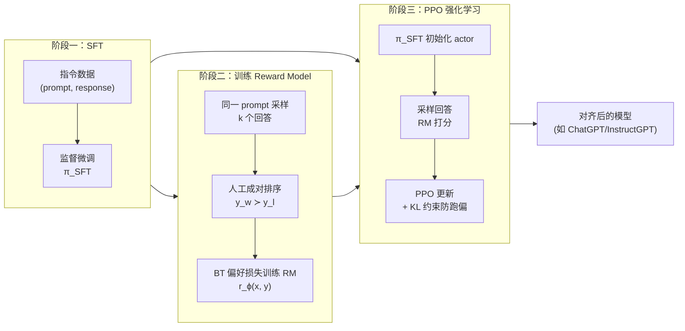
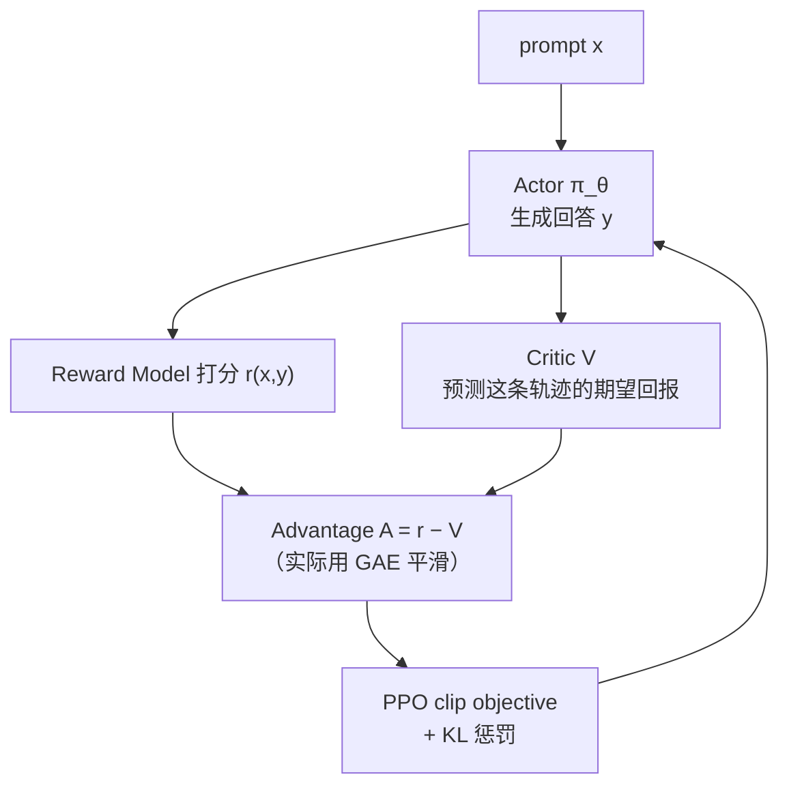
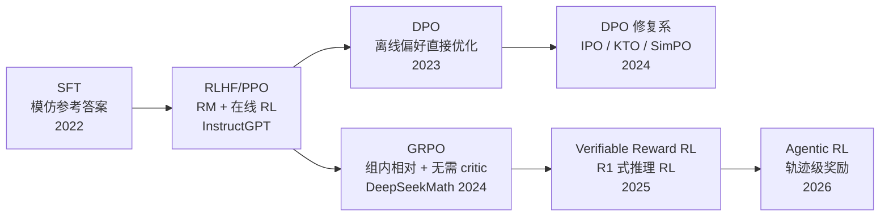

# RLHF 与对齐详解

> 训练与对齐模块第三篇，也是算法岗的"深水区"——PPO/DPO/GRPO 是 Top 20 榜
> 第 9 的极高频题（腾讯/美团/阿里/字节），阿里系面经以"GRPO loss 推导、
> Advantage 怎么算、KL 摆放"的连环深挖著称。本文按 RLHF 三阶段 → RM →
> PPO → DPO → GRPO → 对比表 → 工程问题 的顺序展开，题目标注自
> [高频面试真题汇总](../高频面试真题汇总.md)。

## 一、RLHF 完整流程：三阶段

▶ 面试题：RLHF 完整流程？——**高频**（字节/网易）

SFT 教模型"会答"，但还有两个问题没解决：**答得好不好**（有用/无害/符合
人类偏好）和**拒绝什么**。光靠 supervised loss 写不出"什么样的回答更好"的
标准答案——于是把目标从"模仿参考答案"换成"最大化人类偏好的奖励"，这就是
RLHF（Reinforcement Learning from Human Feedback）。



答这类题的节奏：**先一句话总述（"SFT 打底 → RM 学人类偏好 → PPO 用 RM
当奖励调策略"）→ 再逐阶段展开细节**。InstructGPT 原文的三阶段就是这个
骨架，后来 Llama 2、DeepSeek、Qwen 都在此之上做了变体。

## 二、Reward Model：数据怎么构建

▶ 面试题：Reward Model 训练数据怎么构建？——**高频**（字节）

### 数据来源：pairwise 偏好

给同一个 prompt $x$ 采样 $k$ 个回答，标注员做**成对比较**（pairwise
comparison）——不比绝对分数，只比"这两个里哪个好"，因为人对相对偏好
的判断远比绝对打分稳定。得到大量三元组：

```text
  (x, y_w, y_l)      y_w = chosen（更好的回答），y_l = rejected
```

### 建模：Bradley–Terry

假设人类偏好服从 Bradley–Terry 模型：回答 $y_w$ 优于 $y_l$ 的概率由它们
奖励分的差值过 sigmoid 给出。RM 是一个打分函数 $r_\phi(x,y)$，loss 就是
maximize 这个概率，即：

$$L_{RM} = -\log \sigma\big(r_\phi(x, y_w) - r_\phi(x, y_l)\big)$$

直觉：**让 RM 给好回答打的分显著高于差回答**——只需要相对序关系，不需要
绝对标尺，这是对偏好建模最省心的假设。

### 工程要点

- RM 一般用 SFT 模型初始化（换个打分头），不需要很大，但要能理解任务
  （常见 7B~70B 与 policy 同族）。
- 难点在**标注质量与覆盖**：分布越广 RM 泛化越强；数据里混入偏题/刷长度
  的坏样本会让 RM 学到"长就是好"——这就是后面 reward hacking 的源头。
- RM 的排序准确率（pairwise accuracy）通常在 65%~75% 就够用——先把 RM
  自己的精度验清楚，再上 PPO。

## 三、PPO：一个 actor-critic 的故事

▶ 面试题：PPO 推导要点？——**高频**（算法岗深挖）

RL 的设定：状态 $s$ = 当前 prompt + 已生成前缀，动作 $a$ = 下一个 token，
策略 $\pi_\theta$ = 语言模型，奖励 = RM 对完整回答的打分（往往在序列末尾
一次性给出）。目标：最大化期望奖励，同时**不偏离 SFT 模型太远**（否则语言
崩坏）：

$$\max_\theta\ \mathbb{E}_{y \sim \pi_\theta}\big[r_\phi(x,y)\big] - \beta\, D_{KL}(\pi_\theta \| \pi_{ref})$$

$\pi_{ref}$ 就是冻结的 SFT 模型。整体是四件套：



三块必答的零件：

1. **Actor/Critic**：actor 是策略（要微调的 LLM），critic 是价值函数 $V$，
   学"从当前状态往后平均能拿多少奖励"。Critic 用和 actor 同尺寸的模型
   初始化（常见做法是共享 backbone 换头）。
2. **Advantage**：不用 reward 直接当梯度权重，而用 $A = R - V(s)$——减掉
   baseline（critic 预测值）能**降方差**：只奖励"比预期好"的部分，避免
   所有 token 一起遭殃一起沾光。实际用 GAE（Generalized Advantage
   Estimation）在方差/偏置间折中。
3. **Clip**：一次采样得到的 batch 更新太多步会偏离原策略（on-policy 破坏），
   PPO 用重要性采样比 $\rho = \pi_\theta / \pi_{old}$ 并裁剪：

$$L_{CLIP} = \mathbb{E}\Big[\min\big(\rho A,\ \text{clip}(\rho, 1-\epsilon, 1+\epsilon) A\big)\Big]$$

   $\epsilon$ 通常 0.1~0.2。直觉：**步子迈太大就不管账了**——clip 掉超出
   区间的收益，防止策略一跳跳出信任域。

LLM 版 PPO 的特殊性：**一次 forward 要维护四个模型**（actor、critic、
reward model、ref policy），显存和工程复杂度都很高——这是 DPO/GRPO 后来
兴起的工程动机。

## 四、DPO：绕开 RM 和采样的捷径

▶ 面试题：DPO 为什么不需要 RM 和在线采样？——**高频**

DPO（Direct Preference Optimization，Stanford 2023）的核心观察：RLHF 的
KL 正则化 + 奖励最大化这个优化问题**有闭式最优解**，最优策略可以写成

$$\pi^*(y|x) \propto \pi_{ref}(y|x)\, e^{r(x,y)/\beta}$$

反过来，奖励可以由策略隐式表示：$r(x,y) = \beta \log \frac{\pi^*(y|x)}{\pi_{ref}(y|x)} + \text{const}$。
把这个隐式奖励代回 Bradley–Terry 偏好模型，RM 显式消失了，直接在偏好
数据 $(x, y_w, y_l)$ 上优化策略本身：

$$L_{DPO} = -\log \sigma\Big(\beta \log \frac{\pi_\theta(y_w|x)}{\pi_{ref}(y_w|x)} - \beta \log \frac{\pi_\theta(y_l|x)}{\pi_{ref}(y_l|x)}\Big)$$

直觉三句话：

- **训练目标是让策略对 chosen 的相对概率升、对 rejected 的相对概率降**——
  本质是个加权二分类。
- 分母永远除以 $\pi_{ref}$：防止直接拉高 chosen 概率时顺带把其他好答案
  概率也压没（KL 约束以 ref 的形式内置）。
- **不需要训练 RM、不需要在线采样、不需要 critic**——一条 forward 两个
  pass（policy 和 ref），工程上是 SFT 级别的复杂度，效果对标 PPO——这就是
  DPO 爆火的原因。

代价：DPO 是**离线算法**，只用已有偏好对，数据分布之外的行为它管不着；
且容易过拟合长度、对 chosen/rejected 同时降概率等已知病理（后续有 IPO、
KTO、SimPO 等变体修复）。

## 五、GRPO：省掉 critic 的组内相对评价

▶ 面试题：GRPO 的 loss？Advantage 怎么算？——**高频**（阿里深挖）

GRPO（Group Relative Policy Optimization）出自 **DeepSeekMath（2024.02）**，
后来在 **DeepSeek-R1（2025.01）** 上大放异彩——推理类任务（数学/代码，
有 verifiable reward）大规模 RL 的事实标配。

动机：PPO 的 critic 和 actor 一样大，显存、训练双倍。**有没有不用 critic
也能算 advantage 的办法？** GRPO 的答案：**组内比较**——对同一个 prompt
$x$ 一次采 $G$ 个回答（$G$ 常见 8~64），用**组内平均奖励当 baseline**：

$$A_i = \frac{r_i - \text{mean}(r_1..r_G)}{\text{std}(r_1..r_G)}$$

> 问"为什么不用 reward 直接算"——答：绝对奖励有偏置（不同 prompt 天然有
> 难易差、RM 打分有尺度漂移），减掉组内均值相当于给每个 prompt 一个
> 自适应 baseline，降低方差且消除跨 prompt 的尺度差；除 std 再归一化组内
> 波动幅度。Critic 的作用就是学这个 baseline，GRPO 用采样均值直接估出来，
> 把 critic 全省了。

GRPO 的 loss 仍是 PPO 风格（每项 token 级重要性采样 + clip + KL）：

$$L_{GRPO} = \mathbb{E}\Big[\frac{1}{G}\sum_{i=1}^{G}\frac{1}{|y_i|}\sum_{t}\min\big(\rho_{i,t}A_i,\ \text{clip}(\rho_{i,t})A_i\big)\Big] - \beta\, D_{KL}(\pi_\theta \| \pi_{ref})$$

与 PPO 的差异点：**KL 放 loss 里**（PPO 通常把 KL 折进 reward），
$\beta$ 的调参语义略有不同，面试常追问这一点（见第七节）。

## 六、PPO vs DPO vs GRPO 对比表（极高频）

▶ 面试题：PPO / DPO / GRPO 的差异、优缺点、适用场景？——**极高频**
（腾讯/美团/阿里/字节）

| 维度 | PPO | DPO | GRPO |
|---|---|---|---|
| 是否需要 RM | 需要（在线打分） | 不需要（偏好数据直接优化） | 需要 reward，但规则/verifiable reward 可替代 RM |
| 是否需要 critic | 需要（价值网络） | 不需要 | **不需要**（组内均值当 baseline） |
| 在线采样 | 需要（rollout 当前策略） | 不需要（离线偏好对） | 需要（每个 prompt 采 G 个） |
| 数据形态 | prompt + 在线打分 | (x, y_w, y_l) 偏好对 | prompt + G 个采样的奖励 |
| 显存/工程 | 4 模型（actor/critic/RM/ref），最重 | ≈ SFT 复杂度（policy + ref），最轻 | 3 模型（actor/ref/reward 或规则），中等 |
| 稳定性 | 好，但调参重 | 易受离线分布外影响、易过拟合 | 组大小 G 是新的方差旋钮 |
| 最适用场景 | 通用偏好对齐（InstructGPT 路线） | 快速偏好微调、算力有限 | 数学/代码等 **verifiable reward** 的推理 RL（R1 路线） |
| 代表工作 | InstructGPT、Llama-2-Chat | Stanford DPO、Zephyr | DeepSeekMath、DeepSeek-R1 |

一句话总结版：**"PPO 是功能最全最重，DPO 用数学变换把 RL 问题化简成
监督学习，GRPO 把 PPO 的 critic 换成组内均值、专为可验证奖励的推理 RL
而生。"**

## 七、高频工程追问：on/off-policy、重要性采样与 KL 摆放

▶ 面试题：PPO/GRPO 是 on-policy 还是 off-policy？重要性采样为什么需要？
——**中高频**

- **On-policy**：训练用的数据由**当前策略**采样；**off-policy**：数据来自
  旧策略（或其他策略）。PPO/GRPO 本质是 on-policy 算法，但通过**重要性
  采样 + clip** 允许同一个 batch 复用更新几步——属于"有限偏差的
  off-policy 化"。
- **重要性采样**就是把旧策略 $\pi_{old}$ 采的样本换算成当前策略
  $\pi_\theta$ 下的期望：权重 $\rho = \pi_\theta(a|s)/\pi_{old}(a|s)$。
  为什么需要：采样很贵（LLM rollout 一次大几百 token），一个 batch 只用
  一次梯度太浪费；clip 就是为了把 rho 限制在 1 附近、防止换算误差爆炸。

▶ 面试题：KL 放 loss 里还是 reward 里？PPO 和 GRPO 的 KL 一样吗？——**中频**（字节）

两种放法数学上近似等价，工程语义不同：

| 放法 | 位置 | 代表 | 特点 |
|---|---|---|---|
| KL 折进 reward | $r' = r_{RM} - \beta \log \pi_\theta(a|s)/\pi_{ref}(a|s)$，逐 token 扣 | 经典 PPO（InstructGPT） | 惩罚随 token 粒度生效，天然进入 advantage 计算 |
| KL 单独进 loss | 目标函数里 $-\beta D_{KL}(\pi_\theta\|\pi_{ref})$ | GRPO（DeepSeek 路线） | 更直观、好监控，但 loss 曲线里要跟主项一起读 |

注意 GRPO 的 KL 估计用的是 $k_3$ 无偏估计（Schulman 2020，
$\log r - r + 1$ 形式），PPO 常用逐 token log-ratio——追问到这个层
面答出"都是 KL 的不同蒙特卡洛估计，无偏性略有差异"即可。

## 八、Reward Hacking / 奖励坍缩

▶ 面试题：Reward hacking / 奖励坍缩的原因与解法？——**中高频**（字节）

RM 只是人类偏好的**代理**，对代理优化过头就是对真正目标的背叛
（Goodhart 定律）。典型症状：

- **长度 hacking**：RM 数据里"长回答分高"就疯狂注水，回答越写越长。
- **谄媚（sycophancy）**：顺着用户说，对错不重要。
- **格式刷分**：堆 markdown、堆 emoji、说官话——凡是标注员潜意识喜欢的
  表面特征都会被刷。
- **奖励坍缩**：policy 把 RM 的"甜区"摸透后输出坍缩到单一模式，多样性
  消失、熵爆降。

解法清单（面试能报出 4 条就是高分）：

1. **KL 约束**：第一道闸，限制策略离 ref 多远。
2. **RM 迭代/多 RM 集成**：policy 变强后 RM 落后，要持续 refresh；或用
   多个 RM 投票抑制单点 hacking。
3. **Verifiable reward**：数学答案对错、代码是否过测试——规则验证的信号
   没有 hacking 空间，这是 R1/GRPO 路线推可验证奖励的根本原因。
4. **过程监控**：盯 KL 值、输出长度分布、熵——三曲齐跌（KL 不涨 + loss
   平 + 长度涨）就要警惕。
5. **数据侧**：偏好数据里加入"长度相近"配对、对抗样本，削弱表面特征信号。

## 九、阿里式深挖：GRPO 推导题参考答法

▶ 面试题：现场推导 GRPO loss、讲清 Advantage？——**高频**（阿里算法岗）

按这个顺序答（模拟白板节奏）：

1. **写目标**：maximize $\mathbb{E}[r(x,y)] - \beta D_{KL}(\pi_\theta\|\pi_{ref})$——
   先把"奖励最大化 + 别跑偏"讲出来。
2. **policy gradient**：$\nabla J = \mathbb{E}[A \nabla \log \pi_\theta]$
   ——REINFORCE 公式随口能背。
3. **Advantage 从哪来**：引入 baseline 降方差 → PPO 用 critic 学 $V$，
   GRPO 改用**组内均值**：采 $G$ 个回答，$A_i = (r_i - \bar r)/\sigma_r$。
4. **写完整 loss**：PPO-clip 形式 + token 级重要性采样比
   $\rho_{i,t} = \pi_\theta(y_{i,t}|x, y_{i,<t}) / \pi_{old}(...)$ + KL 项。
5. **追问备弹**：为什么除 std（归一组内波动）？G 太小怎么办（baseline
   估计噪声大，A 方差大）？verifiable reward 下为什么 GRPO 更配（无需
   训 RM，组内比较天然利用二值/稀疏奖励里"有人对有人错"的信号——全对
   或全错的组 advantage 全零，等于自动跳过无效样本）。

## 十、观点题：基模越来越强，SFT/RLHF 还值得做吗？

▶ 面试题：基模越来越强，SFT/RLHF 还值得做吗？——**中频**（新问法）

参考立场（三句话版）：

- **值得，但重心在迁移**。基模通用能力越强，SFT 越从"教能力"退化为
  "定风格、定边界、定拒答策略"——数据量需求变小（LIMA 逻辑被放大），
  但对**数据精度**的要求变高。
- **RLHF 没死，是换了形态**：从"PPO + 人标 RM"迁移到"GRPO + verifiable
  reward / RLAIF"，对齐的难点从标注成本转向**奖励设计与评估**。
- **垂域壁垒反而更值钱**：通用基模解决不了的最后一公里（内部流程、合规
  红线、私有术语、特定输出契约）才是微调的真正战场——基模越强，越显出
  这部分永远要自己做。

## 十一、Agentic RL：2026 新热点（一笔带过）

▶ 面试题：Agentic RL——多轮长对话怎么做 reward？SFT 到什么阶段可上 RL？
——**中频，2026 新热点**

要点速记：单轮对齐的 RLHF 正在扩展为**多轮轨迹级 RL**——一轮任务是
"一串工具调用 + 最终结果"，reward 落在终态（任务是否完成、测试是否通过），
过程用规则校验（调用合法、参数正确）+ LLM-as-judge 混合打分；SFT 先保证
工具调用格式 90%+ 合法率再进 RL，否则 rollout 全是无效轨迹。展开见
[agent 模块](../agent/agent基础与规划.md)——它被问到的语境通常在 Agent
岗而非对齐深挖岗。

## 十二、对齐方法演进一图



## 十三、高频追问清单（本主题）

| 追问 | 答题要点 |
|---|---|
| RLHF 为什么不再多 SFT 几轮？ | SFT 是模仿，标注"完美答案"成本随质量指数上升；偏好比黄金答案便宜得多——**比较两个回答 vs 写出一个完美回答**，这是 RLHF 存在的根本理由。 |
| RM 多大合适？ | 与 policy 同族、尺寸相当或略小；排序精度 65~75% 够用；policy 强了要 refresh RM。 |
| DPO 的 β 有什么意义？ | β 控制偏离 ref 的力度：β 大 → 更保守更接近 SFT；β 小 → 偏好学习激进但风险文本崩坏。 |
| GRPO 组内全对/全错怎么办？ | advantage 全零，这批样本不贡献梯度——天然过滤"太简单/太难"的 prompt，也是 R1-Zero 能自举的机制之一。 |
| RL 训练看哪些指标？ | reward 均值曲线、KL 值、输出长度分布、策略熵、RM 的 held-out 排序精度——五件套缺一不可。 |

## 十四、手撕练习（→ coding/）

本主题对应的手写练习（详见 [高频面试真题汇总-手写代码题](../高频面试真题汇总.md#七手写代码题live-coding-真题)）：

- **手撕 DPO loss**：输入 policy/ref 模型对 chosen/rejected 的 logprob，
  写 sigmoid 偏好损失（十几行 PyTorch）——阿里/字节的 live coding 变体。
- **手撕 GRPO advantage**：给定 `rewards[G]`，返回标准化组内 advantage，
  并处理 std=0 边界——考的就是公式 + 数值稳定性意识。
- **RM 偏好损失**：Bradley–Terry loss 一行写完，再让面试官追问数值稳定
  （`logsigmoid`）。

配套代码会在 [coding/](../../coding/) 目录更新；想找可跑通的参考实现，
[学习资源清单](../../resources/学习资源清单.md) 里的 **trl**（HF 官方
SFT/DPO/PPO/GRPO trainer）与 **OpenRLHF** 是手撕 loss 的最佳对照。写完对着本文公式自查
符号方向（chosen 在前、rejected 在后，别写反——这是面挂高发点）。

---

*相关阅读：[预训练与sft](./预训练与sft.md) ·
[lora与参数高效微调](./lora与参数高效微调.md) · 上一页 [模块导航](../README.md)*
