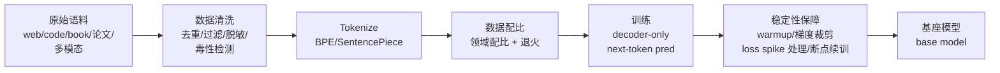

# 预训练与 SFT 详解

> 训练与对齐模块第一篇。主题线索：预训练怎么来的（数据清洗/配比/稳定性）→
> 垂域要不要 continued pretrain → SFT 怎么造数据 → 少量数据为什么也能涨点 →
> Prompt/RAG/微调怎么选（阿里高频题）→ 微调完怎么评估与落地。题目标注自
> [高频面试真题汇总](../高频面试真题汇总.md)。LoRA 与参数高效微调单独成篇
> 见下篇 [lora与参数高效微调](./lora与参数高效微调.md)。

## 一、预训练完整流程

▶ 面试题：预训练流程？数据配比？——**中频**（爱奇艺）

预训练一句话：在海量无标注文本上做 next-token prediction，把所有"世界知识"
灌进模型参数。流程拆开看：

面试被问"预训练流程"，能讲清的三个重点：

### 1. 数据清洗（质量决定上限）

- **去重**：精确去重（URL/文档 hash）+ 近似去重（MinHash/SimHash / n-gram
  重叠率）。重复语料会让模型在重复模式上分配过多容量，还容易记 twins。
- **启发式过滤**：剔除乱码、模板化 SEO 页、符号占比过高/句子过短的行、
  机器生成的低质内容；保留高信息密度文本（wikipedia/教科书/论文优先）。
- **合规与脱敏**：PII（个人身份信息）打码、有毒内容过滤、版权剔除。
- **质量打分器**：训一个小分类器专门挑"像 wiki/教科书"的文档——FineWeb-Edu、
  DCLM 都把这套玩成了胜负手。

一句话答法：**"预训练的本质是数据质量工程，模型结构早已收敛，各家差距主要
在 data pipeline。"**

### 2. 数据配比（什么多喂、什么少喂）

- 典型三桶：**web 大规模低质 + code/book/paper 高质量 + 垂域数据**。
- 配比不是一次拍死：前期大量 web 数据冲多样性，**退火阶段（annealing /
  cooldown）**提升高质量和垂域数据占比，让收敛更稳。
- 加 code 数据反哺推理能力——code 天然带长链逻辑结构，是公开口径里公认的
  "免费的推理增强剂"。
- 配比用 scaling law 实验小样本扫出来再外推，而不是拍脑袋。

### 3. 训练稳定性

- **lr scheduler**：warmup 几万 step 线性涨到峰值再 cosine 衰减，最后退火；
  LR 拍太大直接 loss 爆炸，太小收敛慢。
- **梯度裁剪**（grad clip，常用 1.0）：抑制 loss spike。
- **混合精度 BF16**：见 L1 的定增公式，BF16 比 FP16 动态范围大很多、pretrain 稳定；
  FP32 主权重 + AdamW 动量，每个参数约占 16 字节（详细拆账见
  [lora 篇显存拆账一节](./lora与参数高效微调.md)）。
- **loss spike 处理**：发现 spike 后回滚 checkpoint、跳过坏 batch、临时降 LR。
- **断点续训 + 容错**：千卡/万卡集群不可能不宕机，定期 checkpoint + 快速恢复
  是刚需。
- **3D 并行**：DP/TP/PP 组合见分布式训练模块，这里只提一句。

## 二、垂域 continued pretrain：要不要做、什么时候做

▶ 面试题：垂域 continued pretrain 必要性？——**中频**（爱奇艺）

continued pretrain（CPT，领域继续预训练）：拿已有的 base/instruct 模型，
在垂域语料上接着跑 next-token prediction，继续内化领域知识。

**什么时候值得做**：

- 领域**术语分布、写作风格**和通用语料差异很大（法律、医疗、金融、代码
  私有领域），模型 base 上根本"看不懂"。
- 知识是**内部/新增**的（未公开财报、私有代码库），RAG 再怎么召回也救不了
  "模型根本没学过这个领域"的本质问题。
- 缺失的是**能力**而不是**事实**——比如让模型掌握 hex 转 ascii、特殊协议
  格式、专用 DSL。

**什么时候别做**：

- 知识更新快、要出处的领域（客服政策、内部 wiki）——**RAG 优先**，CPT
  改完一次参数，知识被固化了就再也改不动了。
- 只是Prompt格式/风格问题——SFT 就够。

**常见坑**：

- **灾难性遗忘**：只喂垂域数据，通用能力掉光。解法：混入 10%~30% 通用数据
  做回放，或控制 LR。
- **数据量错觉**：CPT 动辄几十亿 token 才见效，几千条 SFT 数据那种量级想
  用 CPT 内化知识基本没用——量级对不上。

## 三、SFT：指令微调的流程与数据集构建

▶ 面试题：SFT 流程与数据集构建？——**高频**（阿里/小红书追问）

SFT（Supervised Fine-Tuning）：用"指令 → 期望回答"的成对数据，让模型学会
按指令意图作答，同时固化回答风格。一句话：CPT 教知识，SFT 教**行为和格式**。

### 流程

1. **数据格式**：`system / user / assistant` 三段的 chat 模板（Qwen/LLaMA
   各家 chat template 略有差异），训练只对 **assistant 部分算 loss**
   （instruction masking），防止模型学着去"预测问题本身"。
2. **数据来源**：
   - 人工标注（金标准但贵）
   - 强模型蒸馏/合成（GPT-4/Claude 生成 + 规则过滤）
   - Self-Instruct / Evol-Instruct（模型自己造指令再自己答）
3. **质量控制手段**：长度过滤、去重、拒答筛、人工抽检；正式版最好给每个
   system prompt 做多样性均衡，防止模型把拒答模式学歪。
4. **超参**：lr 比预训练小 1~2 个数量级（常见 1e-5 ~ 5e-6），epoch 1~3，
   batch 64~512——核心是**过拟合比欠拟合更容易发生**。
5. **对齐校验**：训完跑通用 benchmark + 垂域评测集，检查是否退化成复读机
   或拒答机。

### 数据集构建的取舍

- **多样性 > 数量**：任务类型（问答/写作/代码/数学/拒答）要均衡，单一任务
  数据再多也撑不起泛化。
- **难度分层**：要有一部分"难题"样本（否则模型学不会处理复杂指令），也要
  有一部分"明确拒答"样本（否则模型不敢说不）。
- **长度分布**：避免全短回答或全长回答——全短会把模型压成问答机，全长会
  压成跑不了短任务的冗长机。

## 四、2000 条数据为什么也能涨点：LIMA 的观点

▶ 面试题：2000 条数据为什么也能涨点？——**高频**（阿里/小红书）

LIMA（Less Is More for Alignment，Meta 2023）的实验非常反直觉：只用
**1000 条**精选指令数据 SFT，就在人类评估上击败了在第一次 SFT 上喂了
10 万+ 数据的模型。论文的核心结论：

> **绝大多数能力是在预训练阶段获得的，SFT 的主要作用不是教新知识，而是**
> **教模型「把这些能力按什么格式吐出来」。**

所以 2000 条数据涨点的合理性在于三件事齐备：

1. **任务窄**：比如"把任意需求转成 JSON 格式的函数调用"就这一条任务，
   样本量小但**风格统一、模板对齐**——模型快就学到格式。
2. **基模早已具备能力**：模型 pretrain 里读过 JSON、函数调用、编程知识，
   SFT 只在"开口方式"上对齐，不是教"新技能"。
3. **数据质量 >> 数据数量**：每条样本都是人工/强模型精选，格式、长度、
   难度、拒答模式都精准，没有噪声反方向拉扯。

逆向推论也成立：**如果 2000 条不涨点**，先查数据问题（格式不统一、噪声、
拒答样本缺失、任务覆盖面不够），再谈加量。

答这道题的节奏：**先摆 LIMA 结论 → 再用"能力 vs 格式"框子解释 →
最后落到自己项目的数字**（比如"我们 1800 条垂域指令数据，SFT 后在内部
测试集 +12pt 函数调用准确率"）。

## 五、什么时候 Prompt / 什么时候 RAG / 什么时候微调

▶ 面试题：什么时候调 Prompt、什么时候微调、什么时候上 RAG？——**高频**
（阿里，应用岗必问）

这是阿里超高频题的决策框架题。决策顺序与 RAG 模块的参考答法保持一致
（见 [RAG 全链路 · RAG vs 微调](../rag/rag全链路.md)）：

1. **Prompt**——零成本试错，先跑通再谈成本；问题如果能通过上下文示例、
   思维链、角色设定解决，就不该训练。
2. **RAG**——知识问题、要出处、随时更新：**动态知识 + 可信源 + 低幻觉**
   的首选。
3. **LoRA / CPT**——行为/格式/风格问题，或垂域术语差距大到 RAG 补上不够：
   改参数是最重的，代价也最大，最后一步再上。

判断口诀：**知识动态变 → RAG；风格行为定 → 微调；基模不会 → CPT**。
更完整的对比表和一图决策见 RAG 模块，本篇不再展开。

## 六、微调完怎么评估，怎么工程落地

▶ 面试题：微调完怎么评估提升、怎么工程落地（部署/精度对齐/回归）？——**中频**

评估三件事，按难度排：

- **内部评测集**：从真实业务场景抽样（> 500 条），采样覆盖任务类型 ×
  难度分层，人工 + LLM-as-judge 双标，看历史模型/新模型的相对胜率而不是
  绝对分数。
- **公开 benchmark**：通用能力回归（MMLU/C-Eval/GSM8K 等），怕的是垂域涨
  通用掉。
- **线上灰度**：AB 实验 + 效果指标（接受率、用户反馈、业务转化率），别只看
  模型分数。

工程落地的关键动作：

- **权重合并**：LoRA merge 成一条 FP16/BF16 权重，部署回归对齐
  （推理侧 dtype 和 merge 时保持一致，量化模型重新跑量化对比）。
- **回归测试**：把上一版模型的核心用例集跑一遍，确认没 regression 再用。
- **部署对齐**：推理框架（vLLM / SGLang）和训练框架（HF/TRL）在数值上对齐，
  dtype 不一致直接掉点；上 vLLM 之前先本地跑几个 canonical prompt sanity
  check。
- **可观测**：线上收集 badcase → 放回数据集 → 迭代，闭环要把这一步跑通
  才算"落地"而不是"发版"。

答工程落地这道题的口径：**"我跑过完整闭环——评测集 → 灰度 → 回滚 →
迭代——比发版本身重要。"**

## 七、高频追问清单（本主题）

| 追问 | 答题要点 |
|---|---|
| 预训练 vs SFT vs RLHF 各做什么？ | 预训练灌知识；SFT 教格式/行为；RLHF/DPO 偏"对齐人类偏好"。——**高频** |
| CPT 跟 SFT 数据量能差多少？ | CPT 几亿~几十亿 token；SFT 几百~几万条就见效。量级差 3-4 个数量级，不能用 SFT 的量做 CPT 的事。 |
| 模型"复读机/拒答机"怎么排查？ | 先看 SFT 数据：辞藻过度相似/拒答样本比例失衡是最常见根因；其次看 lr 太大或过拟合。 |
| 什么时候从 SFT 直接跳到 RL？ | SFT 的上限受限于"参考答案"本身——写完美答案的成本随质量指数上升；当任务难到写不出 ground truth（开放式写作、推理链、辩论）就得上 RL。细讲见下下篇 [rlhf与对齐](./rlhf与对齐.md)。 |

## 八、手撕练习（→ coding/）

本主题对应的手写练习（详见 [高频面试真题汇总-手写代码题](../高频面试真题汇总.md#七手写代码题live-coding-真题)）：

- **手撕 SFT loss 掩码**（给定 instruction + response，只在 response 部分
  算 cross entropy）——简单但常追问细节。
- **数据集去重脚本**（MinHash 近似去重的 Python 伪代码）——考察数据工程视角。

配套代码会在 [coding/](../../coding/) 目录更新，写完对着本文公式自查 loss
计算逻辑。

---

*相关阅读：[lora与参数高效微调](./lora与参数高效微调.md) ·
[rlhf与对齐](./rlhf与对齐.md) · 上一页 [模块导航](../README.md)*
