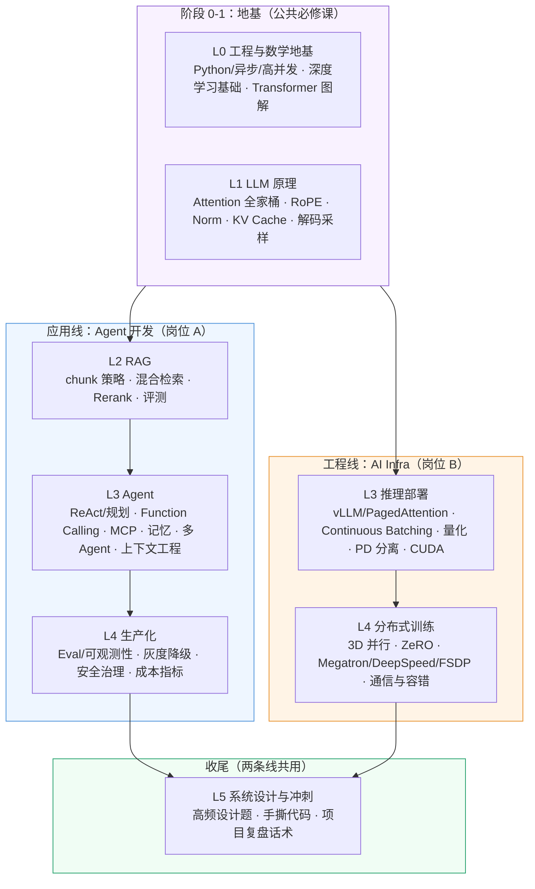
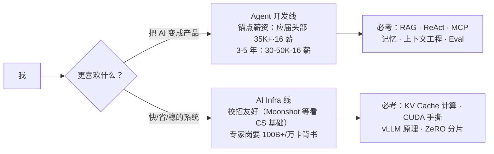

# 大模型面试备战路线图（Agent 开发 / AI Infra）

> 入门指引：本文是整个仓库的导航页。内容体系基于对 **15 份官方招聘 JD（腾讯/字节官网 + Moonshot）**
> 与 **70+ 份聚合 JD** 的调研（见 [JD 分析-Agent 开发岗](./jd分析-agent开发岗.md)、
> [JD 分析-AI Infra 岗](./jd分析-ai-infra岗.md)），按「由浅入深」拆成 6 个阶段，
> 配两个岗位的差异化备战路径。

## 一、知识全景图

## 二、阶段总表

| 阶段 | 内容 | 到什么程度 | 对应仓库目录 | 建议投入 |
|---|---|---|---|---|
| L0 | Python 工程 + 深度学习 + Transformer 图解 | 能徒手画 Transformer 结构图并讲清每个组件 | `interview-questions/llm基础` | 1-2 周 |
| L1 | LLM 原理八股 | KV Cache 显存手算、MHA→MLA 演进、RoPE 推导 | `interview-questions/llm基础` | 2-3 周 |
| L2A | RAG 全链路 | 能搭一套带评测的 RAG，讲清每个环节的取舍 | `interview-questions/rag` | 2 周 |
| L3 分线 | A: Agent 工程 / B: 推理部署 | 见下方分线说明 | `interview-questions/agent`、`inference` | 各 2-3 周 |
| L4 分线 | A: 生产化 / B: 分布式训练 | 见下方分线说明 | `interview-questions/*`、`system-design` | 各 2-3 周 |
| L5 | 系统设计 + 手撕代码 + 项目复盘 | 模拟面试 3 轮以上 | `system-design`、`coding` | 冲刺期持续 |

## 三、两条岗位主线怎么选

调研结论（详见两份 JD 分析）：

- **都不要偏废软件工程底盘**：95% 的 Agent 岗 JD 仍要求 API/并发/Docker/云；
  推理岗第一语言偏向 C/C++，训练岗偏向 Python。
- **分线信号**：
  - 你更在意"把模型能力变成产品"→ 走 Agent 开发线：RAG → ReAct/MCP/记忆 → Eval 与生产化。
  - 你更在意"让模型又快又省"→ 走 AI Infra 线：vLLM/CUDA/量化 → 3D 并行/ZeRO/NCCL。
- **交汇点**：训练对齐（SFT/RLHF/GRPO）两条线都要懂概念；RL Infra 等新兴高薪岗
  要同时熟悉 vLLM 与 Megatron，是 2026 的差异化竞争力。

## 四、JD 调研给出的 5 条备战启示

1. **RAG/框架名词只是门票，"生产化证据"才是入场券**：21/21 的 Agent 岗 JD 要求可验证项目。
   把项目从 Demo 升级为可上线系统：评测集、Tracing、失败降级、成本指标。
2. **准备"稳定性叙事"而非"功能叙事"**：高频追问全是失效模式——Agent 死循环、
   工具调用失败分类、检索没召回 vs 模型乱编、评测集怎么构造。
3. **2026 新分水岭**：MCP（18/21 JD 提及）、Eval/可观测性、重度使用 AI Coding 工具
   （DeepSeek 把 Claude Code/OpenClaw 深度使用列为硬性要求）。
4. **Infra 方向简历必须写"规模数字"**：100B+ 模型、千卡集群、X tokens/s、MFU 从 A% 到 B%。
   没有大集群就用小集群复刻 + 开源 benchmark 数字。
5. **给 vLLM/SGLang/Megatron 提 PR 是 Infra 最高性价比加分项**：腾讯/字节/Moonshot
   多家 JD 显式点名。

## 五、使用方法

1. 先读两份 [JD 分析](./jd分析-agent开发岗.md)，确认自己的目标岗位画像。
2. 按本路线图的阶段顺序刷 [interview-questions](../interview-questions/README.md)
   考点地图；每章配套 [coding](../coding) 手撕练习。
3. 学习资源（书单/仓库/B站/博客）汇总在 [学习资源清单](./学习资源清单.md)。
4. 面一家公司前，先查 [面经复盘](../interview-experiences) 有没有对应案例，
   再过一遍对应阶段的 Top 题。
