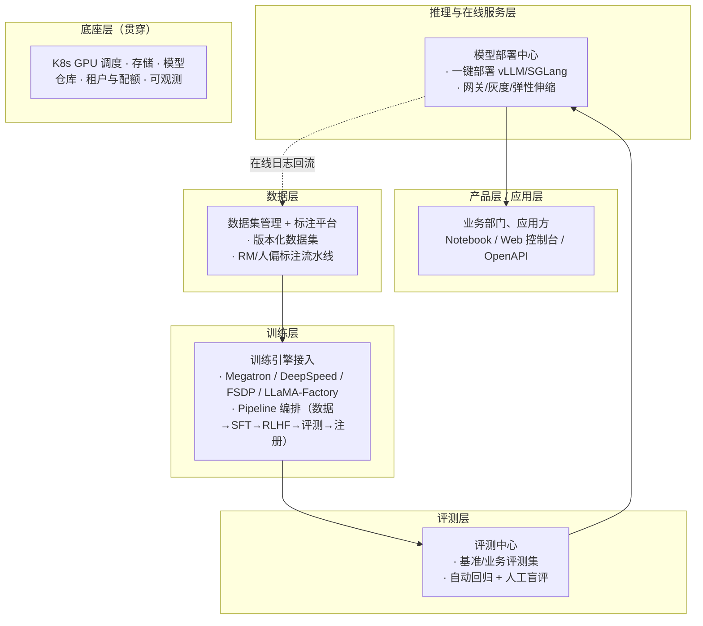
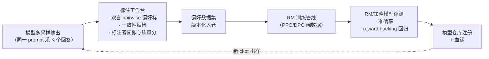

# 设计AI开发平台（训练/微调/评测/部署/服务一体化）

▶ **真题来源：腾讯混元（中频）**——"训练/微调/评测/部署一体化 AI 开发平台怎么分层"
（收入 [高频面试真题汇总-系统设计题](../interview-questions/高频面试真题汇总.md#八系统设计题)）。

> 平台岗招牌题，直接对应 [JD 分析-AI Infra 岗](../resources/jd分析-ai-infra岗.md)
> 里腾讯 ML 平台 / Moonshot Infra 系统应用岗的 JD："MaaS、K8s、OpenAI API、生产管线"。
> 统一答题框架：**澄清问题 → 架构图 → 容量/数据估算 → 关键设计取舍 → 评测与 SLO →
> 追问预案**。训练原理（3D 并行/ZeRO/框架）见
> [distributed-training 模块](../interview-questions/distributed-training/三维并行.md)，
> 本文只管"这些能力怎么产品化成平台"。

## 一、澄清问题

1. **用户是谁**：内部算法/应用工程师（自助式 LoRA/部署为主），还是也对外卖 MaaS？
   两个答法差很多，先钉死。
2. **业务闭环**：只做训练侧，还是要打通"数据 → 训练 → 评测 → 部署 → 在线服务 →
   回流数据"全链？（本题的问法是全链，分层图按全链画。）
3. **规模**：模型尺寸（7B 微调为主还是 100B+ 预训练）、并发任务数、卡池规模
   （百卡/千卡/万卡，决定 K8s 调度那一层要不要展开）。
4. **边界问题**：和自研训练/推理框架的分工——平台**不做**框架本身，平台做
   框架之上的**生命周期管理与资源编排**（这是本篇最重要的边界判断，追问预案会回收）。

立题一句话："**把数据、训练、评测、推理这四件事原本各跑各的脚本和卡，收成同一套
租户、同一套资源池、同一条资产链路（数据集 → checkpoint → 评测报告 → 在线服务）
**；平台的资产不是代码，是"可追溯的模型版本"。

## 二、分层架构



讲图动线自底向上：底座层解决"卡归谁、数据放哪、版本怎么管"，上面四层各管一个
生命周期阶段，最后由在线服务的日志**回流**到数据层形成闭环——闭环这一笔是
"作业平台"和"AI 平台"的分水岭，一定要画上。

## 三、每层职责与关键组件

### 3.1 底座：K8s 调度 + 存储 + 模型仓库

- **GPU 调度**：K8s + 自定义 GPU 调度器（gang scheduling——分布式训练必须整组
  Pod 一起起、一起容，参 [JD 分析](../resources/jd分析-ai-infra岗.md)
  "万卡 GPU 调度"一条）；任务按优先级抢占，离线训练让位在线推理。
- **存储分层**：训练数据（对象存储 + 本地 NVMe 缓存）/ checkpoint（高吞吐并行
  文件系统，checkpoint 的开销与异步落盘见
  [训练框架与稳定性-容错一节](../interview-questions/distributed-training/训练框架与稳定性.md#二容错与断点续训)）/
  模型仓库（版本化、元数据、血缘：这个 ckpt 是哪个 job、哪个数据集、哪个评测
  报告长出来的）。
- **租户与配额**：CPU/GPU 配额按部门、按任务优先级；计量计费与
  [统一接入网关](./设计大模型统一接入网关.md#44-token-计费与配额) 的出账体系对齐。

### 3.2 数据层

- 数据集版本化（不可变快照 + lineage），支持按"训练项目"白名单分发权限；
- **标注子平台**是亮点，下面第五节单开；
- 在线回流日志 → 清洗 → 采样 → 新数据集的管线（"数据飞轮"的具体形态）。

### 3.3 训练层

- 引擎接入而非自研：Megatron / DeepSpeed / FSDP 做大模型预训练与全参微调
  （[框架横评口径](../interview-questions/distributed-training/训练框架与稳定性.md#一训练框架横评横频题)），
  LLaMA-Factory 生态做轻量 SFT/LoRA；平台统一**作业描述**（镜像 + 资源规格 +
  启动命令 + 断点策略），下接不同框架。
- **Pipeline 编排**：把 `数据准备 → 预处理 → SFT → RLHF → 评测 → 模型注册`
  编成 DAG（Argo/Kubeflow 这类工具的思路），节点重跑幂等、失败可断点续走；
  产出物每步落模型/数据仓库，血缘可追。
- 大模型训练的坑（NCCL timeout、loss spike、checkpoint 吞吐）由框架层兜底，
  平台层负责**暴露出来**——训练 metrics、通信/IO 指标、故障自动换机，口径见
  [训练框架与稳定性](../interview-questions/distributed-training/训练框架与稳定性.md)。

### 3.4 评测层

- **三件套**：公开基准（MMLU/C-Eval 这类跑一遍即可）、业务评测集（平台核心资产，
  必须跟上线的模型版本绑定）、人工盲评（AB 双盲打分入报告）。
- **自动回归门禁**：新 ckpt 注册 → 自动触发评测 → 报告不入库不许部署；
  这是"模型上线流程化"的主力卖点，面试时把门禁讲细比讲分层有用。

### 3.5 推理与服务层

- 一键部署：模型仓库拉 ckpt → 选引擎（默认 vLLM，选型见
  [推理引擎选型](../interview-questions/inference/推理引擎选型与源码路线.md#一主流引擎怎么选)）→
  部署成服务，挂到 [统一接入网关](./设计大模型统一接入网关.md) 后面拿鉴权/计量/
  灰度能力，不自建第二套。
- 在线灰度 + 回放评测：新模型 1% 流量，和线上基线对照 AB 评测，达标放量。

### 3.6 产品层

- 以 **OpenAI 兼容 API + Web 控制台 + Notebook SDK** 三面输出（Moonshot Infra JD
  里"OpenAI API 标准"的对应物）。

## 四、容量与数据估算（可复用模板）

平台估算与推理服务不同，**估的是「任务排队」而不是 QPS**：

**假设**（公开量级注明）：模型团队 30 个、并训任务高峰 ~100（7B LoRA 占 70%，全参
SFT 25%，预训练/RLHF 5%）；卡池 1000 张 H100 级别。

```text
LoRA (QLoRA 级) 单任务 4~8 卡 × 70 = 560 卡
全参微调 7B (ZeRO-3 + DP) 单任务 16~32 卡 × 25 = 800 卡
预训练/RLHF ~64~128 卡 × 5 ≈ 500 卡
高峰总需求 ≈ 1900 卡 > 池 1000 卡 → 平均排队 ~先到先跑 + 优先级抢占
```

显存侧的微观账交给框架文档：
[ZeRO 与显存优化-计算题](../interview-questions/distributed-training/zero与显存优化.md) 有现成公式。

**资源利用率是平台第一 KPI**：GPU util + 排队时长，比"平台能跑多少任务"更值钱；
引擎离线/在线混部提利用率的思路见
[分布式推理服务-第五节](./设计分布式推理服务.md#五弹性伸缩与-gpu-超卖)。

## 五、RLHF / 标注子平台（低频追问但要会）

▶ 面试追问："RM 数据怎么来的？标注平台怎么设计？"——低频延伸题（在汇总表
[§八](../interview-questions/高频面试真题汇总.md#八系统设计题) 里占一行）。



设计要点：

- **双盲 pairwise 是首选标注范式**（比 5 分制打分更稳），标注者间一致性
  （Cohen's kappa 或简单 agreement 率）作为质量准入；
- **闭环**：RM 训练 → 策略模型训练（PPO/DPO/GRPO，原理见
  [RLHF 与对齐](../interview-questions/训练与对齐/rlhf与对齐.md)）→ 新模型输出回流生成
  新的待标样本——每过一轮偏好数据都在迭代，版本化管理是刚需；
- **防 reward hacking**：评测集里固定放一组"reward 与真人类偏好对冲"的探针样本，
  挂在 RL 训练监控大盘上（[reward hacking 一栏](../interview-questions/训练与对齐/rlhf与对齐.md)）。

## 六、关键设计取舍

| 取舍 | 选法 |
|---|---|
| 平台 vs 自建框架 | 平台**编排、托管、计量**现有框架，不自研框架内核——框架人才稀缺且复用开源才跟得上社区 |
| 全自研 vs 基于 KubeFlow/Volcano | 复用开源底座（Volcano gang scheduling + Argo 编排）+ 自研租户/计量/模型仓库这三件差异化资产 |
| 单卡池 vs 训练/推理分池 | 一个池 + 优先级抢占：在线推理 > 高优训练 > 离线训练，混部提利用率 |
| 评测门禁强制化 | Android 式强制（不评测不许部署）值得做——它把"提升"变成了"可比" |

## 七、SLO（平台侧也有 SLO）

| 指标 | 参考 SLO | 说明 |
|---|---|---|
| 任务启动延迟 | LoRA 作业 P95 < 5 min（排队除外） | 镜像预热 + 预留节点 |
| 平台可用性 | 99.9% | 任务失败可自动换机重跑（断点续训，[容错一节](../interview-questions/distributed-training/训练框架与稳定性.md#二容错与断点续训)） |
| GPU 池利用率 | > 55% 平均 | 离在线混部 + 超卖回收 |
| 链路可追溯率 | 100% 线上模型可查血缘 | 数据集/代码/超参/评测报告四件套 |

## 八、追问预案

| 追问 | 答题要点 |
|---|---|
| 平台和自建框架的边界在哪？ | 平台管"作业生命周期、资源、资产血缘"；框架管"一次训练/推理怎么算"。平台不自研并行策略、kernel——那是 [分布式训练模块](../interview-questions/distributed-training/三维并行.md) 和 [推理引擎](../interview-questions/inference/推理引擎选型与源码路线.md) 的地盘 |
| 多租户资源隔离怎么保？ | 租户 Cgroup/命名空间隔离 + 配额 + 作业动态优先级；数据权限按项目白名单；Key 和计量走[统一接入网关](./设计大模型统一接入网关.md) |
| 千卡任务的容错？ | 断点续训 + 异步 checkpoint + 坏卡自动定位换机，[训练框架与稳定性](../interview-questions/distributed-training/训练框架与稳定性.md) 已经写了三板斧，平台层把它们编排成"失败自动恢复策略" |
| 怎么证明平台有价值？ | 三个数字：任务上手时间（天 → 小时）、GPU 利用率、上线流程时长（含评测门禁） |
| RLHF 标注为什么低频但重要 | 它是"平台能生产新能力"而非"只跑别人模型"的证据链终端——面试官混元出题大概率顺这里 |

---

*配套阅读：[distributed-training 三篇](../interview-questions/distributed-training/三维并行.md)
（训练侧原理）· [vllm与推理加速核心](../interview-questions/inference/vllm与推理加速核心.md) ·
[设计分布式推理服务](./设计分布式推理服务.md)（平台推理层的下游落地）·
[设计大模型统一接入网关](./设计大模型统一接入网关.md)（计量/鉴权复用）。*
