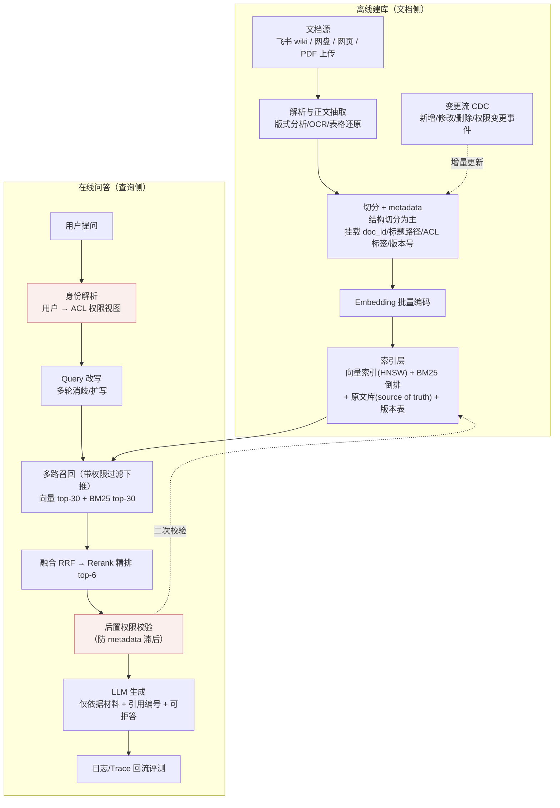

# 系统设计：企业知识库 / 本地化 Wiki Agent

> ▶ 真题来源：字节 / Shopee（[高频面试真题汇总 · §八](../interview-questions/高频面试真题汇总.md)：
> "企业知识库/本地化 Wiki Agent（导入/权限/评测全链路）"，**高**频）
>
> 答题模板（本仓库所有设计题统一）：**澄清问题 → 架构图 → 关键设计取舍 →
> 评测与指标 → 追问预案**。八股支撑：[RAG 全链路](../interview-questions/rag/rag全链路.md)、
> [评测与建库工程](../interview-questions/rag/评测与建库工程.md)。

这题是 RAG 模块的"期末大考"——面试官不指望你 45 分钟设计一个完美系统，而是看你能不能把
rag 三篇里的每一块八股**安置到一个真实系统的正确位置**。三个核心得分点：权限隔离、
增量更新一致性、评测体系（2026 共同追问主线"怎么量化"）。

## 一、澄清问题（先问清楚再画架构，这一步本身就是得分点）

拿到题先别画图，花 3-5 分钟问四类问题，并**报出假设的默认数字**表示你设计的是具体系统：

| 维度 | 要问的 | 参考假设（面试里主动给） |
|---|---|---|
| **规模** | 多少用户（DAU/QPS）？多少文档、什么格式？未来一年涨多少？ | 企业内 5K 员工、日均 2 万次提问；文档 100 万页含 PDF/Word/飞书 wiki/网页；年增 30% |
| **权限** | 权限粒度到部门还是到文档？权限变更频率？有没有"高敏文档"（薪酬/人事）？ | 粒度到「部门 + 项目空间 + 单文档」三级；权限变更日均百次级；有薪酬类高敏库 |
| **更新频率** | 文档变更频率？更新要多快生效——分钟级还是小时级可接受？ | 日均新增/修改 5000 篇；要求分钟级生效；删除/撤权要求"立即"（最多秒级窗口） |
| **评测口径** | 什么叫"好"？头部问题追求准确率还是覆盖率？幻觉容忍度？ | 正确性是第一目标；薪酬/制度类零幻觉容忍，宁可拒答；一般问题允许"部分答对 + 引用" |

这步的加分话术：**"设计形态由这四个变量决定——权限粒度决定索引怎么分，更新频率决定
离线链路是批处理还是流式，评测口径决定生成端的拒答策略。"** 一句话表明你后面每个取舍
都不是套路，是被需求推出来的。

## 二、整体架构

离线建库 + 在线问答两条流水线，共享索引层——这就是
[RAG 全链路](../interview-questions/rag/rag全链路.md) 那张图在"企业知识库"语境下的
实例化，差异在三处：文档接入源更多、权限贯穿全程、索引要有版本。

面试讲法：30 秒把两条流水线过一遍，然后说"我想重点展开权限和增量更新两块，
这是企业场景和普通 RAG demo 的核心差别"——**主动选主场**，别等面试官挑。

## 三、关键设计取舍

### 3.1 权限隔离：ACL 先过滤 vs 先召回

这是字节级纵深追问，详细对比表在
[检索与混合召回 §七](../interview-questions/rag/检索与混合召回.md)，设计题里的落法是
**分层混合，不是二选一**：

1. **租户/库级物理隔离**：薪酬、人事等高敏库**独立 collection / 独立索引**——最强
   的"先过滤"，它们对普通用户根本不可达，检索空间都不存在。
2. **召回层过滤下推 + 过采样**：通用库在 ANN 检索时带 ACL metadata filter
   （Milvus/ES 都支持 filtered search），同时 top-k 过采样（要 10 条召 50 条）
   给过滤留余量——解决"先召回再过滤，剔完只剩 1 条"的召回雪崩。
3. **生成前后置校验**：索引里的权限 metadata 可能滞后于权限变更事件，组装上下文前
   再查一次权限服务（带短 TTL 缓存），**这是防越权的最后一道闸**。
4. **权限变更走事件流**：ACL 变更 → 消息队列 → 索引 metadata 更新，接受秒级
   一致窗口；高敏场景不偷懒，后置校验实时反查。

答题口诀：**「高敏物理隔离，通用下推加过采，生成前再验一次，权限事件进索引。」**
再补一句为什么不用纯方案 B（先召回再过滤）：小权限用户的 top-k 被大量无权 chunk
占满，剔完召回质量雪崩——这是面试官在等的那个"坑点认识"。

### 3.2 切分与索引：结构切分为主 + chunk 挂全程 metadata

- 企业文档（制度、手册、合同）天然有标题层级，**结构切分为主、滑动窗口兜底**，
  每个 chunk 前拼"文档名 > 章节路径"（如 `员工手册 > 薪酬 > 3.2 补贴`）——
  依据见 [RAG 全链路 §三](../interview-questions/rag/rag全链路.md)。
- chunk 的 metadata 是这题的主角：`doc_id / 版本号 / ACL 标签 / 更新时间`，
  权限、增量、引用三件事全靠它。
- 原文库是唯一事实源，向量库只存指针——引用和版本校验都回查原文
  （[评测与建库工程 §三](../interview-questions/rag/评测与建库工程.md) 的铁律）。

### 3.3 增量更新与一致性：文档级变更 + 双索引切换

1. **变更识别**：文档 hash/版本号对比，新增/修改/删除三类事件进消息队列。
2. **修改 = 删旧 + 重建**：以文档为单位——找出该文档全部旧 chunk 标记删除，
   重新解析切分重建。为什么不 diff 级更新？切分边界对编辑位置敏感，改一句话可能
   让下游 chunk 全部漂移，文档级重建是唯一能保证一致的粒度。
3. **大批量更新双索引切换**：建新分区 → 校验 → 原子切换，避免用户查到半新半旧。
4. **删除的窗口期**：HNSW 真删太贵，软删标记 + 定期重建；删除生效有窗口期，
   高敏场景用第 3.1 节的后置校验补偿。

一致性 SLA 答题口径：新增分钟级、修改分钟级、删除/撤权秒级（靠后置校验而不是
索引本身达成）。

### 3.4 生成端：引用与拒答是产品输出

- 组装 context 给 chunk 编号，prompt 强制"仅依据材料回答 + 结论句标注引用 +
  材料不足请明说"，忠实度校验做后处理。
- **拒答是一等公民**：rerank 分数断层（top-6 整体不相关）→ 触发拒答而非硬答；
  宁可拒答率高一点，也别让企业知识库给用户编制度。依据：
  [评测与建库工程 §二](../interview-questions/rag/评测与建库工程.md)。
- 复杂/多跳问题升级为 Agentic RAG（检索变成 ReAct 循环里的工具），但默认单轮 +
  Query 拆分覆盖 80%——别为了简历过度工程。

## 四、评测与指标（"怎么量化"追问主战场）

离线集 + 在线指标双轨，检索段和生成段分开打分（混在一起算平均分等于没评，
依据 [评测与建库工程 §一](../interview-questions/rag/评测与建库工程.md)）。

### 4.1 离线评测集

- **构造**：业务方 TOP 问题清单（占 60%+）+ 文档反向造题 + 对抗样本（易混术语、
  库内无答案的"该拒答"题，占 10–20%）+ 上线失败 case 持续回流。
- **规模**：冷启动 50 条冒烟，迭代回归 300–500 条，上线验收 1000+。
- **版本化**：评测集 + 切分策略 + prompt + 模型配置四者一起版本化，回归才对得上号。

### 4.2 指标表（指标名 + 口径 + 获取方式）

**离线指标（每次改动跑回归集）：**

| 指标 | 口径 | 获取方式 |
|---|---|---|
| Recall@10 | 正确 chunk 进召回 top-10 的 query 占比 | 评测集逐条查召回日志，对照标注的 correct chunk id |
| MRR | 第一个相关结果的倒数排名均值 | 同上，回归脚本自动算 |
| 忠实度（faithfulness） | 答案每个断言能否在引用 chunk 中找到支持 | LLM-as-Judge 按 rubric 打分，10–20% 人工抽检校准 judge |
| 引用正确率 | 标注的 `[1][2]` 引用是否真支撑对应结论句 | 生成后校验脚本 + judge 复核 |
| 拒答正确率 | 该拒答的题拒了、该答的题没躲 | 对抗样本子集单独统计，两个方向分 precision/recall |
| 权限泄露率 | 越权 chunk 进入 context 的条数（**应为 0**） | 构造越权测试账号跑权限回归集，查召回/context 日志 |

**在线指标（上线后持续监控）：**

| 指标 | 口径 | 获取方式 |
|---|---|---|
| 答案采纳率 / 点赞率 | 用户显式反馈正向占比 | 前端埋点 |
| 拒答率分位 | 拒答占比按知识库/意图分桶 | 日志聚合；异常升高 = 召回链路故障的早期信号 |
| 引用点击率 | 用户点开引用溯源的比例 | 前端埋点，反映引用信任价值 |
| P95 端到端延迟 | 提问到首 token + 全文完成 | 网关/服务埋点，按召回/重排/生成分段拆分 |
| 单次问答成本 | LLM token + embedding + rerank 折合成本 | Trace 台账聚合（接入[多 Agent 与评测 · 可观测性](../interview-questions/agent/多agent与评测.md)里的 trace 体系） |
| 越权告警 | 后置校验拦截次数 | 权限服务日志；非零即事故，进 oncall |

**量化话术**："以答案采纳率 + 忠实度为 primary metric，权限泄露率 0 和 P95 为
guardrail——guardrail 不过线，离线涨点也不准上线。"

## 五、追问预案（高频三连）

**Q：召回答不上来（召不回）怎么办？**

按 [评测与建库工程 §二的定位框架](../interview-questions/rag/评测与建库工程.md)
分流：先查库里到底有没有 → 有，查切分/embedding/混合检索哪一环漏的（术语问题靠
BM25 兜底、口语问题靠 Query 改写）→ 没有，走补库流程，并且**生成端要诚实拒答**
而不是硬编。配套量化：评测集上统计召回缺失率，迭代从玄学变排期。

**Q：多轮对话「那这个呢」怎么检索？**

指代/省略让原 query 不可检索，标准做法：用小模型把"历史 + 当前问题"改写成独立
完整 query 再进检索；改写要保住领域术语，歧义大时宁可带历史检索两次也别编造实体。
详见 [检索与混合召回 §六](../interview-questions/rag/检索与混合召回.md)。
多轮上下文膨胀问题引用 [记忆与上下文工程](../interview-questions/agent/记忆与上下文工程.md)
的压缩策略。

**Q：怎么保证权限不泄露？**

回到 3.1 的四层：物理隔离 → 过滤下推 + 过采样 → 生成前后置校验 → 权限事件同步。
再补攻防两面：攻击面不只是"chunk 进了答案"——越权 chunk 参与 rerank 打分、
出现在中间日志同样是泄露面，所以权限回归集要查的是**整条链路的中间产物**，
不是只看最终回答。

**备用追问**：为什么不用 Plan-and-Execute 写死检索流程？——单轮 RAG 本质是
workflow（确定性流水线优先，见
[Agent 基础与规划](../interview-questions/agent/agent基础与规划.md) 的选型），
只有确认多跳/自我修正真实需求才升级为 Agentic RAG。

---

*相关设计题：[AI 客服 Agent](./设计ai客服agent.md)（RAG 在会话场景下的变体）｜
[代码 Review 与运维排障 Agent](./设计代码review与运维agent.md)*
