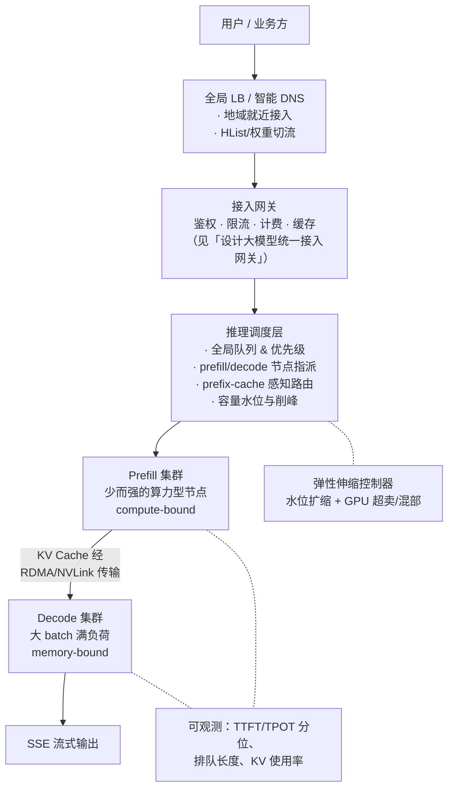

# 设计分布式推理服务（多地域多节点）

▶ **真题来源：字节 / 腾讯 / Moonshot 等 Infra 岗（中频，系统设计向）**——"多地域
多节点分布式推理服务怎么设计"（收入
[高频面试真题汇总-推理部署](../interview-questions/高频面试真题汇总.md#五推理部署)）。

> 这是 Infra 向最重的一道设计题：**把 inference 模块的引擎原理放大到集群级**。
> 引擎内部的 PagedAttention / Continuous Batching / PD 分离在
> [vllm与推理加速核心](../interview-questions/inference/vllm与推理加速核心.md) 已写透，
> 本文不再重复，全程引用；引擎选型口径见
> [推理引擎选型与源码路线](../interview-questions/inference/推理引擎选型与源码路线.md)。
> 统一答题框架：**澄清问题 → 架构图 → 容量估算 → 关键设计取舍 → 评测与 SLO →
> 追问预案**。

## 一、澄清问题

1. **模型与规模**：什么模型（7B/70B/MoE）？峰值 QPS 与日均调用量？每个要求的
   输入/输出长度分布（这直接定 KV Cache 显存）？
2. **SLO**：TTFT / TPOT 的 P99 要求是多少？在线交互（低延迟优先）还是批量
   离线（吞吐优先）？——这决定后面几乎所有取舍。
3. **地理与合规**：用户分布在几个地域？数据有无出域限制（→ 多地域是性能需求还是
   合规需求，答法完全不同）？
4. **资源约束**：卡型卡量（A100/H100/国产卡）、是否有 spot/混部资源？

立题一句话："**把一次 LLM 调用的生命周期拆成排队、prefill、decode 三段，分别做
集群化部署、调度与 SLA**；核心矛盾就一个——decode 的显存/带宽是硬资源，所有设计
都在围绕'让每 GB 显存尽可能一直干活'展开。"

## 二、容量评估（先算清再画架构）

▶ 这门题的分数一半在估算上。模板可复用：**DAU → 请求量 → tokens/s → 单卡产能 →
卡数 → 显存核对**。全部用公开量级假设并注明。

### 2.1 从业务到 token 吞吐

**假设**（面试时主动声明）：

- 50 万 DAU，人均 20 次请求/天 → 日均 **1000 万请求**；
- 平均每次输入 1500 tokens、输出 500 tokens；
- 峰值系数 3（白天集中）；PD 分离下 prefill/decode 分开算账。

输出侧（decode 集群要扛的）：

```text
日均 output tokens = 10^7 × 500 = 5×10^9
平均 out-tokens/s = 5×10^9 / 86400 ≈ 5.8 万/s
峰值 out-tokens/s ≈ 5.8w × 3 ≈ 17 万/s
```

并发请求数（用 Little's Law，比拍脑袋 QPS 更准确）：

```text
单次请求全程时长 ≈ TTFT(1s) + 500 × TPOT(30ms) ≈ 16 s
并发 ≈ 峰值 QPS(≈350 req/s) × 16 s ≈ 5600 条在途请求
```

### 2.2 单卡产能估算（decode）

Roofline 口径（推导见
[vllm与推理加速核心-第一节](../interview-questions/inference/vllm与推理加速核心.md#一prefill-与-decode一次推理的两种性格)）：
decode 是 memory-bound，单请求上限 ≈ HBM 带宽 ÷ 每步读取字节数。

以 **70B BF16 + A100-80G(2TB/s)** 为例，TP=4 时每步每卡读 140GB/4=35GB：

```text
单请求 decode 上限 ≈ 2 TB/s ÷ 35 GB ≈ 57 tokens/s（每卡视角）
```

continuous batching 把 batch 开大后，权重一份读全 batch 共享（
[CB 为什么提吞吐](../interview-questions/inference/vllm与推理加速核心.md#四continuous-batching按-iteration-调度不按请求调度)），
**聚合吞吐按"带宽 ÷ 权重字节 × batch 有效利用率"量级估**——工程口径：70B 级
一台 8×A100 机型经 good batching 聚合 decode 吞吐约 **3000~6000 out-tokens/s**
（取决于输出长度、量化、SLO 余量；面试强调"这是随 SLO 和 batch 变的区间，不是常数"）。

### 2.3 卡数估算

```text
decode 侧：17 万 out-tokens/s ÷ (单台 ~4000 tokens/s) ≈ 43 台 8 卡机 ≈ 350 卡
打 60% 利用率余量 + 冗余：≈ 550~600 张 A100 级别
```

prefill 侧按 tokens-in 算 FLOPs（2 × P × tokens），通常只有 decode 卡量的
1/4~1/3，且可借 spot 卡——这正是 PD 分离后异构搭配的动机
（[PD 分离](../interview-questions/inference/vllm与推理加速核心.md#七pd-分离prefill-和-decode-为什么要拆成两套集群)）。

### 2.4 显存核对（必须走一遍，不然不算闭环）

KV Cache 每 token 显存公式（必背，推导见
[KV Cache 显存估算](../interview-questions/llm基础/transformer与attention.md#四kv-cache-原理与显存估算)）：

```text
KV bytes/token = 2(K,V) × L(层数) × n_kv(kv头数) × d_head × 2 bytes(BF16)
```

以 70B GQA 配置（约 80 层、8 个 kv 头、d_head=128）估：每 token ≈
2×80×8×128×2 B ≈ **320 KB**。一条 3K 序列（1500 in + 500 out + 1K 余量）≈ 1GB。

```text
总需求：5600 并发 × ~1 GB ≈ 5.6 TB KV Cache
总供给：600 卡 × (80GB - 权重 35GB - 碎片余量) ≈ 600 × 35 GB ≈ 21 TB
21 TB > 5.6 TB ✓ 显存容量过关
```

并发打满时 KV 显存占用 ≈ 27%，余量健康；若 SLO 收紧 TPOT，batch 开更大时才需要
KV cache 量化（[量化与压缩-第八节](../interview-questions/inference/量化与压缩.md#八kv-cache-量化长上下文时代的第二战场)）
把账重算一遍。

**答题要点**：这套链条——token 吞吐 → 并发 → 卡数 → 显存核对——每一步数字都可以
错一点，但**链条不能断**；面试官要的是方法论。

## 三、总体架构



三段动线：请求先到**接入层**做租户级治理 → **调度层**决定"什么时候算、在哪个
prefill 节点算、KV 寄到哪个 decode 节点" → 两个异构集群各自按各自的资源瓶颈
优化。网关层细节见 [设计大模型统一接入网关](./设计大模型统一接入网关.md)，
PD 架构原理见 [PD 分离一节](../interview-questions/inference/vllm与推理加速核心.md#七pd-分离prefill-和-decode-为什么要拆成两套集群)。

## 四、调度设计

### 4.1 全局队列与优先级

- **三级队列**：付费实时 > 普通在线 > 离线批处理；同优先级内部 FIFO +
  预估等待时间（用队列里排队 token 量 ÷ 当前集群吞吐估）返回给调用方。
- **优先级抢占**：高优请求进来可抢占低优请求的 KV 槽位（KV 换出/重算），代价
  是被抢占请求 TTFT 变长——抢占策略要有上限（最多被抢占 N 次后放
  行）。
- **对接引擎层**：全局调度只做"请求 → 节点"指派，节点内部还是引擎的
  continuous batching / chunked prefill——两层各司其职，别把全局调度说成
  替代品。引擎侧原理见 [Continuous Batching](../interview-questions/inference/vllm与推理加速核心.md#四continuous-batching按-iteration-调度不按请求调度)。

### 4.2 Prefix-cache 感知路由

同一租户/同一长 system prompt 的请求**粘性路由**到其前缀 KV 还热着的节点
（[Prefix Cache](../interview-questions/inference/vllm与推理加速核心.md#五prefix-cache--radixattention多轮对话与同前缀请求的缓存复用)），
命中则 prefill 近乎免费、TTFT 砍大半；它与负载均衡目标冲突时的取舍：
**命中收益 > 排队损失就走粘性**，工程实现是给节点打"前缀热度标签"，调度时作为
软约束。

## 五、弹性伸缩与 GPU 超卖

- **弹性**：decode 集群按"排队长度 + TPOT 预测"扩缩——注意 LLM 实例启动慢
  （加载 140GB 权重分钟级），单冷水位扩缩护航不住突发，所以要**水位维持 +
  定时扩缩 + spot 预池**三件套；扩缩期间旧实例要 drain（停止接新、在途跑完）。
- **GPU 超卖/混部**：离线批处理（评测、dataset 生成、RL rollout）和在线服务
  混部在同一卡型上，在线水位高时**秒级驱逐离线**（这在
  [JD 分析](../resources/jd分析-ai-infra岗.md) 字节/Moonshot JD 里是明文关键词）；
  通过 cgroup/MIG/MPS 做资源硬隔离，驱逐要能在 10 秒内完成且不灰在线 TPOT。
- **成本视角一句话**："在线保证 SLO、离线吃满碎片"是这类系统毛利率的主要来源。

## 六、多地域部署与容灾

- **多地域拓扑**：每个地域一套完整（网关 + 调度 + PD 集群）的可用区；模型权重与
  配置全局分发，**KV Cache 不跨地域**（延迟和带宽都不允许），跨地域只走请求级转发。
- **容灾三档**：
  1. 节点级：健康检查剔除 + 重试（其在该节点上的 KV 作废，其他节点重算 prefill）。
  2. 机房级：DNS/LB 切流，对侧地域接管；代价是 TTFT 上升（prefix cache 全冷）。
  3. 全地域降级：回落到"小模型 + 短参数 + 高优租户保留"的保底态；离线业务全停。
- **合规优先于性能**：有数据不出域要求时，地域路由规则写死在网关，不做"就近但出域"
  的优化式路由（呼应 [统一接入网关-追问预案](./设计大模型统一接入网关.md#九追问预案)）。

## 七、SLO 体系与压测

指标定义已烂熟于 [TTFT/TPOT/ITL 一节](../interview-questions/inference/vllm与推理加速核心.md#八吞吐-vs-延迟ttft--tpot--itl-指标必须脱口而出)，
落到 SLO：

| 指标 | 示例 SLO | 手段 |
|---|---|---|
| TTFT P99 | < 2s（prompt ≤ 2K） | prefix 粘性路由、prefill 集群富余、chunked prefill |
| TPOT P99 | < 50 ms | batch 上限约束、PD 分离、KV cache 量化/前置 |
| ITL 毛刺 | P99 < 3× 中位数 | chunked prefill 隔离 prefill 冲击 |
| 可用性 | 99.9% 请求成功 | 多实例、熔断、多地域切换 |
| GPU 利用率 | decode 集群 SM/带宽 > 60% | 混部离线、超卖 |

**压测方法**：
1. **打桩引擎**先压网关+调度链路（隔离变量）；
2. **真实回放**：用线上 prompt/输出长度分布的回放流量压端到端，将 TTFT/TPOT 分布
   对齐线上基线；
3. **故障注入**：随机 kill prefill/decode 节点、注入网络延迟，验证 SLO 曲线不塌、
   恢复时间达标；
4. **长尾榨干**：压 2~3 倍峰值找出队列崩塌拐点——这个拐点就是线上要监控的水位线。

## 八、关键设计取舍（速答卡）

| 取舍 | 选项 A | 选项 B | 我的选法 |
|---|---|---|---|
| 引擎自研 vs 开源 | TRT-LLM 极限性能 | vLLM/SGLang 生态 | 90% 场景选 vLLM/SGLang，[选型口径](../interview-questions/inference/推理引擎选型与源码路线.md#一主流引擎怎么选) |
| PD 合设 vs 分离 | 部署简单 | TTFT/TPOT 独立 SLA | 高 QPS 长 prompt 场景选分离；小流量别过度设计 |
| 全局 vs 本地调度 | 统一优化 | 延迟低、简单 | 两级：全局指派 + 引擎内 CB |
| 超卖收益 vs 风险 | 毛利率 | TPOT 抖动 | 只在离线/在线混合场景超卖，纯在线不碰 |
| 缓存位置 | 网关语义缓存 | 引擎 prefix cache | 两层都要，[见网关篇缓存对比](./设计大模型统一接入网关.md#43-缓存能不复算就不复算) |

## 九、追问预案

| 追问 | 答题要点 |
|---|---|
| KV Cache 跨节点怎么传？ | PD 后靠专用 KV transfer 层（RDMA/P2P，藏在 decode 间隙），[高频追问表](../interview-questions/inference/vllm与推理加速核心.md#十高频追问清单本主题) |
| 70B 为什么 TP=4 而不是 TP=8？ | TP 增加通信开销且权重分得更薄，过 TP 拐点吞吐受益不再线性；并行切分的通信账见[三维并行](../interview-questions/distributed-training/三维并行.md) |
| 7B 和 70B 架构哪里不同？ | 70B 必须 TP、显存主导设计；7B 可单机多实例，重点在 batch 与副本数 |
| 队列打爆了怎么办？ | 反压 + 429；高优抢占；离线瞬停；不要让队列无限长后集体超时（重试风暴） |
| Mooncake 这类论文思想？ | PD 分离 + KV 中心化缓存池（DRAM/SSD 分层），[第五节](../interview-questions/inference/vllm与推理加速核心.md#五prefix-cache--radixattention多轮对话与同前缀请求的缓存复用) 末尾口径 |
| 模型升级怎么灰度？ | 网关切 1% 流量 → 评测集回归（谁跑评测见 [ai 开发平台篇](./设计ai开发平台.md)）→ 放量；KV 目录隔离不串 cache |

---

*配套阅读：[vllm与推理加速核心](../interview-questions/inference/vllm与推理加速核心.md)
（引擎内原理）· [推理引擎选型与源码路线](../interview-questions/inference/推理引擎选型与源码路线.md)
· [量化与压缩](../interview-questions/inference/量化与压缩.md) ·
[设计大模型统一接入网关](./设计大模型统一接入网关.md)（前置网关）。*
